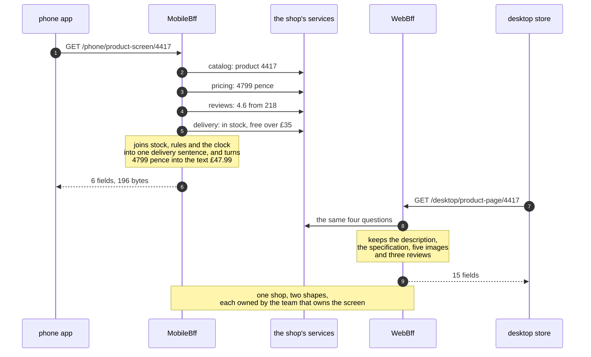

# Backends for Frontends Pattern — Sequence Diagram

One product screen drawn twice, in the order the calls happen: once on a phone and once
on a desktop, with each device talking to a backend that belongs to it. The architecture
diagram says what is running and the data flow diagram counts the bytes; this one says
**who asks whom, and how many times, before a pixel appears**.

Read the phone's half first. The phone makes a single call — to its own backend, naming
a screen rather than a resource. That backend then makes four calls of its own, to the
catalog, the pricing service, the review service and the delivery service, all of them
inside the shop's network where a round trip costs almost nothing. It joins three of
those answers into one sentence — free delivery, arriving Friday — turns four thousand
seven hundred and ninety-nine pence into the string "forty-seven ninety-nine", throws
away everything no phone draws, and sends back six fields and a hundred and ninety-six
bytes.

Then read the desktop's half, which is the same shape and a different answer: one call
in, four calls behind it, fifteen fields back including the description, the
specification, five images and three reviews. Same shop, same second, same product,
deliberately different documents.

Mermaid source

## What the order proves

**One arrow leaves the device; four leave the backend.** The work did not disappear — it
moved onto a network that costs nothing. That is the honest version of the claim this
pattern is usually sold with. On office wifi nobody could tell the two designs apart. On
a train, where each device round trip is a wait of its own, five sequential calls before
a single pixel is the difference between a screen and a spinner.

**The shop appears once.** Two backends, one set of services behind them. The fix for two
screens wanting different data is a second waiter, not a second kitchen: duplicate the
shop and you have two places for a price to be calculated, and they will disagree
eventually without telling anybody.

**The joining happens in a process that can be corrected this afternoon.** The delivery
sentence and the currency formatting are presentation decisions, and they now live in
something the phone team can redeploy today rather than in an app customers will still be
running in two years — or in a shared endpoint whose every change has to be agreed with
five other clients.

The failure this pattern is bought with — a pricing rule copied into one backend, going
quietly out of date, and the two screens making different claims about the same price in
the same second — is sequence 4 in [`uml-diagram.md`](uml-diagram.md), along with the
rejected designs and the boundary with an API gateway.
