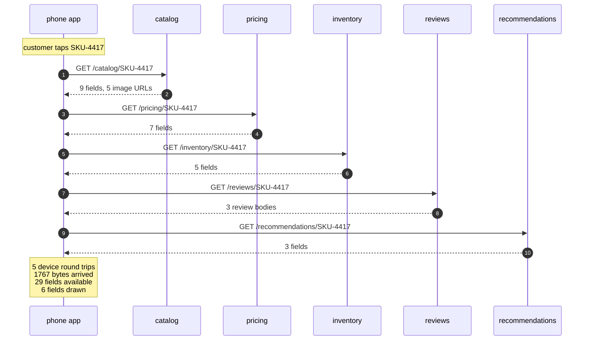
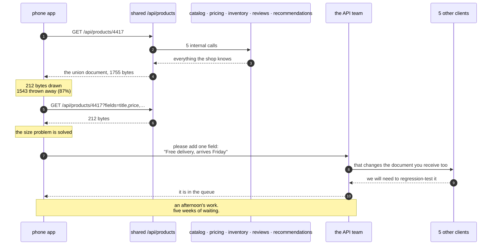
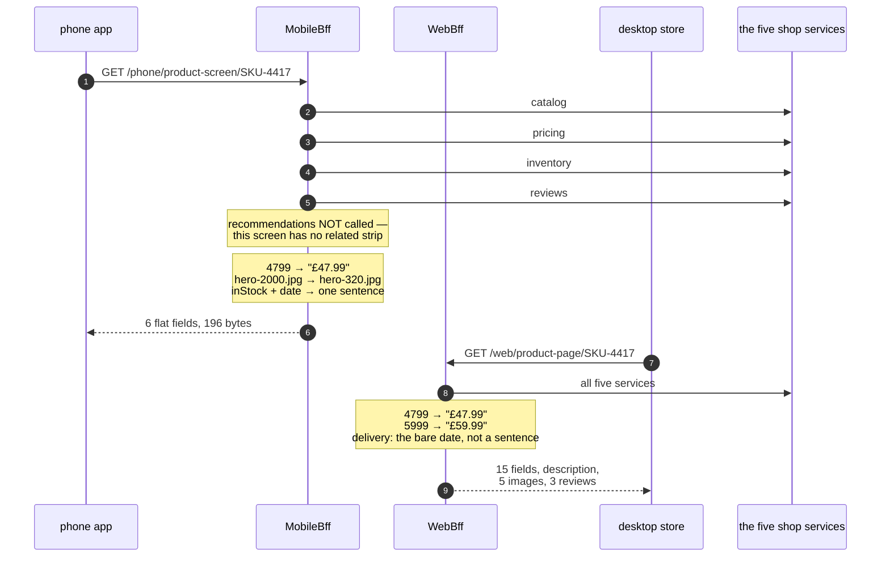
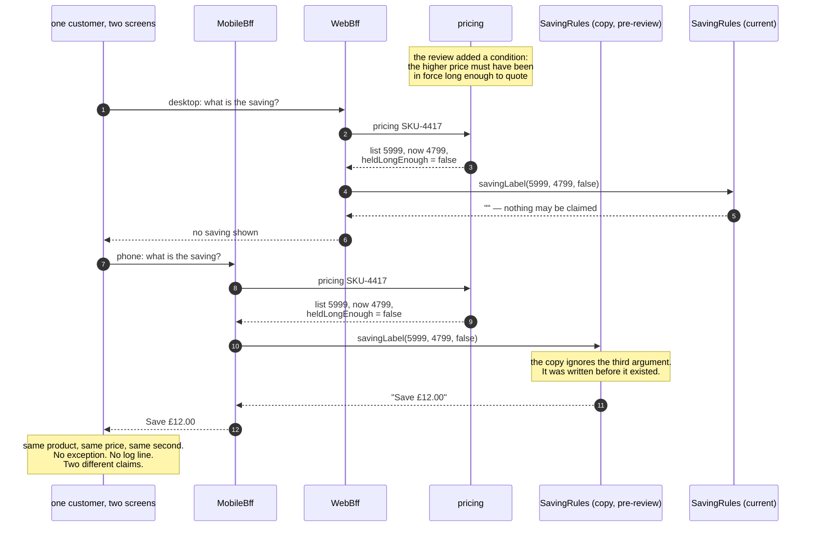
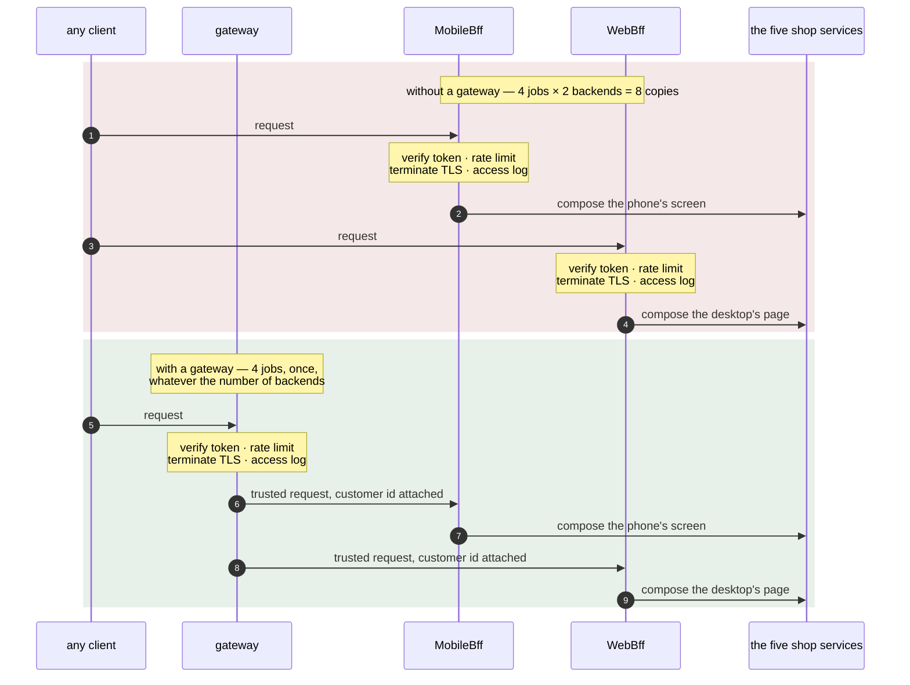

# Backends for Frontends Pattern — UML Sequence Diagrams

Five sequences. The first two are the designs the pattern replaces. The third is the
pattern itself. The last two are the bill — the silent disagreement, and the line
between this pattern and the gateway it sits behind.

## 1. The Chatty Phone — Five Calls Across A Mobile Network

The first design, and the one shops arrive at by accident. Watch where the dashed
boundary is: every single arrow on the customer's side of it is a wait.

Mermaid source

Five request-and-response pairs, all of them crossing the customer's own connection,
and they happen one after another rather than all at once because the later calls
need the earlier answers.

Then read the closing note. Twenty-nine fields arrived and six were drawn, which
looks like the headline. It is not. The headline is the five. Bytes cost the
customer their data allowance; round trips cost them the two seconds they spend
looking at an empty screen, and on a poor connection each one of those five is a
tenth of a second of pure waiting before any work has begun.

---

## 2. One Shared Endpoint — Better, And Still Wrong

The obvious fix, which genuinely fixes the round trips and genuinely does not fix
the thing that matters.

Mermaid source

Read the first half and the second half as two separate stories, because they have
different endings.

The first half is a success. One round trip instead of five, and once the field list
is added, two hundred and twelve bytes — close to what a tailored backend would
send. A shop that stopped here would have most of the measurable benefit and none of
the extra processes, and plenty of shops do exactly that.

The second half is why the story continues. The phone team asks for one line of
text, joined from stock, the delivery rules and the clock. It does not exist in any
service, so it is a new field on the shared document, and the shared document is
received by five other clients who did not ask for it and must test it anyway.

Notice who is at fault in that exchange: nobody. The API team is not obstructive,
the other clients are not unreasonable, and the phone team's request is not
exotic. The queue is a property of the *structure* — one endpoint owned by everybody
is owned by nobody in particular.

---

## 3. A Backend Per Frontend

The pattern. Two sequences side by side over the same shop, and the interesting part
is how differently they end.

Mermaid source

For anyone listening rather than looking: the phone makes one call to its own
backend, that backend makes four calls inside the data centre, and it sends back six
flat fields. Then the desktop makes one call to a *different* backend, that backend
makes five calls inside the data centre, and it sends back fifteen fields.

Three things on that diagram are the pattern, and all three are decisions only a
client-specific backend can make.

**The call that is not there.** `MobileBff` never asks recommendations for anything,
because the phone's product screen draws no related-products strip. A shared
endpoint has to call it, because some client somewhere needs it.

**The conversions in the note.** `4799` becomes `"£47.99"`. The 2000-pixel hero
image becomes the 320-pixel thumbnail. Stock plus a date becomes "Free delivery,
arrives 2026-09-18". Every one of those is a presentation decision, and every one of
them now lives in a process that can be corrected this afternoon rather than in an
app release that customers may not install for two years.

**The two backends disagreeing.** Look at `delivery` on both sides. The phone gets a
whole sentence; the desktop gets the bare date, because the desktop page has a
delivery panel and wants the parts. Same field name, same service underneath, two
different answers, and neither is a bug.

---

## 4. The Bill, Part One: Two Backends, One Rule, Two Answers

The pattern's worst failure. There is no error in this sequence — read it looking for
the moment something goes wrong, and notice that there isn't one.

Mermaid source

Both backends asked pricing. Both received the same three values, including the flag
that says the higher price is too recent to advertise. The shop is not hiding
anything and nothing has failed.

The difference is in the last argument. The current rule reads
`heldLongEnough = false` and returns an empty string. The stale copy ignores that
argument, because when it was written the argument did not exist. It subtracts, it
formats, and it returns a claim the shop is not permitted to make.

Sit with the shape of that failure for a moment, because it is why this one is worth
a diagram of its own. There is no arrow in that sequence that is wrong. Every
participant behaves correctly according to what it knows. The only place the problem
exists is in the relationship between two files, and the only observer who can see
it is a customer with a phone in one hand and a laptop in front of them.

The rule the diagram argues for: **a backend for a frontend may hold the shape.
Anything the shop would still believe with every client switched off belongs behind
it, with one implementation.**

---

## 5. The Bill, Part Two: Where The Shared Jobs Go

The last sequence is two sequences, and the difference between them is the answer to
"how is this different from an API gateway?"

Mermaid source

In the first block each backend does the four shared jobs itself: eight copies of
work that is identical by definition. Add a third client and it is twelve. The way
this happens is not negligence — the nearest place to put token verification is
inside whichever backend you have open, and each individual decision to do it there
is defensible.

In the second block the gateway does them once, and the backends trust what it
passes them. The count is four whether there are two backends or nine, which is why
`CrossCutting.copiesBehindAGateway()` takes no argument.

And the line, stated as one question you can apply to any file:

- *"What does this screen need?"* → it belongs in a backend for that frontend.
- *"Is this request allowed in at all?"* → it belongs in front of all of them.

A gateway is about **entry**. A backend for a frontend is about **shape**. Almost
every real system has both, arranged exactly as the second block above, and that is
the correct relationship between two patterns people spend a lot of time confusing.
