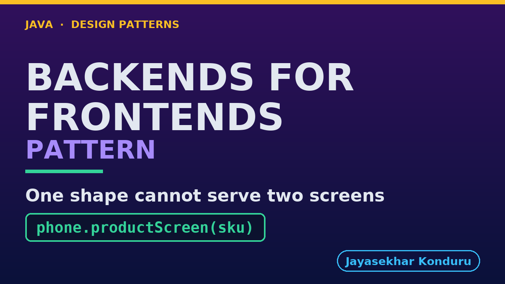

# YouTube — Backends For Frontends Pattern

Everything needed to publish `video/backends-for-frontends-pattern-explained.mp4`. Copy the fields straight out of this file.

Chapter timings are generated from the video's `.srt`. Re-run `python3 docs/make_youtube_docs.py backends-for-frontends` after any change to the narration, or they will be wrong.

## Title

```
Backends for Frontends in Java - One Shape Won't Fit
```

52 characters — under the 60 YouTube shows before truncating in search results.

## Description

The first two lines are what a viewer sees above the fold, so they carry the hook rather than the boilerplate.

```
Learn the Backends for Frontends pattern in Java 21, starting from one online shop, one coffee maker, and two screens that disagree about what a product is — six fields on a phone, fifteen on a desktop. We watch the phone make five calls before a pixel is drawn, replace them with one shared endpoint that throws away eighty-seven per cent of what it sends, and then fix that completely with a query parameter — because if this pattern were about payload size, the story would end there. It does not: the next thing the phone team asks for is one line of delivery text they could write in an afternoon and wait five weeks to ship. That queue is what the pattern removes. Then the bill, which is most of the second half: a discount rule copied into one backend so the same product advertises a saving on the phone and none on the desktop, with nothing thrown and every test passing; where the shared jobs go and how to tell this pattern from an API gateway; and why six clients need three backends rather than six. No prior design-pattern knowledge needed, and no Docker, HTTP or framework — it all runs in one JVM. Full source code and written notes are in the repository.

CHAPTERS
00:00 Introduction
01:35 The Scenario
02:42 The First Design — The Phone Calls Everybody
03:41 The Second Design — One Endpoint For Everybody
04:35 And the Obvious Fix Works
05:28 The Request That Cannot Be Served
06:32 The Pattern
07:38 Who Does What
09:04 A Backend That Knows One Screen
10:20 Two Backends, Two Documents
11:33 The Same Product, Three Ways
12:44 The Bill, Part One — One Rule, Two Answers
14:20 The Bill, Part Two — Where the Shared Jobs Go
15:32 The Bill, Part Three — How Many Is Too Many
16:43 What to Take Away
17:52 Thanks for Watching

SOURCE CODE, WRITTEN NOTES AND AN INTERACTIVE ANIMATION
https://github.com/jk-boot-up/java-design-patterns/tree/main/gradle-java/platform-design-patterns/backends-for-frontends-pattern

WHAT YOU NEED FIRST
Java 21 and a working knowledge of classes and interfaces. No prior design-pattern knowledge is assumed. The full prerequisites are in docs/prerequisites.md in the repository.
```

## Chapters

YouTube renders these as chapters only if there are at least three and the first is at `00:00`.

```
00:00 Introduction
01:35 The Scenario
02:42 The First Design — The Phone Calls Everybody
03:41 The Second Design — One Endpoint For Everybody
04:35 And the Obvious Fix Works
05:28 The Request That Cannot Be Served
06:32 The Pattern
07:38 Who Does What
09:04 A Backend That Knows One Screen
10:20 Two Backends, Two Documents
11:33 The Same Product, Three Ways
12:44 The Bill, Part One — One Rule, Two Answers
14:20 The Bill, Part Two — Where the Shared Jobs Go
15:32 The Bill, Part Three — How Many Is Too Many
16:43 What to Take Away
17:52 Thanks for Watching
```

## Tags

```
backends for frontends, bff pattern, api design java, design patterns, java design patterns, gang of four, java 21, software design, clean code, object oriented design, java tutorial, ecommerce, programming tutorial
```

215 characters, under YouTube's 500 limit.

## Thumbnail



**Upload `docs/thumbnail.png`** — 1280×720, the size YouTube recommends, generated by `docs/make_thumbnails.py`. It is deliberately not the same image as the video's opening frame: a thumbnail is judged at about 360 pixels wide in a search result, so this one carries only the pattern name, one line of promise and one short piece of code, each set large enough to survive the shrink.

`video/poster.png` is the 1920×1080 opening frame, produced by the video build. It stays in the repository as the title card; it is not what gets uploaded.

YouTube will not pick the thumbnail up on its own — upload it under **Details → Thumbnail → Upload file**. A custom thumbnail requires a verified channel.

## Upload checklist

- [ ] Upload `video/backends-for-frontends-pattern-explained.mp4` (1080p, H.264, 30 fps, AAC 48 kHz — already YouTube's recommended settings, no re-encode needed)
- [ ] Set the video language to **English** first, or the subtitle option may not appear
- [ ] Add subtitles: *Video elements → Add subtitles → Upload file → With timing* → `video/backends-for-frontends-pattern-explained.srt`
- [ ] Upload `docs/thumbnail.png` as the thumbnail — do not let YouTube auto-pick a frame
- [ ] Paste the title, description and tags from above
- [ ] Add to the **Java Design Patterns** playlist, in learning order
- [ ] Wait for 1080p processing before sharing the link — code slides are unreadable at 360p

## Cards and end screen

End screen links to whichever pattern video goes up next — set it at upload time rather than assuming an order.

Add a card partway through pointing at the playlist, so a viewer who arrives at this pattern from search can find the rest of the series.

## Runtime

Approximately 18:29, narrated at 145 words per minute.
