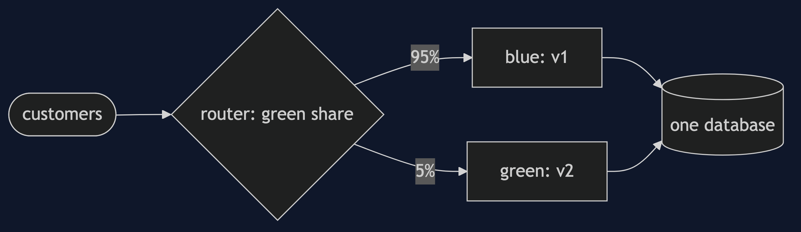
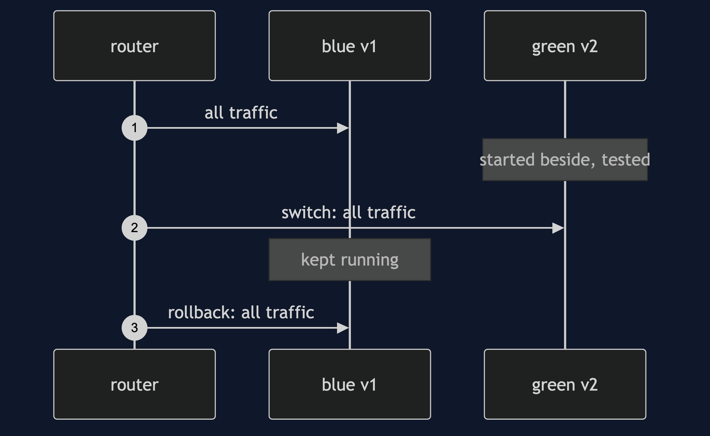

# Blue-Green and Canary Pattern

```
src/main/java/com/jk/explore/bluegreen/
├── BlueGreenDemo.java               the six acts
├── Router.java                      sends each request to blue or green
├── Version.java                     one release, good or buggy
├── CanaryRollout.java               grows the share in steps, with a failure gate
│
└── InPlaceUpgrade.java              stop, replace, start
```

**Blue-green and canary: run two releases side by side, switch at once or grow a small share, and go back with one setting.**

This project is in [platform-design-patterns](..). It is the release side of [Strangler Fig](../strangler-fig-pattern), and it pairs with [Feature Toggle](../feature-toggle-pattern) and [Externalised Configuration](../externalised-configuration-pattern), since the switch is only a setting.

## Run

```bash
./gradlew run
```

Six acts. Every number quoted below comes from this program's own output.

```
ONE. Replace it where it stands.
  stop v1, install v2, start v2: 10 requests arrive while it is down. of 100 requests, failed: 10.
TWO. Blue and green.
  v2 was started beside v1 and tried with a test order: ok. v1 served 50 requests meanwhile.
  the switch was one setting. after it v2 served 50. of 100 requests, failed: 0.
THREE. Going back.
  v2 has a bug with big orders. 50 requests on v2, failed: 5.
  one setting sent traffic back to v1, which had never been stopped. the next 50 requests, failed: 0.
FOUR. A canary.
  5% of traffic to the buggy v2. of 200 requests, v2 got 10 and failed 2.
  had all 200 gone to v2, 20 would have failed. a few customers found the bug, not everyone.
FIVE. Promote in steps, with a gate.
  buggy v2: halted true after 1 step, failure rate on v2 20%, traffic back to 100% v1.
  good v2: halted false, steps 4, now at 100% v2.
SIX. The bill.
  two full copies run during the switch: capacity 20 instead of 10.
  v2 wrote 5 orders in a new format before we went back. v1 can read: 0.
  both releases share one database, so a release that changes the data cannot be switched back safely.
```

## Test

```bash
./gradlew test
```

2 test classes, 6 test methods, offline, with nothing installed and no framework.

## Technologies and versions

| What | Version | Why it is here |
| --- | --- | --- |
| Java | 21 | The repository standard, via the Gradle toolchain block |
| Gradle | 9.2.1 | The wrapper in this directory; no separate install needed |
| JUnit 5 | 5.10.2 | Test runner |

No framework. A hand-built project stays plain Java so the mechanism is the whole lesson.

## Learning Material

| Document | What it covers |
| --- | --- |
| [`docs/problem-statement.md`](docs/problem-statement.md) | The scenario, and the problem |
| [`docs/blue-green-and-canary-pattern-explained.md`](docs/blue-green-and-canary-pattern-explained.md) | The pattern, and six acts |
| [`docs/class-diagram.md`](docs/class-diagram.md) | The types |
| [`docs/architecture-diagram.md`](docs/architecture-diagram.md) | The parts and how they connect |
| [`docs/data-flow-diagram.md`](docs/data-flow-diagram.md) | What happens to one request |
| [`docs/sequence-diagram.md`](docs/sequence-diagram.md) | Written for a listener with the screen off |
| [`docs/uml-diagram.md`](docs/uml-diagram.md) | Four sequences |
| [`docs/animation.html`](docs/animation.html) | The six acts in a browser |
| [`docs/prerequisites.md`](docs/prerequisites.md) | What you need to know |
| [`docs/session.md`](docs/session.md) | A one-hour taught session |
| [`docs/spec.md`](docs/spec.md) | The generated specification |
| [`docs/youtube.md`](docs/youtube.md) | Title, description and chapters |

### The pattern in one picture


### Where each piece sits



### How one request moves


### Who calls whom, in order


### All four sequences




### Video

Built from [`video/scenes.py`](video/scenes.py) by
[`video/build_video.sh`](video/build_video.sh). The rendered file is not
committed; see the repository README for why.

## Where you have already met this

Almost every large web service's release process, and Kubernetes rollouts with a service mesh.

## When this is too much

For an internal tool where a short outage is fine, a plain restart is enough. These methods pay off where downtime or a bad release is costly.

## Where this sits

This project is in [`platform-design-patterns`](..), and is meant to be read with its neighbours there.
