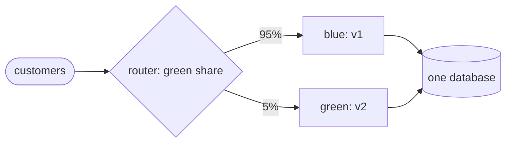

# Blue-Green and Canary Pattern — Architecture Diagram

One router. Two releases. A setting decides the share.

Mermaid source

```mermaid
flowchart LR
    C(["customers"]) --> R{"router: green share"}
    R -->|95%| B["blue: v1"]
    R -->|5%| G["green: v2"]
    B --> DB[("one database")]
    G --> DB
```

