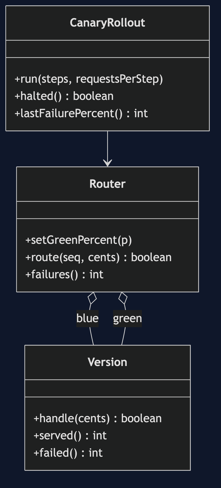
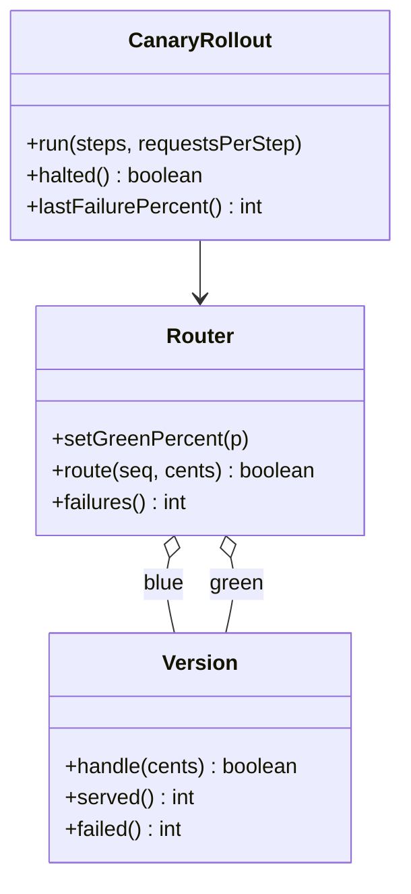

# Blue-Green and Canary Pattern — Class Diagram

A router in front of two releases, and a rollout that steers it.

Mermaid source

```mermaid
classDiagram
    class Router {
        +setGreenPercent(p)
        +route(seq, cents) boolean
        +failures() int
    }
    class Version {
        +handle(cents) boolean
        +served() int
        +failed() int
    }
    class CanaryRollout {
        +run(steps, requestsPerStep)
        +halted() boolean
        +lastFailurePercent() int
    }
    Router o-- Version : blue
    Router o-- Version : green
    CanaryRollout --> Router
```

