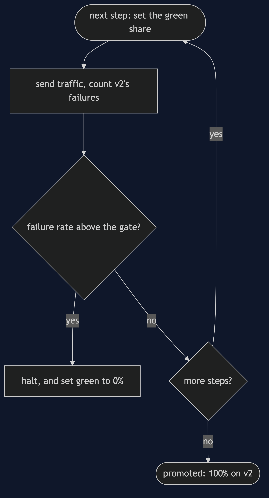
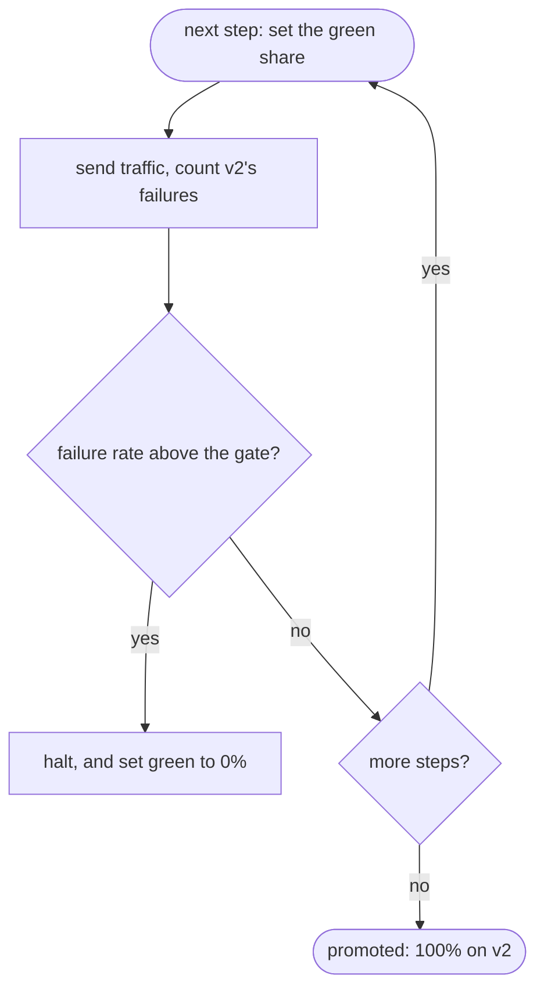

# Blue-Green and Canary Pattern — Data Flow Diagram

What the rollout does at each step.

Mermaid source

```mermaid
flowchart TD
    Step(["next step: set the green share"])
    Run["send traffic, count v2's failures"]
    Gate{"failure rate above the gate?"}
    Back["halt, and set green to 0%"]
    More{"more steps?"}
    Done(["promoted: 100% on v2"])
    Step --> Run --> Gate
    Gate -- yes --> Back
    Gate -- no --> More
    More -- yes --> Step
    More -- no --> Done
```

