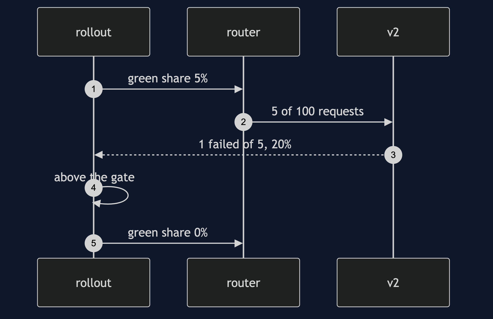
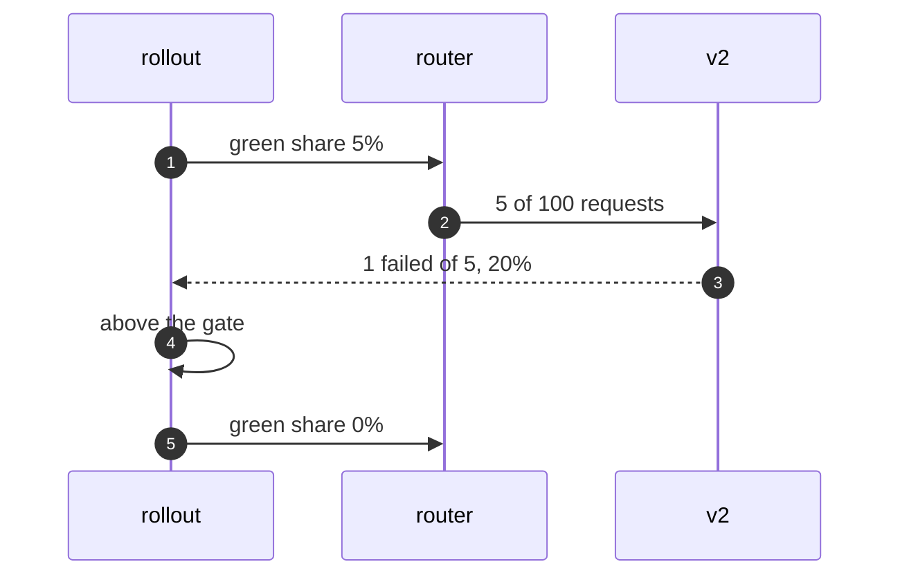

# Blue-Green and Canary Pattern — Sequence Diagram

Written for a listener with the screen off.

Say it in words. The rollout sets the green share to five percent. Traffic flows, and five in a hundred requests go to version two. The rollout counts version two's failures. One in five failed, which is twenty percent, above the gate. So the rollout halts, and sets the share back to zero. All traffic is on version one again.

Mermaid source

The load-bearing sentence: **the rollout watches the failures, and moves the setting.**
