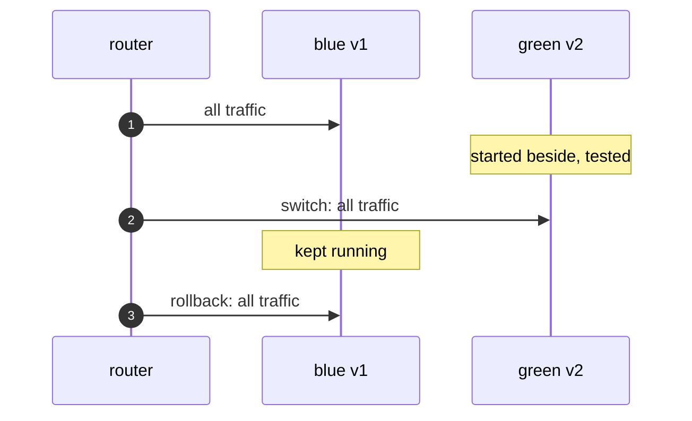

# Blue-Green and Canary Pattern — UML Sequence Diagrams

Four sequences.

## 1. Blue-Green Switch

Mermaid source

```mermaid
sequenceDiagram
    autonumber
    participant R as router
    participant B as blue v1
    participant G as green v2
    R->>B: all traffic
    Note over G: started beside, tested
    R->>G: switch: all traffic
    Note over B: kept running
    R->>B: rollback: all traffic
```

