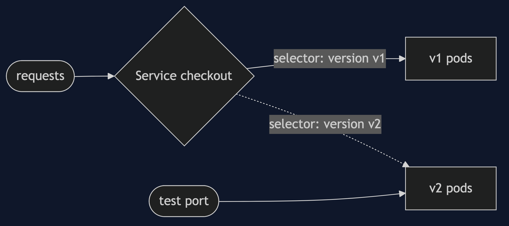
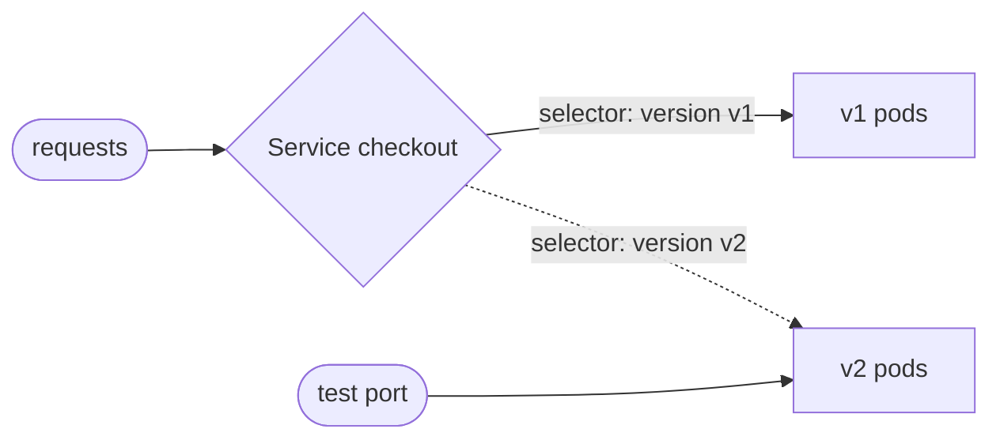

# Blue-Green and Canary with Kubernetes Pattern — Architecture Diagram

One Service picks pods by label. Its selector is the switch.

Mermaid source

```mermaid
flowchart LR
    C(["requests"]) --> S{"Service checkout"}
    S -->|selector: version v1| B["v1 pods"]
    S -.->|selector: version v2| G["v2 pods"]
    T(["test port"]) --> G
```

