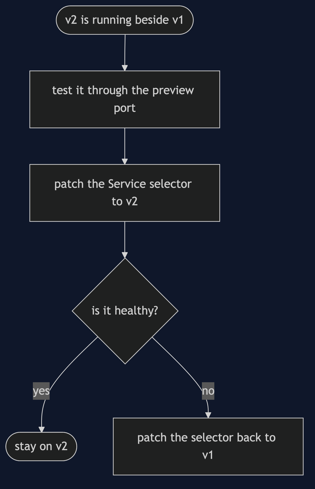
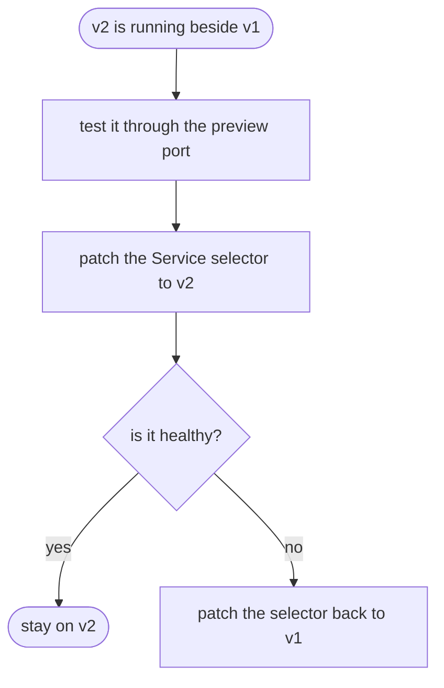

# Blue-Green and Canary with Kubernetes Pattern — Data Flow Diagram

How a release goes live.

Mermaid source

```mermaid
flowchart TD
    Start(["v2 is running beside v1"])
    Test["test it through the preview port"]
    Switch["patch the Service selector to v2"]
    Watch{"is it healthy?"}
    Keep(["stay on v2"])
    Back["patch the selector back to v1"]
    Start --> Test --> Switch --> Watch
    Watch -- yes --> Keep
    Watch -- no --> Back
```

