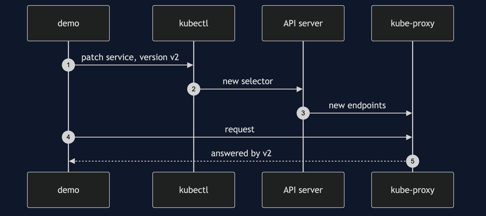

# Blue-Green and Canary with Kubernetes Pattern — Sequence Diagram

Written for a listener with the screen off.

Say it in words. The demo asks kubectl to patch the checkout service, so that its selector says version two. Kubernetes updates the list of pods behind the service. A moment later, kube-proxy on the node changes its rules. Requests to the service now reach version two pods only. To go back, the demo patches the selector again.

The load-bearing sentence: **the switch reaches the rules a moment after the patch, so the demo polls until it does.**
