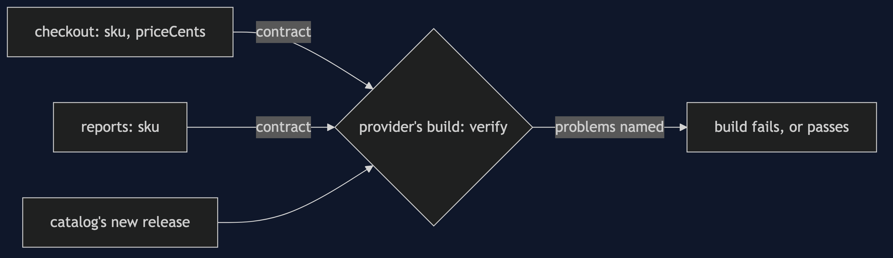
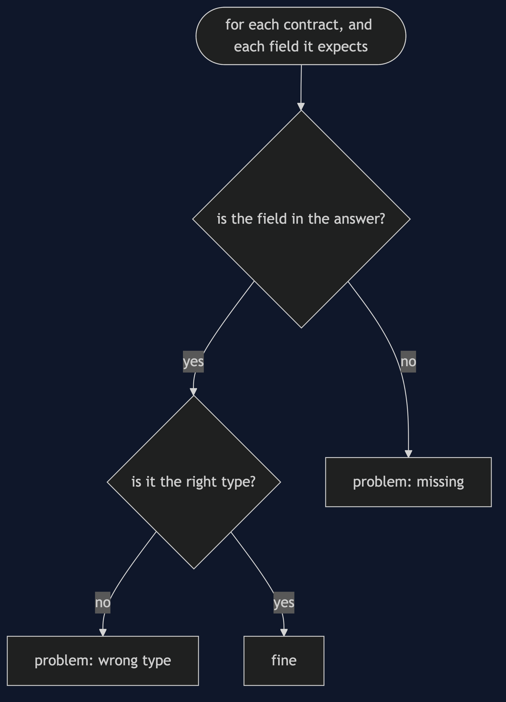
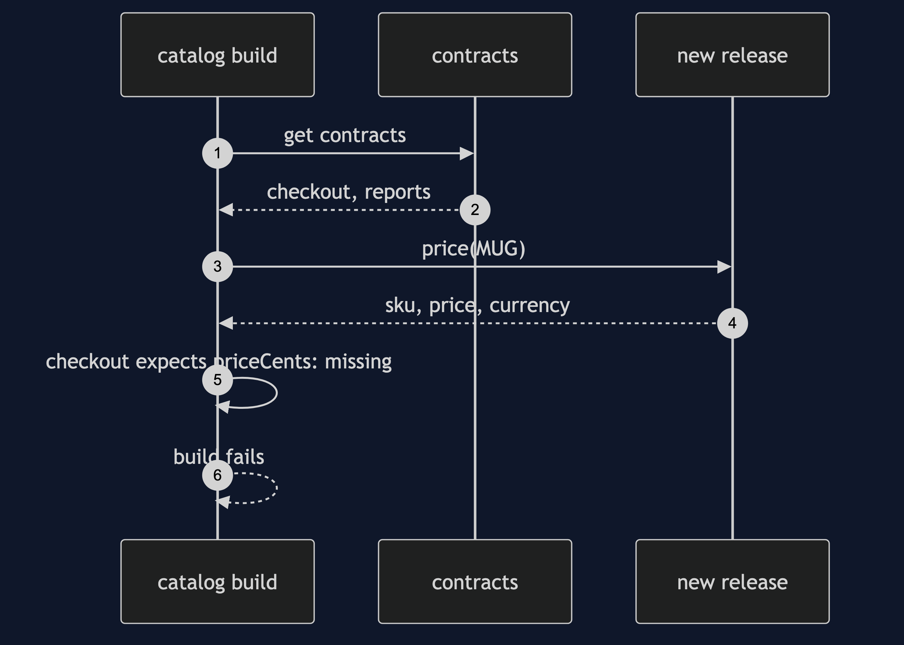

# Consumer-Driven Contract Pattern

```
src/main/java/com/jk/explore/contract/
├── ContractDemo.java                the six acts
├── Contract.java                    a consumer's name, and the fields and types it reads
├── Type.java                        string, integer, boolean
├── Verifier.java                    checks a provider's real answer against every contract
├── PriceProvider.java               the catalog's releases: v1, renamed, extra field, pounds
├── Checkout.java                    a consumer, with its contract
├── Reports.java                     a consumer, with a smaller contract
```

**Consumer-driven contract: each consumer writes down what it needs, and the provider checks itself before every release.**

This project is in [platform-design-patterns](..). It is the safety net for changes across services, the test-side partner of [Anti-Corruption Layer](../../domain-driven-design-patterns/anti-corruption-layer-pattern), and the reason [Blue-Green and Canary](../blue-green-and-canary-pattern) can go back safely.

## Run

```bash
./gradlew run
```

Six acts. Every number quoted below comes from this program's own output.

```
ONE. Nobody told the consumer.
  the catalog renamed priceCents to price and released. checkout, 2 mugs: total -1, meaning the order failed.
  it was found in production, by a customer.
TWO. The consumer writes down what it needs.
  checkout's contract: {priceCents=INTEGER, sku=STRING}.
  reports' contract: {sku=STRING}.
  each lists only the fields it reads, and their types.
THREE. The provider checks itself.
  the catalog's real answer against both contracts. problems: []. safe to release.
FOUR. The rename is caught before release.
  problems: [checkout expects priceCents (integer): missing].
  the build fails, and it names the consumer and the field.
FIVE. Adding is safe, and only the affected are named.
  a release that adds a stock field. problems: [].
  the rename again, per consumer: checkout 1 problem, reports 0 problems. reports never used that field.
SIX. The bill.
  a release that now sends pounds, not pence, in the same field. problems: []. it passes.
  checkout, 2 mugs: total 32, where it should be 3200.
  a contract checks the shape, and not the meaning. and every consumer must keep its contract up to date, or the check protects nobody.
```

## Test

```bash
./gradlew test
```

2 test classes, 7 test methods, offline, with nothing installed and no framework.

## Technologies and versions

| What | Version | Why it is here |
| --- | --- | --- |
| Java | 21 | The repository standard, via the Gradle toolchain block |
| Gradle | 9.2.1 | The wrapper in this directory; no separate install needed |
| JUnit 5 | 5.10.2 | Test runner |

No framework. A hand-built project stays plain Java so the mechanism is the whole lesson.

## Learning Material

| Document | What it covers |
| --- | --- |
| [`docs/problem-statement.md`](docs/problem-statement.md) | The scenario, and the problem |
| [`docs/consumer-driven-contract-pattern-explained.md`](docs/consumer-driven-contract-pattern-explained.md) | The pattern, and six acts |
| [`docs/class-diagram.md`](docs/class-diagram.md) | The types |
| [`docs/architecture-diagram.md`](docs/architecture-diagram.md) | The parts and how they connect |
| [`docs/data-flow-diagram.md`](docs/data-flow-diagram.md) | What happens to one request |
| [`docs/sequence-diagram.md`](docs/sequence-diagram.md) | Written for a listener with the screen off |
| [`docs/uml-diagram.md`](docs/uml-diagram.md) | Four sequences |
| [`docs/animation.html`](docs/animation.html) | The six acts in a browser |
| [`docs/prerequisites.md`](docs/prerequisites.md) | What you need to know |
| [`docs/session.md`](docs/session.md) | A one-hour taught session |
| [`docs/spec.md`](docs/spec.md) | The generated specification |
| [`docs/youtube.md`](docs/youtube.md) | Title, description and chapters |

### The pattern in one picture


### Where each piece sits



### How one request moves



### Who calls whom, in order



### All four sequences


### Video

Built from [`video/scenes.py`](video/scenes.py) by
[`video/build_video.sh`](video/build_video.sh). The rendered file is not
committed; see the repository README for why.

## Where you have already met this

Pact in many microservice teams, Spring Cloud Contract, and Google's and Netflix's approaches to safe change across services.

## When this is too much

If provider and consumer are one team with one release, an ordinary test is enough. Contracts pay off across teams that release apart.

## Where this sits

This project is in [`platform-design-patterns`](..), and is meant to be read with its neighbours there.
