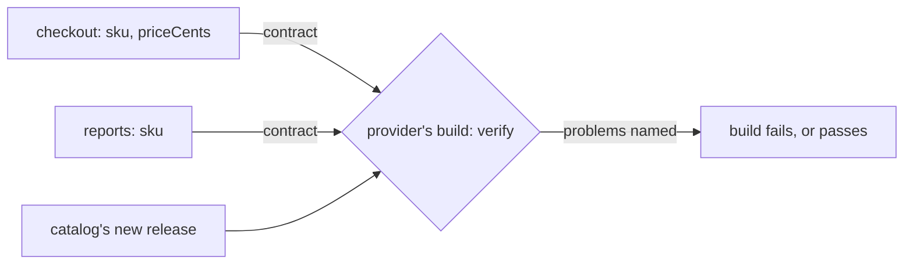

# Consumer-Driven Contract Pattern — Architecture Diagram

Consumers hand their contracts to the provider's build.

Mermaid source

```mermaid
flowchart LR
    C["checkout: sku, priceCents"] -->|contract| V{"provider's build: verify"}
    R["reports: sku"] -->|contract| V
    P["catalog's new release"] --> V
    V -->|problems named| B["build fails, or passes"]
```

