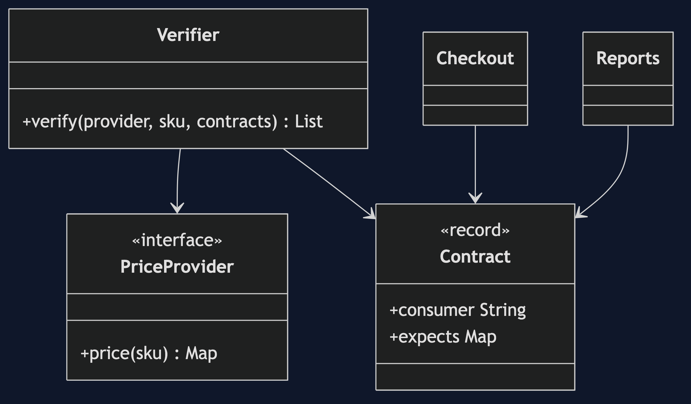
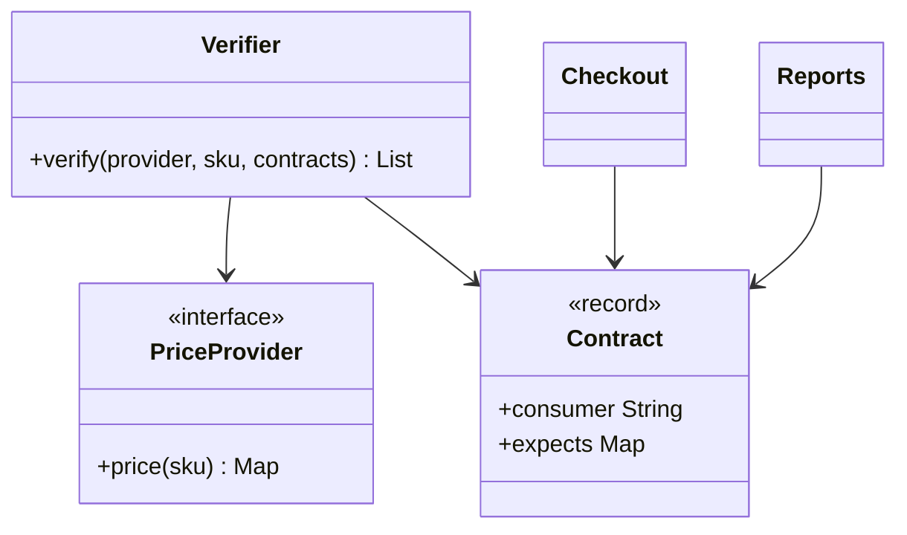

# Consumer-Driven Contract Pattern — Class Diagram

Contracts as data, a verifier, and the provider's releases.

Mermaid source

```mermaid
classDiagram
    class Contract {
        <<record>>
        +consumer String
        +expects Map
    }
    class Verifier {
        +verify(provider, sku, contracts) List
    }
    class PriceProvider {
        <<interface>>
        +price(sku) Map
    }
    class Checkout
    class Reports
    Verifier --> PriceProvider
    Verifier --> Contract
    Checkout --> Contract
    Reports --> Contract
```

