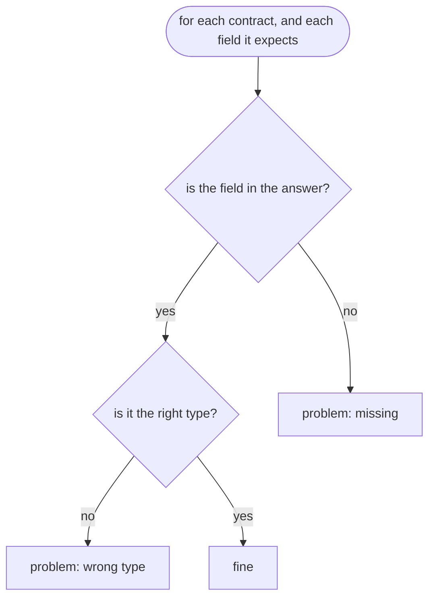

# Consumer-Driven Contract Pattern — Data Flow Diagram

What the verifier does for each contract.

Mermaid source

```mermaid
flowchart TD
    Start(["for each contract, and each field it expects"])
    Has{"is the field in the answer?"}
    Type{"is it the right type?"}
    Miss["problem: missing"]
    Wrong["problem: wrong type"]
    Ok["fine"]
    Start --> Has
    Has -- no --> Miss
    Has -- yes --> Type
    Type -- no --> Wrong
    Type -- yes --> Ok
```

