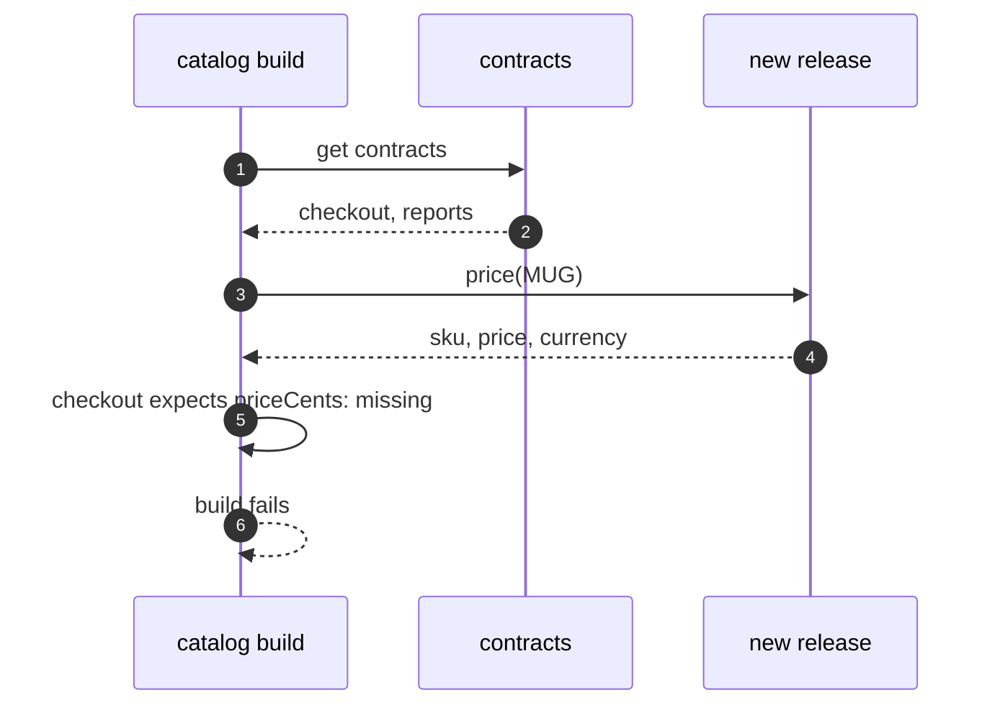

# Consumer-Driven Contract Pattern — Sequence Diagram

Written for a listener with the screen off.

Say it in words. The catalog team changes the price service, and starts its build. The build gets the contracts from checkout and from reports. It asks the new release for a real answer. It checks each field that each consumer expects. Price cents, which checkout expects, is missing. The build fails, and says checkout, and price cents. The team fixes it before release.

Mermaid source

The load-bearing sentence: **the provider learns about the break in its own build.**
