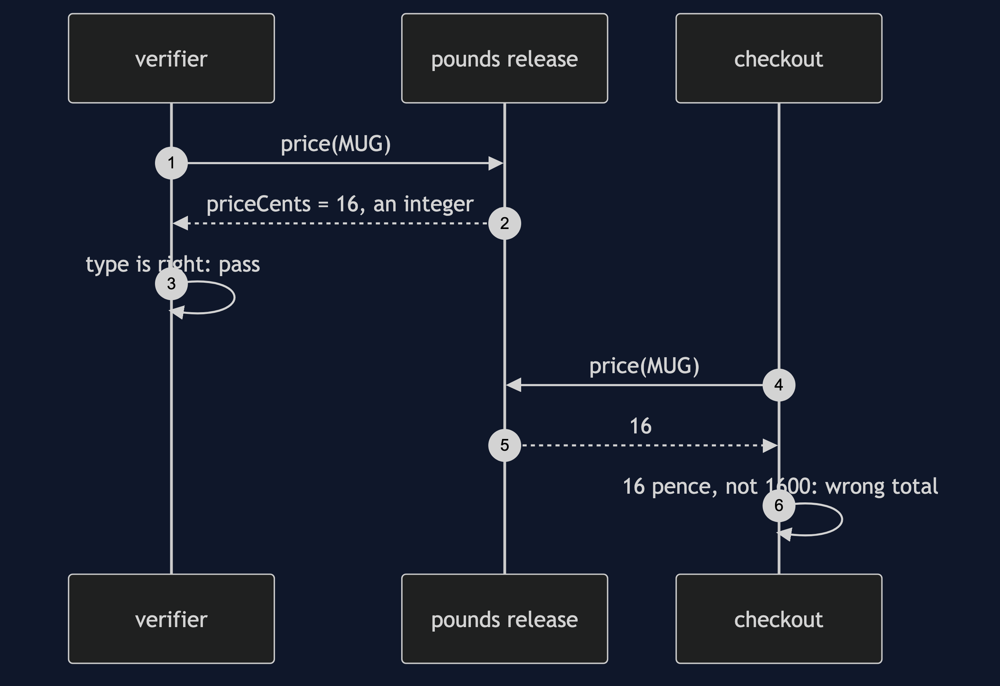
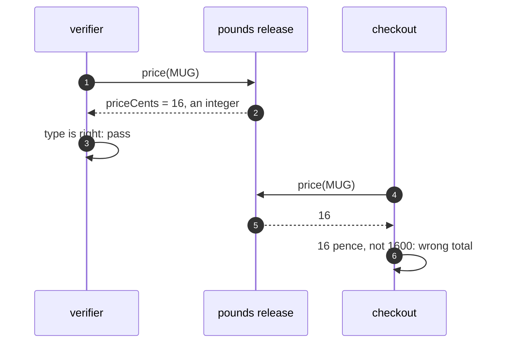

# Consumer-Driven Contract Pattern — UML Sequence Diagrams

Four sequences.

## 1. What A Contract Cannot See

Mermaid source

```mermaid
sequenceDiagram
    autonumber
    participant V as verifier
    participant P as pounds release
    participant C as checkout
    V->>P: price(MUG)
    P-->>V: priceCents = 16, an integer
    V->>V: type is right: pass
    C->>P: price(MUG)
    P-->>C: 16
    C->>C: 16 pence, not 1600: wrong total
```

