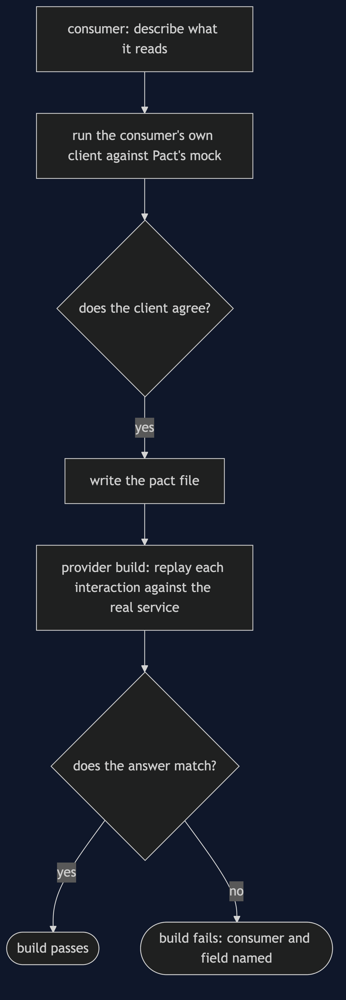
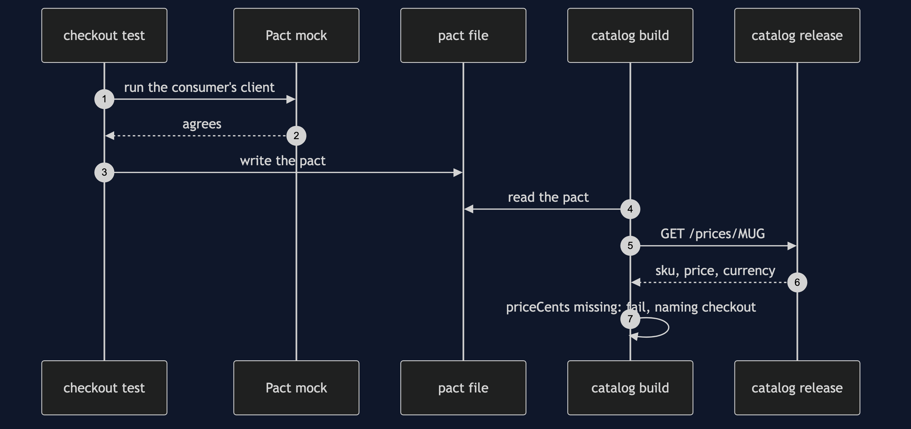

# Consumer-Driven Contract with Pact Pattern

```
src/main/java/com/jk/explore/pactcdc/
├── PactDemo.java                the six acts
├── Pacts.java                   the consumers' pacts, written with Pact's DSL
├── Verifier.java                runs Pact's provider verification against a release
├── CatalogVerification.java     the provider's verification test, as Pact needs it
├── Catalog.java                 the catalog's price service: a real HTTP server
├── Release.java                 v1, renamed, extra field, pounds
├── CheckoutClient.java          a consumer's own code
└── ReportsClient.java           another consumer's own code
```

**With Pact, each consumer writes a pact file, and the provider's build replays it against the real service.**

This project is the framework version of [Consumer-Driven Contract](../consumer-driven-contract-pattern). That project built the mechanism by hand. This one shows the same idea inside Pact. It does not re-teach the pattern. It shows what Pact adds, the failures that are its own, and what it costs.

## Run

```bash
./gradlew run
```

Six acts. The partner project, Consumer-Driven Contract, built the mechanism by hand. Here the same idea runs through Pact, and every count comes from real output.

```
ONE. Nobody told the consumer.
  the catalog renamed priceCents to price and released. checkout, 2 mugs: total -1, meaning the order failed.
  it was found in production, by a customer.
TWO. The consumer writes a pact.
  each consumer's own client was run against Pact's mock of the catalog, and agreed: true. two pact files were written.
  checkout's pact: {priceCents=integer, sku=string}.
  reports' pact: {sku=string}.
THREE. The provider replays the pacts.
  Pact replays each pact against the real catalog over HTTP. interactions checked: 2, problems: []. safe to release.
FOUR. The rename is caught before release.
  interactions checked: 2, failed: 1.
  checkout - body: Actual map is missing the following keys: priceCents
  the build fails, and Pact names the consumer and the field. reports' pact still passes.
FIVE. Adding is safe.
  a release that adds a stock field. interactions checked: 2, problems: [].
SIX. The bill.
  a release that now sends pounds, not pence, in the same field. problems: []. it passes.
  checkout, 2 mugs: total 32, where it should be 3200.
  a pact checks the shape, and not the meaning. and every consumer must keep its pact up to date, or the check protects nobody.
```

## Test

```bash
./gradlew test
```

2 test classes, 7 test methods, offline, with each Spring context started inside the test, and no server.

## Technologies and versions

| What | Version | Why it is here |
| --- | --- | --- |
| Java | 21 | The repository standard, via the Gradle toolchain block |
| Gradle | 9.2.1 | The wrapper in this directory |
| Pact JVM | 4.7.5 | The consumer DSL and the provider verifier |
| JUnit | 5.10.2 | Runs the provider verification |
| slf4j-simple | 2.0.16 | Pact's logging |

See [`docs/dependencies.md`](docs/dependencies.md).

## Learning Material

| Document | What it covers |
| --- | --- |
| [`docs/problem-statement.md`](docs/problem-statement.md) | The partner's contracts, and what is new |
| [`docs/consumer-driven-contract-with-pact-pattern-explained.md`](docs/consumer-driven-contract-with-pact-pattern-explained.md) | Real pact files, replayed over HTTP |
| [`docs/class-diagram.md`](docs/class-diagram.md) | The types |
| [`docs/architecture-diagram.md`](docs/architecture-diagram.md) | Consumers, pact files and the provider |
| [`docs/data-flow-diagram.md`](docs/data-flow-diagram.md) | How a pact is written and replayed |
| [`docs/sequence-diagram.md`](docs/sequence-diagram.md) | Written for a listener with the screen off |
| [`docs/uml-diagram.md`](docs/uml-diagram.md) | Four sequences |
| [`docs/animation.html`](docs/animation.html) | The six acts in a browser |
| [`docs/prerequisites.md`](docs/prerequisites.md) | What you need to know |
| [`docs/session.md`](docs/session.md) | A one-hour taught session |
| [`docs/spec.md`](docs/spec.md) | The generated specification |
| [`docs/youtube.md`](docs/youtube.md) | Title, description and chapters |
| [`docs/dependencies.md`](docs/dependencies.md) | What Pact is, what it costs, and that skipping this project loses none of the pattern |

### The pattern in one picture


### Where each piece sits


### How one request moves



### Who calls whom, in order



### All four sequences


### Video

Built from [`video/scenes.py`](video/scenes.py) by
[`video/build_video.sh`](video/build_video.sh). The rendered file is not
committed; see the repository README for why.

## Where you have already met this

Many microservice teams, and Pact Broker or PactFlow in their pipelines.

## When this is too much

If provider and consumer are one team with one release, an ordinary test is enough. Pact pays off across teams that release apart.

## Where this sits

This project pairs with [Consumer-Driven Contract](../consumer-driven-contract-pattern), and is a framework version in [`platform-design-patterns`](..).
