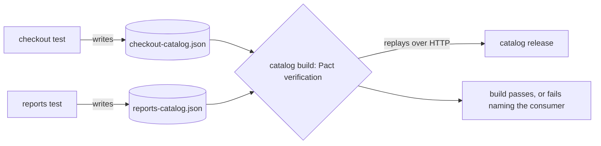

# Consumer-Driven Contract with Pact Pattern — Architecture Diagram

Consumers write pact files. The provider replays them.

Mermaid source

```mermaid
flowchart LR
    C["checkout test"] -->|writes| F1[("checkout-catalog.json")]
    R["reports test"] -->|writes| F2[("reports-catalog.json")]
    F1 --> V{"catalog build: Pact verification"}
    F2 --> V
    V -->|replays over HTTP| P["catalog release"]
    V --> B["build passes, or fails naming the consumer"]
```

