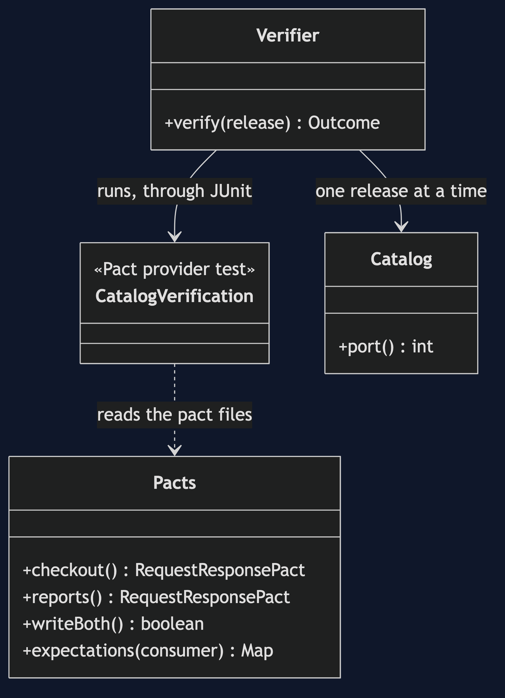
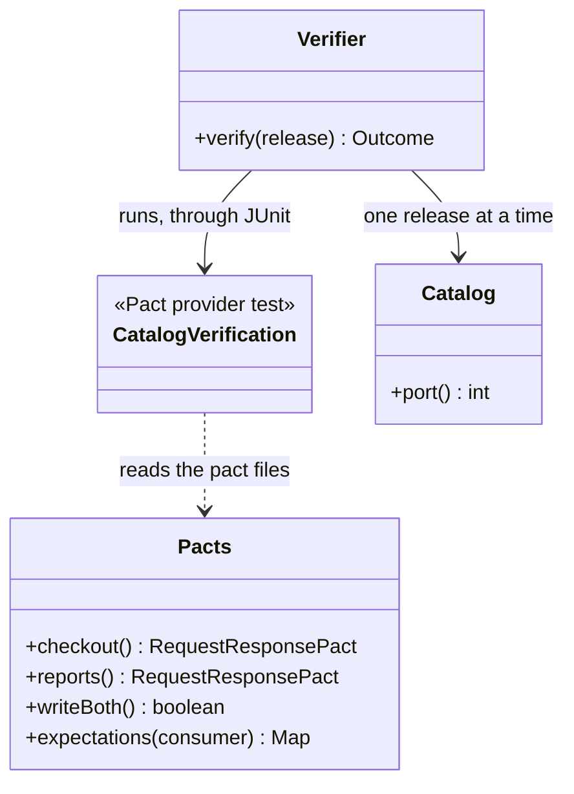

# Consumer-Driven Contract with Pact Pattern — Class Diagram

The consumers' pacts, a verifier, and the catalog under test.

Mermaid source

```mermaid
classDiagram
    class Pacts {
        +checkout() RequestResponsePact
        +reports() RequestResponsePact
        +writeBoth() boolean
        +expectations(consumer) Map
    }
    class Verifier {
        +verify(release) Outcome
    }
    class CatalogVerification {
        <<Pact provider test>>
    }
    class Catalog {
        +port() int
    }
    Verifier --> CatalogVerification : runs, through JUnit
    Verifier --> Catalog : one release at a time
    CatalogVerification ..> Pacts : reads the pact files
```

