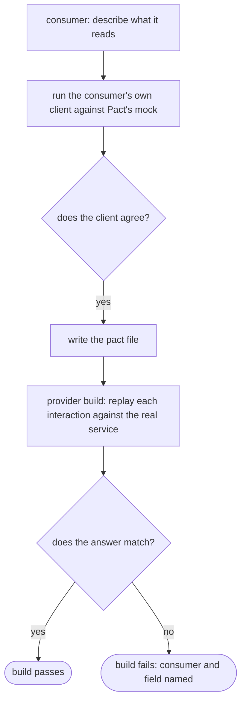

# Consumer-Driven Contract with Pact Pattern — Data Flow Diagram

How a pact is written and replayed.

Mermaid source

```mermaid
flowchart TD
    Write["consumer: describe what it reads"]
    Mock["run the consumer's own client against Pact's mock"]
    Agree{"does the client agree?"}
    File["write the pact file"]
    Replay["provider build: replay each interaction against the real service"]
    Match{"does the answer match?"}
    Pass(["build passes"])
    Fail(["build fails: consumer and field named"])
    Write --> Mock --> Agree
    Agree -- yes --> File --> Replay --> Match
    Match -- yes --> Pass
    Match -- no --> Fail
```

