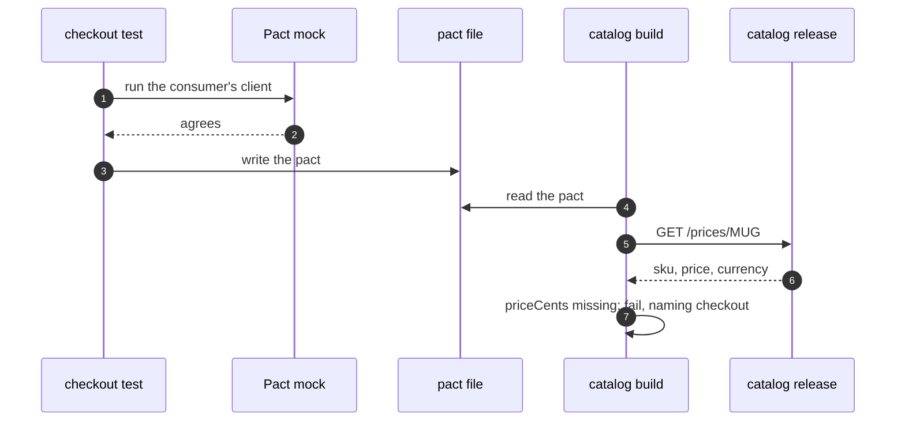

# Consumer-Driven Contract with Pact Pattern — Sequence Diagram

Written for a listener with the screen off.

Say it in words. The checkout's test describes what it reads, and runs its own client against Pact's mock. They agree, and Pact writes a pact file. Later, the catalog's build starts. Pact reads the file, and sends the same request to the real catalog over HTTP. It compares the answer with what the file says. Price cents is missing, so it fails the build, and says checkout, and price cents.

Mermaid source

The load-bearing sentence: **the provider learns about the break in its own build.**
