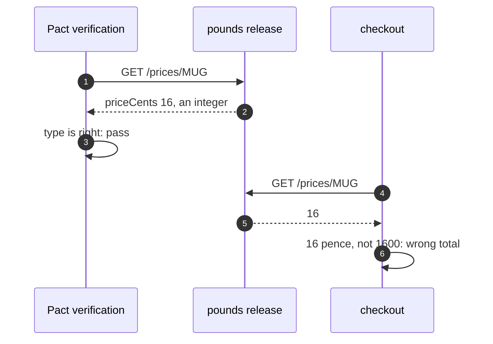

# Consumer-Driven Contract with Pact Pattern — UML Sequence Diagrams

Four sequences.

## 1. What A Pact Cannot See

Mermaid source

```mermaid
sequenceDiagram
    autonumber
    participant V as Pact verification
    participant C as pounds release
    participant K as checkout
    V->>C: GET /prices/MUG
    C-->>V: priceCents 16, an integer
    V->>V: type is right: pass
    K->>C: GET /prices/MUG
    C-->>K: 16
    K->>K: 16 pence, not 1600: wrong total
```

