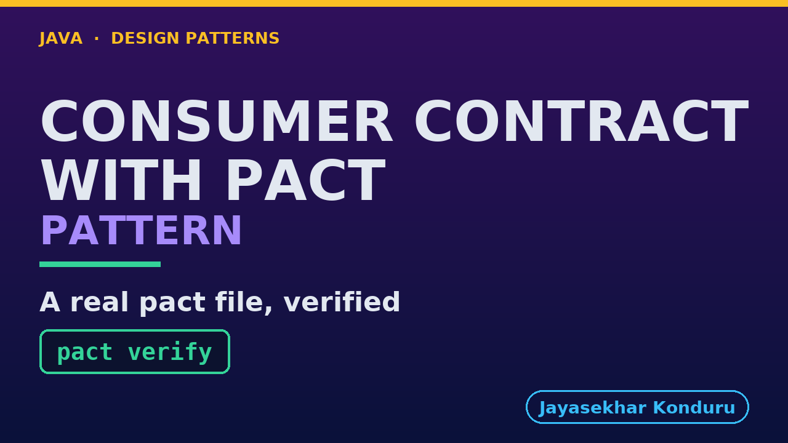

# YouTube — Consumer Driven Contract With Pact Pattern

Everything needed to publish `video/consumer-driven-contract-with-pact-pattern-explained.mp4`. Copy the fields straight out of this file.

Chapter timings are generated from the video's `.srt`. Re-run `python3 docs/make_youtube_docs.py consumer-driven-contract-with-pact` after any change to the narration, or they will be wrong.

## Title

```
Consumer-Driven Contract with Pact
```

34 characters — under the 60 YouTube shows before truncating in search results.

## Description

The first two lines are what a viewer sees above the fold, so they carry the hook rather than the boilerplate.

```
Consumer-Driven Contract pattern in Java, explained with Pact. A consumer's test writes a pact file, and the provider's build replays that file against the real service and fails on any difference. With an online store's price service and checkout, we watch a field rename break checkout in production, let two consumers write real pact files, replay them over real HTTP and pass, then catch the rename before release with the consumer named. We confirm that adding a field is safe, and finish with what a pact cannot catch: a change of meaning.

CHAPTERS
00:00 Introduction
01:02 The Partner Project
01:24 Before The First Line
01:49 Nobody Told The Consumer
02:02 The Consumer Writes A Pact
02:21 The Provider Replays The Pacts
02:33 The Rename Is Caught
02:51 Adding Is Safe
03:01 The Bill
03:24 The Verdict
03:44 How To Recognise It
03:59 Where You Have Met This
04:06 What Was Used
04:16 What Is Real Here
04:31 When This Is Too Much
04:42 Thanks for Watching

SOURCE CODE, WRITTEN NOTES AND AN INTERACTIVE ANIMATION
https://github.com/jk-boot-up/java-design-patterns/tree/main/gradle-java/platform-design-patterns/consumer-driven-contract-with-pact-pattern

WHAT YOU NEED FIRST
Java 21 and a working knowledge of classes and interfaces. No prior design-pattern knowledge is assumed. The full prerequisites are in docs/prerequisites.md in the repository.
```

## Chapters

YouTube renders these as chapters only if there are at least three and the first is at `00:00`.

```
00:00 Introduction
01:02 The Partner Project
01:24 Before The First Line
01:49 Nobody Told The Consumer
02:02 The Consumer Writes A Pact
02:21 The Provider Replays The Pacts
02:33 The Rename Is Caught
02:51 Adding Is Safe
03:01 The Bill
03:24 The Verdict
03:44 How To Recognise It
03:59 Where You Have Met This
04:06 What Was Used
04:16 What Is Real Here
04:31 When This Is Too Much
04:42 Thanks for Watching
```

## Tags

```
consumer driven contract, pact, contract testing, design patterns, java design patterns, gang of four, java 21, software design, clean code, object oriented design, java tutorial, ecommerce, programming tutorial
```

211 characters, under YouTube's 500 limit.

## Thumbnail



**Upload `docs/thumbnail.png`** — 1280×720, the size YouTube recommends, generated by `docs/make_thumbnails.py`. It is deliberately not the same image as the video's opening frame: a thumbnail is judged at about 360 pixels wide in a search result, so this one carries only the pattern name, one line of promise and one short piece of code, each set large enough to survive the shrink.

`video/poster.png` is the 1920×1080 opening frame, produced by the video build. It stays in the repository as the title card; it is not what gets uploaded.

YouTube will not pick the thumbnail up on its own — upload it under **Details → Thumbnail → Upload file**. A custom thumbnail requires a verified channel.

## Upload checklist

- [ ] Upload `video/consumer-driven-contract-with-pact-pattern-explained.mp4` (1080p, H.264, 30 fps, AAC 48 kHz — already YouTube's recommended settings, no re-encode needed)
- [ ] Set the video language to **English** first, or the subtitle option may not appear
- [ ] Add subtitles: *Video elements → Add subtitles → Upload file → With timing* → `video/consumer-driven-contract-with-pact-pattern-explained.srt`
- [ ] Upload `docs/thumbnail.png` as the thumbnail — do not let YouTube auto-pick a frame
- [ ] Paste the title, description and tags from above
- [ ] Add to the **Java Design Patterns** playlist, in learning order
- [ ] Wait for 1080p processing before sharing the link — code slides are unreadable at 360p

## Cards and end screen

End screen links to whichever pattern video goes up next — set it at upload time rather than assuming an order.

Add a card partway through pointing at the playlist, so a viewer who arrives at this pattern from search can find the rest of the series.

## Runtime

Approximately 05:18, narrated at 145 words per minute.
