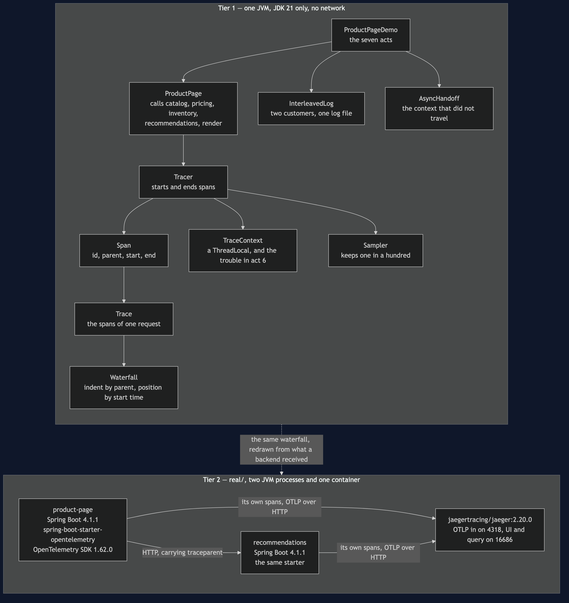
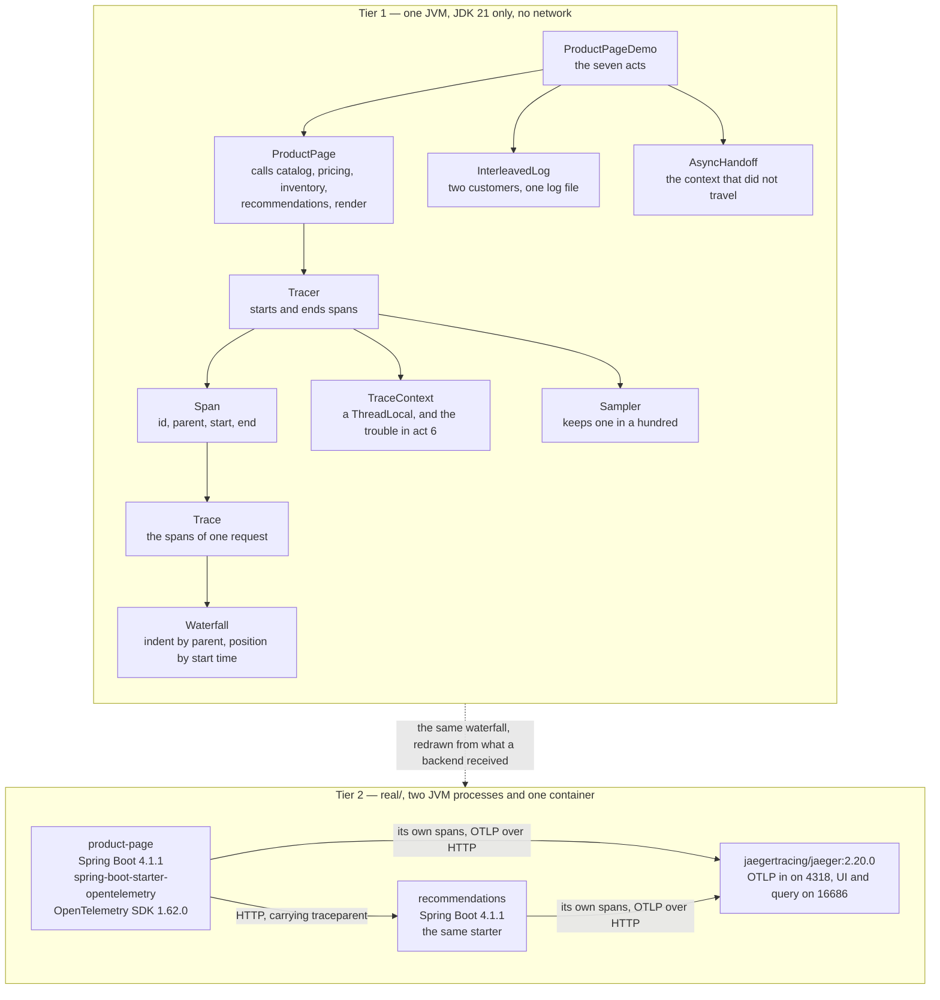

# Distributed Tracing Pattern — Architecture Diagram

Where each piece runs, in both tiers, and which technology it is written in. The class
diagram shows the types and the sequence diagrams show the order of events; this one
answers the question those two cannot, which is **what would I have to start**.

Read it as two boxes stacked. The upper box is Tier 1: one Java program, one process, no
network and no collector. The tracer is about a hundred lines, the clock is scripted, span
ids are sequential, and the waterfall is drawn with string concatenation. The lower box is
Tier 2, under `real/`: two Spring Boot services on a real HTTP hop, OpenTelemetry doing the
instrumenting, and a running Jaeger receiving the spans and drawing the same picture.

The thing to look at in Tier 2 is what the arrow between the two services carries. It is an
ordinary HTTP request with one extra header, `traceparent`, holding the trace id and the id
of the span that is making the call. That header is the entire mechanism. Everything else —
the storage, the query API, the waterfall in a browser — is machinery built on top of one
string being passed along.

The second thing to look at is that both services send their spans to the backend
**independently**. No service forwards another service's data. Each one posts its own
finished spans to the collector, and the trace is reassembled at the far end from the
parent ids. That is why one service failing to send is invisible: nothing is missing from
anybody's request, and the hole only exists in a picture nobody is obliged to look at.

Mermaid source

## What the diagram is telling you to count

**One box per unit of work, and one parent id per box.** Every span on the picture knows
which span asked for it. That single field is what turns a pile of measurements into a
story, and it is the difference between this pattern and having good logs.

**Two arrows into the backend, not one.** Each service reports for itself. There is no
central thing collecting on everyone's behalf, which is what makes the pattern survive
services written by different teams in different languages — and what makes a missing
service so hard to notice.

**The sampler sits at the front door and nowhere else.** The decision to keep or discard a
trace is made once, at the only moment in the request when nothing whatsoever is known
about it. That placement is the honest trade drawn as a position on a diagram: a one per
cent sample answers *recommendations is slow on average* perfectly well and cannot answer
*why was this one slow* at all.

## What it deliberately leaves out

There is no batching, no back-pressure, no retry on export, no clock skew between machines,
and no storage bill. Real tracing has all five, and each one can quietly change what ends up
in the picture. Tier 1 leaves them out because the argument it is making — what a span
carries, why the parent field is the whole thing, how self time is computed, and what each
of the three failures looks like from outside — does not need them.

Tier 2 leaves out the mesh-level version, where the proxies do the tracing and no
application code is involved. That arrangement exists, and it produces spans for network
hops rather than for the work inside a service, which is a different and less useful
picture. The comparison belongs with the Sidecar pattern, where the proxies are already on
the diagram.
