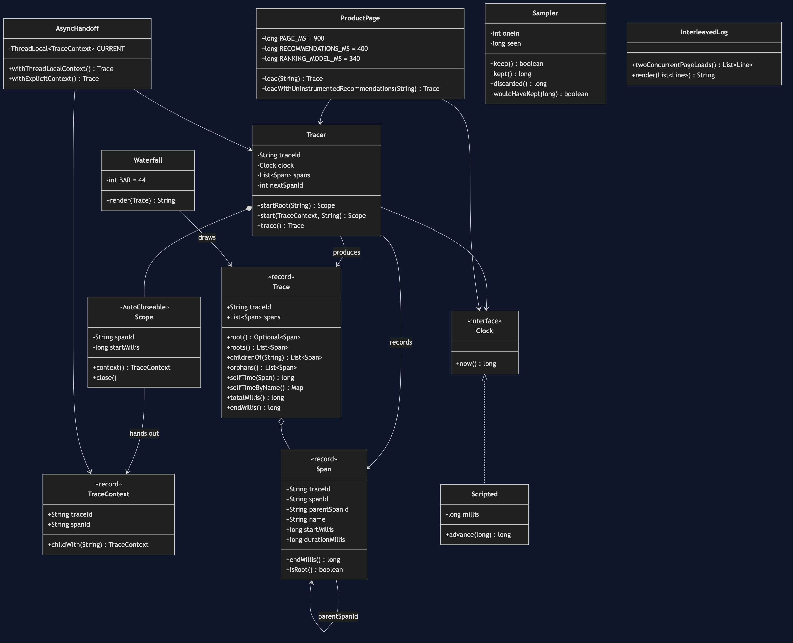
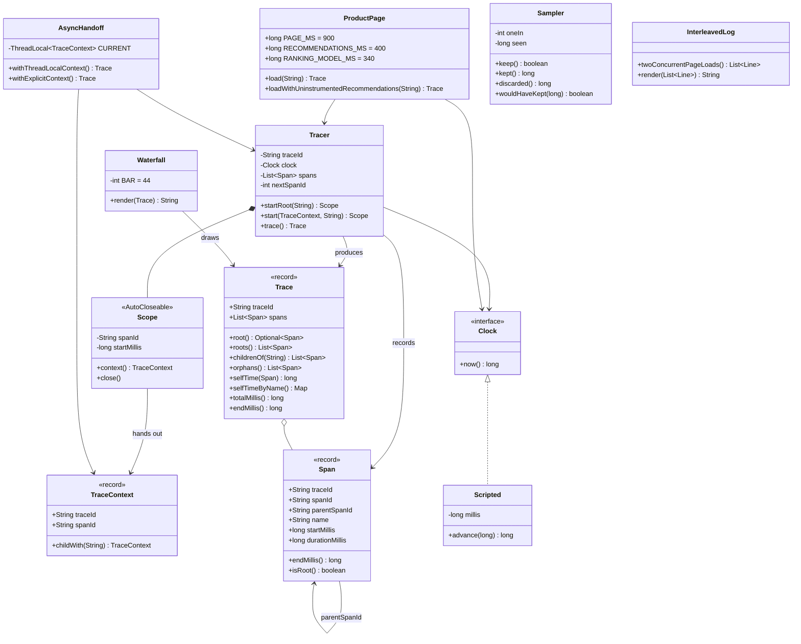

# Distributed Tracing Pattern — Class Diagram

Shows the static structure: the two identifiers that have to travel, the span that
records one unit of work, the tracer that mints and times them, the trace that does
the arithmetic, the drawing that is derived entirely from the parent links, and the
three classes that each demonstrate one item on the bill.

The single most important thing on this diagram is a **self-reference**: `Span`
points at `Span`, through `parentSpanId`. That one field is the entire difference
between this pattern and a pile of timestamps. Remove it and every class below
`Span` on the diagram becomes impossible — `Trace` cannot compute self time,
`Waterfall` cannot indent anything, and you are back to four logs merged by time.

The second most important thing is a **direction of dependency**. `Waterfall`
points at `Trace`, and `Trace` points at nothing but `Span`. There is no class
anywhere in this project whose job is to decide what the picture looks like. The
picture is a rendering of the parent links and nothing else, which is why a hosted
tracing tool and forty lines of Java draw the same shape.

And the third: `InterleavedLog` connects to **nothing**. It is not part of the
pattern. It is the thing the pattern replaces.



<details>
<summary>Mermaid source</summary>



</details>

---

## Reading The Diagram For The Argument

### `Span --> Span`, and why it is the whole pattern

Every other arrow on this diagram is ordinary — a class using another class. The
arrow from `Span` to itself is the one carrying the idea.

A log line knows *when*. A span knows *when*, and *because of what*. That second
piece of knowledge is a single string field, `parentSpanId`, and it costs nothing to
record. What it buys is that a flat collection of spans can be reassembled into the
tree the request actually was, by anybody, later, with no cooperation from the
services that produced it.

`parentSpanId` is `null` for exactly one span per request — the one at the front
door. `Span.isRoot()` is that check, and `Trace.roots()` returning a **list** rather
than an `Optional` is a deliberate admission: more than one root is not an edge
case, it is what a lost context looks like from the outside.

### `Tracer *-- Scope`, and the closing brace

`Scope` is an inner class, and it is `AutoCloseable` for one reason: the duration
is not known until the work is finished, so the span can only be recorded on the
way out.

```java
try (Tracer.Scope pricing = tracer.start(request, "pricing")) {
    // work
}   // <- the span is recorded here, and only here
```

That makes the closing brace load-bearing. A span started and never closed does not
appear in the trace at all, which in a real system is how an exception thrown past
an un-closed span deletes the record of the very call that failed.
`TracerTest.anUnclosedSpanIsInvisible` pins that down.

### `Trace o-- Span` and the arithmetic

`Trace` is an aggregation of spans plus five questions you can ask them. Four of
those questions — `root`, `childrenOf`, `orphans`, `selfTime` — are each three or
four lines, and none of them needs anything the spans did not already carry.

`selfTime` is the one to look at:

```java
public long selfTime(Span span) {
    long childTime = childrenOf(span.spanId()).stream()
            .mapToLong(Span::durationMillis)
            .sum();
    return span.durationMillis() - childTime;
}
```

Duration less what it was waiting on. The root span's self time is zero, which is
why total time never names anybody and self time always does.

### `Waterfall --> Trace`, one direction only

`Waterfall` reads a `Trace` and produces a string. `Trace` has never heard of
`Waterfall`. There is no layout object, no configuration, no notion of a "view".

That asymmetry is worth naming because of what it implies about the tools. When you
open Jaeger and see a flame graph, you are not looking at something Jaeger invented.
You are looking at a rendering of `parentSpanId`, which is a property of your data,
not of their product. Swap the renderer and the answer is the same.

### `AsyncHandoff --> TraceContext` — the dependency that goes missing

`AsyncHandoff` holds a `ThreadLocal<TraceContext>`, and the diagram cannot show
what is wrong with it, which is rather the point. A thread-local field looks like
any other field. The failure is not structural; it is that the field is read on a
thread that never wrote it.

Both methods on this class have the same dependencies, the same span count, and the
same elapsed time. One of them produces a trace with two roots. The only difference
is whether `TraceContext` was read before the handoff or after it.

### `InterleavedLog` — connected to nothing

There is no arrow from `InterleavedLog` to any other class, because it is not part
of the pattern and never calls into it. It shares only `ProductPage`'s duration
constants, so that the two halves of the story are the same request seen two ways.

It is on the diagram for the same reason the "before" panel is on the poster: the
pattern is unconvincing until you have sat with what it replaces.
