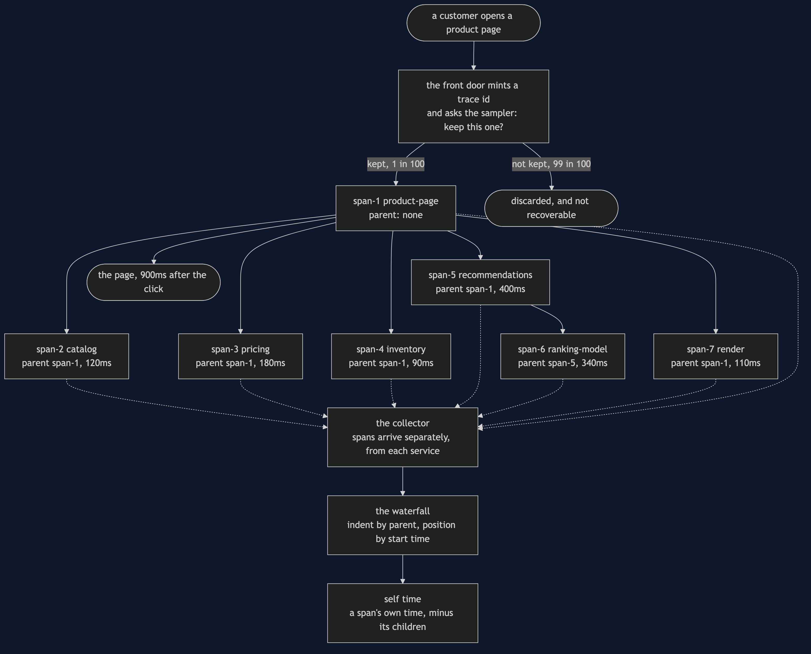
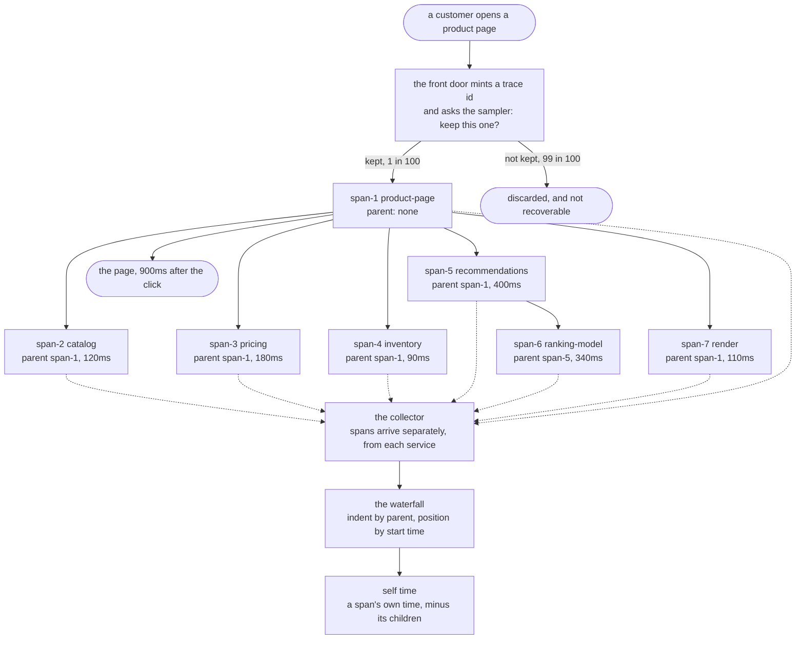

# Distributed Tracing Pattern — Data Flow Diagram

One customer request, followed from the click to the waterfall, with a note at every hop
saying what was added to the data and who added it. The architecture diagram says what is
running; this one says what moves between the boxes and how the picture at the end gets
built.

There are two flows in this diagram and they run in opposite directions. Downwards, and
fast, goes the customer's request: the product page asks catalog, then pricing, then
inventory, then recommendations, and each of those does its work and answers. Sideways, and
afterwards, go the spans: one small record per unit of work, each carrying an id, a parent,
a start and an end, travelling to a collector that the customer never waits for.

The customer's request and the tracing data must never be the same flow. If a service had to
wait for a collector to acknowledge a span, a slow tracing backend would become a slow shop,
and the thing you installed to find latency would be causing it.

The one field that makes all of this work is the **parent**. Six spans name one; one does
not, and that one is the front door. Indent each span under its parent, position it by its
start time, and the waterfall draws itself. Nothing in this project decides what that
picture looks like — it is a property of the data.

Mermaid source

## The three things this flow proves

**The identifier is minted once and copied everywhere.** One trace id is handed to every
unit of work in the request, which is the property no log field ever manages: the same
across one request, and different across the next. A thread name fails the first half the
moment work crosses a thread. A pod name and a product id fail the second half whenever two
customers are doing the same thing.

**The parent turns a list into a shape.** Read the ranking model's parent on the diagram: it
is recommendations, not the page. Without that field you would know six things took some
time; with it you know which one of them is responsible for the one that looks slow.

**Self time is one subtraction, and it is the number you act on.** The page span lasts the
full nine hundred milliseconds and its own work is zero — it did nothing, it waited. Charging
it nine hundred milliseconds would send somebody to read the page renderer for an afternoon.
Subtract the children and the six self times sum to exactly the total, with the ranking model
holding thirty-seven per cent of it.

## Where this flow quietly breaks

**A service that forwards the context but opens no span of its own.** The data still flows,
nothing throws, and the trace that arrives has one root, no orphans and the full nine hundred
milliseconds accounted for. It is also false: the model's parent becomes the page — a call
that exists nowhere in the code — and the service actually responsible is not on the picture
at all. Partial instrumentation is worse than none, because none tells you nothing and
partial tells you something false, confidently, with a diagram.

**A handoff to another thread.** The context lives in a `ThreadLocal`, which belongs to a
thread and does not travel. The worker asks for it, is handed nothing, and starts a second
root — so one request becomes two traces that no tool will ever join. The fix is one line
moved earlier: read the context on the thread that has it and hand it to the task as an
ordinary value, because a value does not care which thread reads it.

**The sample that was decided before anything was known.** The leftmost arrow out of the
front door is the one that hurts during an incident. The customer complaining about request
number 862,144 is asking about a trace that was thrown away at the first instruction, and no
amount of searching brings it back. The way out is tail sampling: hold the spans, let the
request finish, and keep the trace if it was slow or it failed.
