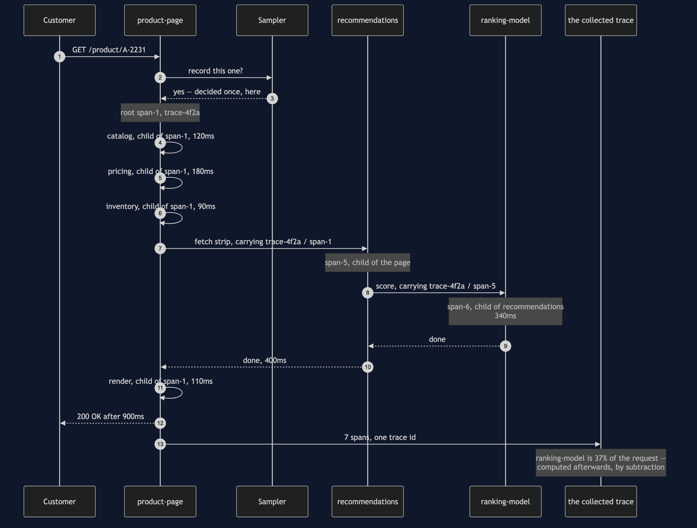
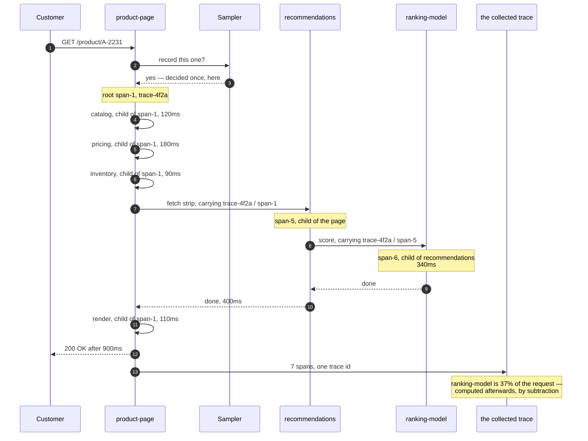

# Distributed Tracing Pattern — Sequence Diagram

One page load, in the order the calls happen, with the trace being built as it goes. The
architecture diagram says what is running and the data flow diagram follows the spans to
the collector; this one says **who starts a span, and whose span they name as the
parent** — which is the entire discipline of the pattern in one repeated gesture.

Follow it in order. A customer asks for a product page. The page service starts a root
span, and the sampler decides once, at the front door, that this request will be
recorded; that decision then travels with the request and nobody downstream re-opens it.
The page calls the catalog, the pricing service and the inventory service, each one
started from the page's own span and each one therefore a child of the page. Then it
calls recommendations, and here is the part worth slowing down for: recommendations
starts its own span from the page's, and when it calls the ranking model, the model's
span is started from *recommendations'* span, not the page's.

That single choice is the difference between two answers. If the model's span hangs off
the page, all anyone learns is that recommendations is slow. Hung off recommendations, the
picture says the scoring model inside recommendations is slow — and only the second answer
tells somebody what to go and fix. When the page returns after nine hundred milliseconds,
seven spans have been collected, and the thirty-seven per cent of the request spent in the
ranking model is worked out afterwards, by subtraction, by somebody who did not know they
were going to ask.

Mermaid source

## What the order proves

**Every call carries the caller's context, and that is all the propagation there is.** The
trace id and the current span id travel with the request, over the wire, to whoever is
called next. Miss one hop and you do not get a broken picture — you get two unrelated
pictures, neither of them wrong and neither of them the truth.

**The parent is chosen by whoever starts the span.** Naming the wrong parent is the
commonest mistake in this pattern and nothing anywhere reports it: the trace still renders,
the timings are still accurate, and the shape quietly lies about who contains whom.

**The sampling decision is taken once, at the front door.** Take it again further in and a
trace arrives with the middle missing, which is worse than no trace at all — the gap looks
like time nobody spent rather than time nobody recorded.

**Nothing on this page was computed while the request was running.** Seven spans were
collected, and every question asked of them afterwards — which service, how long, what
fraction, which hop — was answered by arithmetic on those spans. That is what tracing buys
that logging does not: answers to questions nobody thought to ask in advance.

The three failure modes — a service that opens no span at all, a thread boundary that
drops the context, and the decision taken too early — are sequences 3 to 5 in
[`uml-diagram.md`](uml-diagram.md).
