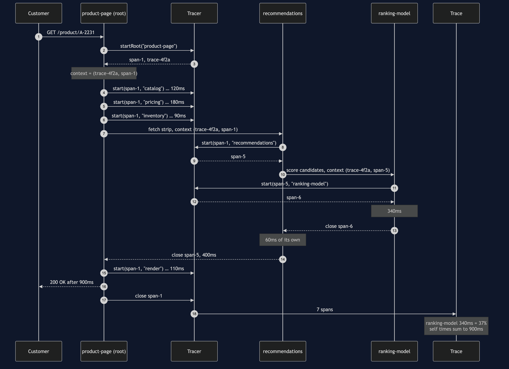
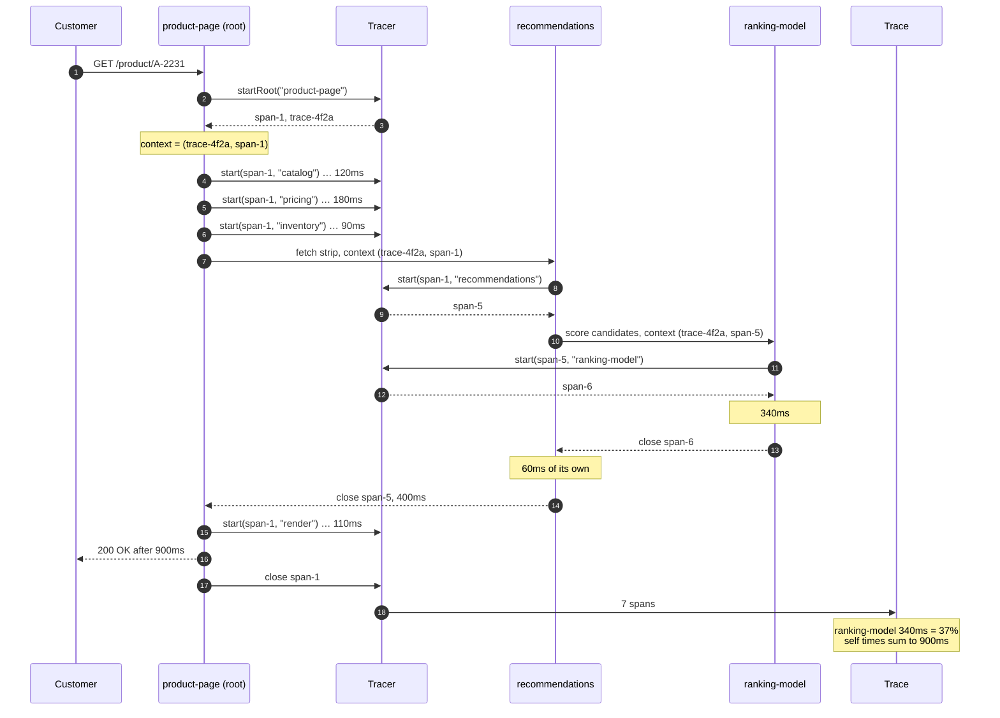
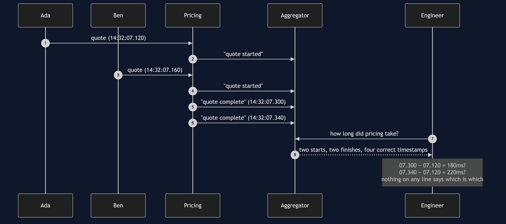
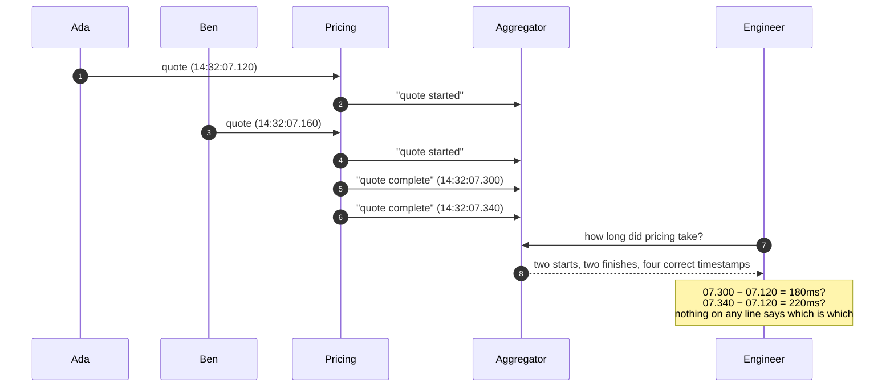
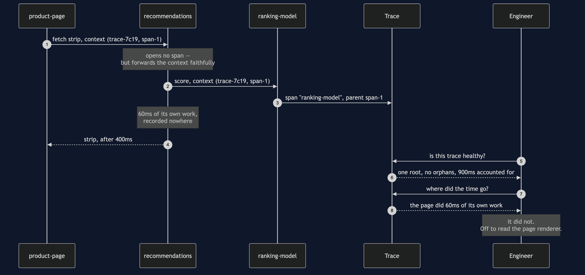
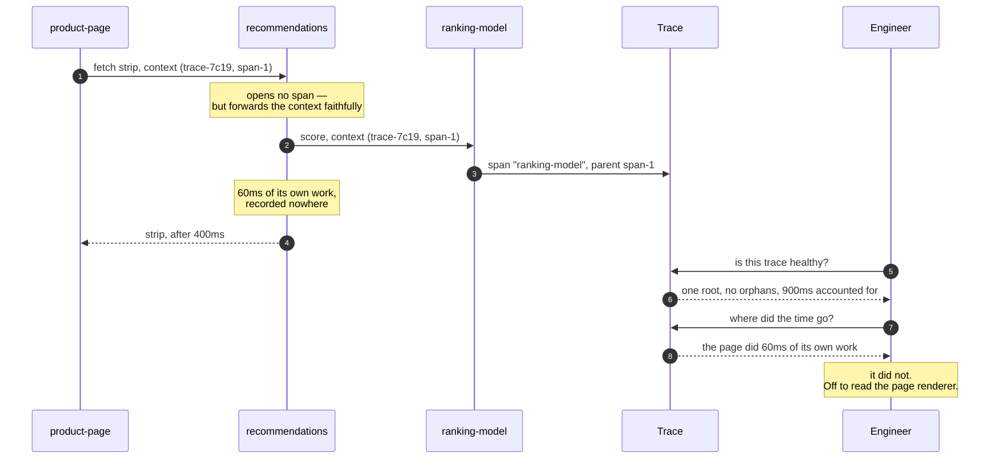
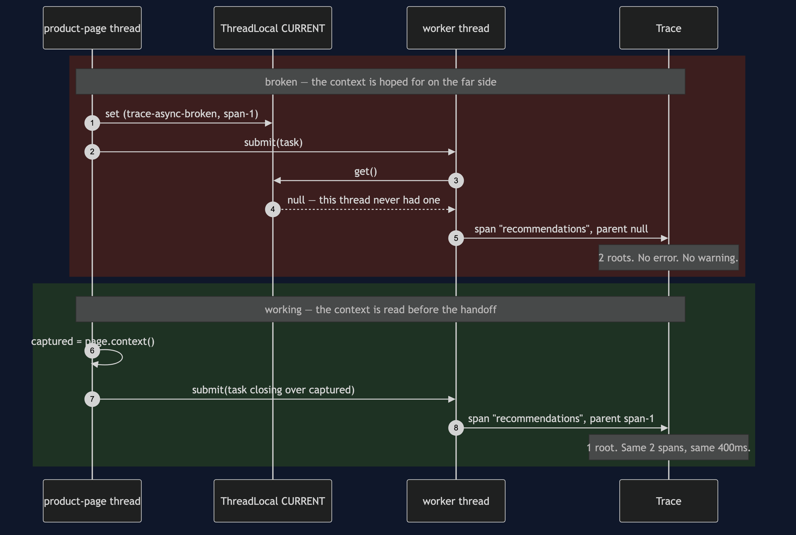
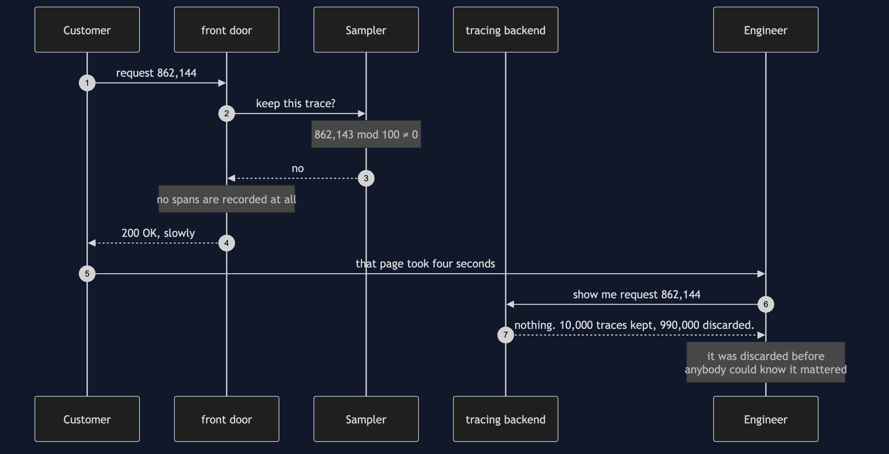
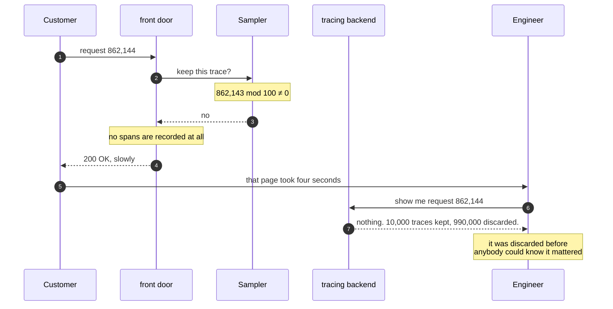

# Distributed Tracing Pattern — UML Sequence Diagrams

Five sequences. The first is the pattern in one picture. The second is the problem
it replaces. The last three are the bill — one diagram per failure, because each of
them fails in a different way and none of them raises an error.

## 1. One Page Load, Fully Instrumented

The pattern in one picture. Watch the third argument in every `start` call: it is
the context of whoever is calling, and passing it is the entire discipline.

Mermaid source

Read step 8 and then step 11. The recommendations span is started from `span-1`,
the page's span, so it becomes the page's child. The ranking model is started from
`span-5`, recommendations' own span, so it becomes recommendations' child rather
than the page's.

That is one argument, and it is the difference between the answer
"recommendations is slow" and the answer "the scoring model inside recommendations
is slow". Only the second one tells anybody what to go and fix.

Then read the last note. Nobody computed the thirty-seven per cent while the request
was running. It was computed afterwards, from seven spans, by subtraction — which is
why tracing can answer questions you did not know you were going to ask.

---

## 2. The Same Request, With Only Logs

The problem, and the reason it is not solved by logging harder.

Mermaid source

Four lines, all correct, and no valid subtraction between any two of them. The
engineer's options are to guess or to add more fields to the log lines, and more
fields do not help: none of them is unique to one request and shared across the
services that served it.

The missing thing is an identifier, and that is the first half of the pattern. The
second half — the parent link — is what the next three diagrams are about.

---

## 3. The Bill, Part One: A Service That Opens No Span

Mermaid source

Read step 2. Recommendations forwards `span-1` — the page's span — because it never
minted a span of its own to forward instead. So the ranking model's parent becomes
the page, a call that does not exist anywhere in the code.

Then read the two answers the trace gives. The first is that the trace is healthy,
and it is telling the truth: one root, no orphans, every millisecond accounted for.
The second is that the page spent sixty milliseconds working, and that is a lie the
trace has no way to know it is telling. The sixty milliseconds is recommendations'
own work with nowhere else to go.

This is why partial instrumentation is worse than none. An uninstrumented system
tells you nothing. A partly instrumented one tells you something false, confidently,
with a diagram.

---

## 4. The Bill, Part Two: The Thread Boundary

Two sequences side by side. The difference is which step reads the context.

```mermaid
sequenceDiagram
    autonumber
    participant Page as product-page thread
    participant TL as ThreadLocal CURRENT
    participant Worker as worker thread
    participant Trace

    rect rgb(60, 30, 30)
    Note over Page, Trace: broken — the context is hoped for on the far side
    Page->>TL: set (trace-async-broken, span-1)
    Page->>Worker: submit(task)
    Worker->>TL: get()
    TL-->>Worker: null — this thread never had one
    Worker->>Trace: span "recommendations", parent null
    Note over Trace: 2 roots. No error. No warning.
    end

    rect rgb(30, 50, 35)
    Note over Page, Trace: working — the context is read before the handoff
    Page->>Page: captured = page.context()
    Page->>Worker: submit(task closing over captured)
    Worker->>Trace: span "recommendations", parent span-1
    Note over Trace: 1 root. Same 2 spans, same 400ms.
    end
```

Mermaid source

Compare step 4 with step 6. In the broken version the worker asks the thread-local
for the context and is handed `null`, because a thread-local belongs to a thread and
the worker's copy was never written. In the working version the context is read at
step 6, on the page's thread, where it exists, and closed over as an ordinary value.

That is the whole fix. A value does not care which thread reads it.

What makes this the failure that catches everybody is the last note in each block:
two spans, four hundred milliseconds, no exception either way. The broken code and
the working code are the same code with one line moved.

---

## 5. The Bill, Part Three: The Decision Made Too Early

Mermaid source

Read step 2 and notice where it is in the sequence: at the front door, before any
work has been done. That is what makes head-based sampling uncomfortable. The
decision to throw a trace away is made at the only moment when nothing is known
about it.

And read the answer at step 7. The trace was not discarded because it looked boring. It was
discarded for the same reason as nine hundred and ninety thousand others — the
sampler's only input was a counter.

The way out is **tail sampling**: buffer the spans, let the request finish, and keep
the trace if it was slow or it failed. The decision moves from the front door to
after the fact, which is the only place it can be made well.
