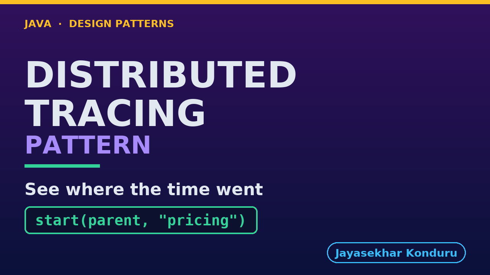

# YouTube — Distributed Tracing Pattern

Everything needed to publish `video/distributed-tracing-pattern-explained.mp4`. Copy the fields straight out of this file.

Chapter timings are generated from the video's `.srt`. Re-run `python3 docs/make_youtube_docs.py distributed-tracing` after any change to the narration, or they will be wrong.

## Title

```
Distributed Tracing in Java - Which Service Is Slow?
```

52 characters — under the 60 YouTube shows before truncating in search results.

## Description

The first two lines are what a viewer sees above the fold, so they carry the hook rather than the boilerplate.

```
Learn distributed tracing in Java 21, starting from a product page that takes nine hundred milliseconds with four healthy services behind it and four sets of correct logs that cannot say which one spent the time. We watch two customers interleave in the log until the same service appears to take both 180 and 220 milliseconds, find that no extra field fixes it, and build the pattern instead: one id per request, one span per unit of work, and the one field people skip — the parent. Then we compute self time, which is the whole trick, and spend the second half on the bill: a service that opens no span and produces a trace that passes every check while blaming the wrong code, a context lost across a thread, and a trace sampled away before anybody knew it would be wanted. None of the three throws an exception. No prior design-pattern knowledge needed, and no Docker, collector or OpenTelemetry — it all runs in one JVM. Full source code and written notes are in the repository.

CHAPTERS
00:00 Introduction
01:29 The Scenario
02:19 What the Logs Give You
03:13 More Logging Does Not Fix It
04:03 The Pattern
04:59 Three Moves
06:00 Who Does What
07:00 The One Argument That Is the Pattern
08:02 Seven Spans, and the Column That Matters
08:55 The Waterfall — That Column, Drawn
10:04 Self Time — The Whole Trick
11:18 The Bill, Part One — A Service That Opens No Span
12:39 The Bill, Part Two — One Line, in the Wrong Place
14:03 The Bill, Part Three — The Decision Made Too Early
15:11 What to Take Away
16:16 Thanks for Watching

SOURCE CODE, WRITTEN NOTES AND AN INTERACTIVE ANIMATION
https://github.com/jk-boot-up/java-design-patterns/tree/main/gradle-java/platform-design-patterns/distributed-tracing-pattern

WHAT YOU NEED FIRST
Java 21 and a working knowledge of classes and interfaces. No prior design-pattern knowledge is assumed. The full prerequisites are in docs/prerequisites.md in the repository.
```

## Chapters

YouTube renders these as chapters only if there are at least three and the first is at `00:00`.

```
00:00 Introduction
01:29 The Scenario
02:19 What the Logs Give You
03:13 More Logging Does Not Fix It
04:03 The Pattern
04:59 Three Moves
06:00 Who Does What
07:00 The One Argument That Is the Pattern
08:02 Seven Spans, and the Column That Matters
08:55 The Waterfall — That Column, Drawn
10:04 Self Time — The Whole Trick
11:18 The Bill, Part One — A Service That Opens No Span
12:39 The Bill, Part Two — One Line, in the Wrong Place
14:03 The Bill, Part Three — The Decision Made Too Early
15:11 What to Take Away
16:16 Thanks for Watching
```

## Tags

```
distributed tracing, observability java, trace id propagation, design patterns, java design patterns, gang of four, java 21, software design, clean code, object oriented design, java tutorial, ecommerce, programming tutorial
```

224 characters, under YouTube's 500 limit.

## Thumbnail



**Upload `docs/thumbnail.png`** — 1280×720, the size YouTube recommends, generated by `docs/make_thumbnails.py`. It is deliberately not the same image as the video's opening frame: a thumbnail is judged at about 360 pixels wide in a search result, so this one carries only the pattern name, one line of promise and one short piece of code, each set large enough to survive the shrink.

`video/poster.png` is the 1920×1080 opening frame, produced by the video build. It stays in the repository as the title card; it is not what gets uploaded.

YouTube will not pick the thumbnail up on its own — upload it under **Details → Thumbnail → Upload file**. A custom thumbnail requires a verified channel.

## Upload checklist

- [ ] Upload `video/distributed-tracing-pattern-explained.mp4` (1080p, H.264, 30 fps, AAC 48 kHz — already YouTube's recommended settings, no re-encode needed)
- [ ] Set the video language to **English** first, or the subtitle option may not appear
- [ ] Add subtitles: *Video elements → Add subtitles → Upload file → With timing* → `video/distributed-tracing-pattern-explained.srt`
- [ ] Upload `docs/thumbnail.png` as the thumbnail — do not let YouTube auto-pick a frame
- [ ] Paste the title, description and tags from above
- [ ] Add to the **Java Design Patterns** playlist, in learning order
- [ ] Wait for 1080p processing before sharing the link — code slides are unreadable at 360p

## Cards and end screen

End screen links to whichever pattern video goes up next — set it at upload time rather than assuming an order.

Add a card partway through pointing at the playlist, so a viewer who arrives at this pattern from search can find the rest of the series.

## Runtime

Approximately 16:52, narrated at 145 words per minute.
