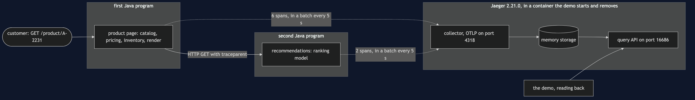
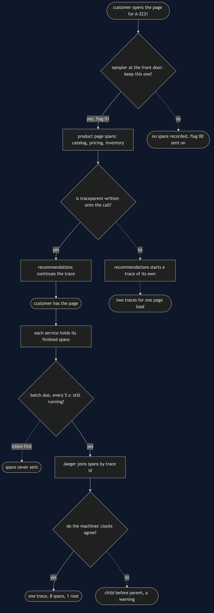
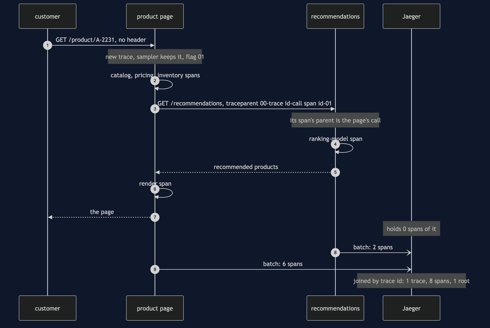
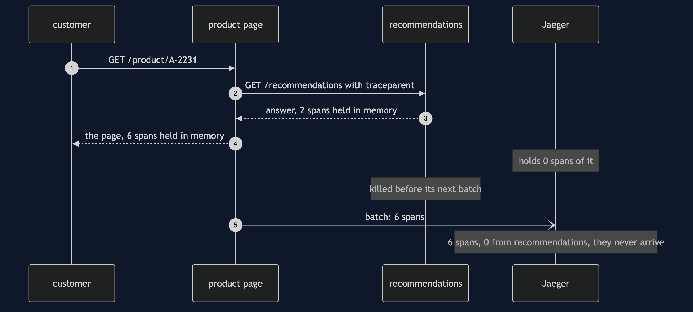
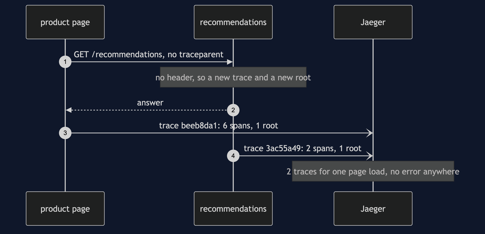
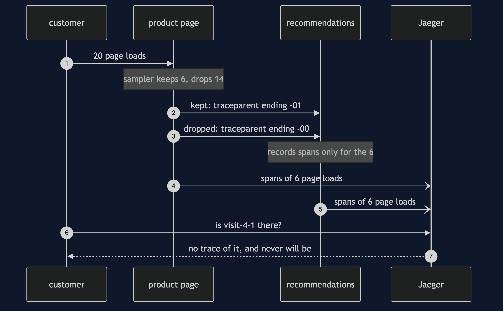
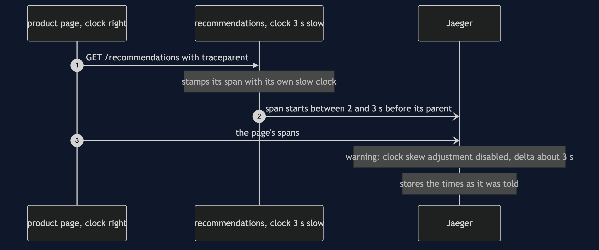

# Distributed Tracing with Jaeger Pattern

```
src/main/java/com/jk/explore/tracingjaeger/
├── JaegerTracingDemo.java        the six acts
├── ProductPageService.java       the front door: a real HTTP server; writes traceparent onto its call to recommendations
├── RecommendationsService.java   a second Java program with its own HTTP server; reads traceparent and continues the trace
├── RecommendationsProcess.java   starts that second program, stops it politely, or kills it
├── Telemetry.java                one service's OpenTelemetry: its name, its sampler, its clock, its batch every 5 seconds
├── JaegerServer.java             starts and stops a real Jaeger container
├── JaegerQuery.java              asks Jaeger what it holds, through Jaeger's own query API
└── SeededIds.java  Http.java  Poll.java   repeatable ids; the header and HTTP plumbing; every wait is a question asked until the answer is yes
```

**With a real collector, a trace is something the collector assembles afterwards from separate reports — so it can arrive seconds late, arrive in two pieces, arrive with a child starting before its parent, or not arrive at all. None of those raises an error.**

**This project needs a container runtime.** Docker Desktop, or anything Docker-compatible, must be running before you start. The demo brings Jaeger up in a container and takes it down again at the end; nothing is installed and nothing is left behind. With no runtime, the demo prints two sentences saying what to do, and stops, rather than a stack trace.

This project is the real-infrastructure version of the plain-Java Distributed Tracing project in this course. That project built the tracer, the spans and the waterfall itself, in one program, with a clock the demo scripted. This one uses OpenTelemetry, the tracing library the industry has settled on, in two real services — the product page and recommendations — that talk over real HTTP from two separate Java programs. Each service sends its own spans to Jaeger, a real trace collector, and everything the demo says about a trace it reads back from Jaeger.

## Run

```bash
./gradlew run
```

Six acts. Every number quoted below, and in every document and slide in this project, comes from this program's own output. Two runs back to back print exactly the same thing.

```
ONE. A hop that forgets the header.
  the product page calls recommendations over real HTTP, in a second Java process.
  the page does not write the trace header onto that call. traceparent sent: none.
  Jaeger holds 2 traces for one page load, and neither says anything is wrong.
  trace beeb8da1: 6 spans, all from product-page, 1 root.
    its call to recommendations has 0 spans under it.
  trace 3ac55a49: 2 spans, all from recommendations, 1 root.
    the ranking model is in here, with no page above it.
  the two were found together only by searching both services for the visit id the shop recorded.
TWO. The header forwarded.
  one line added: write the current trace context onto the outgoing request.
  traceparent sent:     00-bfc846100bfc1e42987bbcbfdd7e532f-b9f24f7bae4a6586-01
  traceparent received: 00-bfc846100bfc1e42987bbcbfdd7e532f-b9f24f7bae4a6586-01
  version 00, trace id, the caller's span id, flags 01, which means sampled.
  Jaeger holds 1 trace: 8 spans from 2 services, 1 root. its shape, as Jaeger holds it:
    GET /product/A-2231        product-page
      catalog                  product-page
      pricing                  product-page
      inventory                product-page
      call recommendations     product-page
        GET /recommendations   recommendations
          ranking-model        recommendations
      render                   product-page
  the slowest piece of work, by its own time: ranking-model, in recommendations, 340 ms or more.
  the page's call lasted longer than recommendations took to answer. the difference is the hop itself.
THREE. The collector puts it together, later.
  the customer has the page. Jaeger holds 0 spans of it.
  each service sends its finished spans by itself, in a batch every 5 seconds.
  the spans arrive more than 2 seconds after the customer had the page.
  Jaeger then holds 8 spans: 6 sent by product-page, 2 sent by recommendations, joined by trace id.
FOUR. Sampling at the front door.
  the page keeps one trace in 4, decided once, at the front door, from the trace id.
  20 page loads. kept: 6. dropped: 14.
  a kept load's header ends -01:    00-2ee9dc9fc86ae25de30fe2669284d85d-d6e5445f3c8658e2-01
  a dropped load's header ends -00: 00-e474c66a4b98b030dbef19fc8e7b845f-ebb1ae25f75e1f5e-00
  recommendations obeys the flag it is sent. it recorded spans for 6 page loads.
  Jaeger holds 6 traces of the 20.
  a customer complains about visit-4-1. Jaeger has no trace of it, and never will.
FIVE. A clock that is off.
  the recommendations machine's clock is 3 seconds slow. the page's clock is right.
  Jaeger holds 1 trace: 8 spans, 1 root. the parent links are all correct.
  in start order, Jaeger's first span is GET /recommendations, before the page that asked for it.
  recommendations' span starts between 2 and 3 seconds before the call that caused it.
  Jaeger's own warning: clock skew adjustment disabled; not applying calculated delta of about 3 seconds.
  the collector stores what each service says. it does not correct a service's clock.
SIX. The bill.
  recommendations answers visit-6, then is killed before its next batch. the page stops politely.
  Jaeger holds 6 spans of visit-6: 6 from product-page, 0 from recommendations. they never arrive.
  the page's call to recommendations has 0 spans under it. the spans lost are the last ones before the crash.
  every page load costs 8 spans from 2 processes, and a 55 character traceparent header on every hop.
  and Jaeger is one more system to run. it said at start-up: No '--config' flags detected, using default All-in-One configuration with memory storage.
  this demo needed 1 container for 2 service processes, and removes it, with every span in it, at the end.
```

The product page's own work is the twin's: catalog 120 ms, pricing 180 ms, inventory 90 ms, render 110 ms. Recommendations spends 60 ms of its own around a ranking model that takes 340 ms.

**Why the ids repeat between runs.** A real service picks trace ids and span ids at random. This project hands OpenTelemetry a random-number sequence that starts from a fixed seed, through the library's own `IdGenerator` hook. The ids still look random, still differ between every trace in a run, and are still what the sampler looks at — but the headers quoted above are the headers every run prints, and the sampler keeps the same 6 of the 20 page loads every time. With truly random ids you would keep about one in four, and a different handful each run.

**What is described rather than counted.** Real work takes a few milliseconds more or less on every run. So the demo never prints a duration it measured; it prints what is certain. The ranking model took "340 ms or more". The spans arrived "more than 2 seconds" after the page. The span from the slow clock starts "between 2 and 3 seconds" early, and Jaeger's warning, which ends with the exact amount it worked out, has that amount rounded to "about 3 seconds". Every other figure is exact, because nothing about timing can change it.

The first run downloads the Jaeger image, about 110 MB, and takes longer. After that a run takes about twenty seconds. Most of it is the second Java program starting six times, and the third act genuinely waiting for the 5-second batch.

## Test

```bash
./gradlew test
```

3 test classes, 16 test methods. `PlainPartsTest` (8) needs nothing installed: the seeded ids, the clock that is off, the header read field by field, Jaeger's warning rounded, the tree built from parent links, and own time. `RealJaegerTest` (7) starts one Jaeger for the whole class and asks it directly: the header carries one trace across the hop and Jaeger joins the two services' reports into 8 spans with 1 root; without the header one page load becomes two traces; the spans are not in Jaeger when the customer has the page, and arrive in the next batch; a dropped trace says so in its header and neither service records it; a clock that is off puts the child before its parent and Jaeger only warns; a killed service never sends its spans; and Jaeger says it keeps spans in memory. `DemoRunsTest` (1) runs the demo and asserts every figure the documents quote.

There is no `Thread.sleep` anywhere under `src/test`. Every wait is a poll on something Jaeger can actually be asked about — does it hold this trace yet, and how many spans — with a limit that fails the test rather than hanging it. The tests that need Jaeger are skipped when no container runtime is there; the rest still run.

## What the simulation got right, and what it left out

This is the reason this project exists, so it comes before anything else.

**What the plain-Java Distributed Tracing project got right.** All of the shape. One identifier minted at the front door and handed down. A span for every unit of work, carrying what it was, when it started, how long it took, and which span asked for it. The parent link as the whole pattern: the indentation of a waterfall is nothing but that link. Own time, not total time, as the way to find the culprit. A context that is not carried across a boundary splits one trace into two roots. And a sampling decision made once, at the front door, before anything is known about the request. Every one of those holds with OpenTelemetry and Jaeger: this project's first two acts show the split and the join over a real hop, and the fourth shows the decision at the front door. The slowest piece of work, by its own time, is the ranking model, inside recommendations, in both.

**What it left out, first: the hop was a method call.** In the simulation the context was an object passed along inside one program. Here the context has to become text, cross a network, and be read back by a different program. That text is one HTTP header, `traceparent`, 55 characters: a version, the trace id, the caller's span id, and a flags byte. The page writes it with one line; recommendations reads it with one line. Leave out the writing line — the first act — and nothing fails. Both services answer, both report their spans, and Jaeger holds 2 perfectly healthy traces for one page load: the page's call to recommendations with 0 spans under it, and the ranking model in a trace of its own with no page above it. The two halves could only be found together by searching both services for a visit id the shop happened to record.

**Second: the demo assembled the trace itself.** The simulation's tracer kept every span in a list and drew the waterfall from it. Here no program ever holds the whole trace. Each service sends its own spans to Jaeger, separately, and Jaeger joins them by trace id: 6 sent by product-page, 2 sent by recommendations. Everything this demo prints about a trace is read back from Jaeger's query API, the check neither service can fake.

**Third, and the headline find: the trace arrives later, or not at all.** In the simulation, the trace existed the moment the request ended. OpenTelemetry does not send a span when it ends. It keeps finished spans in memory and sends them in a batch — every 5 seconds, out of the box — because sending each one as it finished would slow the shop. So in the third act, when the customer already has the page, Jaeger holds 0 spans of it; they arrive more than 2 seconds later. And in the sixth act, recommendations answers the customer and is then killed before its next batch. Its spans were finished, correct and waiting — and they never arrive. Jaeger holds 6 spans of that page load, all from product-page, and the call to recommendations has 0 spans under it. The spans a crash loses are always the last ones before it: exactly the ones somebody will want when they investigate the crash.

**Fourth: every machine has its own clock.** The simulation had one scripted clock. Here each service stamps its spans with its own machine's time, and the fifth act makes the recommendations machine's clock 3 seconds slow. The parent links are all correct, so the tree is right, but in time order Jaeger's first span is `GET /recommendations`, before the page that asked for it: it starts between 2 and 3 seconds before the call that caused it. Jaeger notices, and attaches a warning of its own — "clock skew adjustment disabled; not applying calculated delta of about 3 seconds" — and stores the times exactly as it was told. Out of the box, it corrects nothing.

**What the simulation had that Jaeger does not.** The simulation's trace could never be lost, because it lived in the demo's own memory. Jaeger out of the box keeps spans in its memory too — it says so at start-up, "using default All-in-One configuration with memory storage" — so a restart of the collector empties it. A real deployment gives Jaeger a database, and that database is a bill of its own: 8 spans for every page load, from 2 processes.

## Technologies and versions

| What | Version | Why it is here |
| --- | --- | --- |
| Java | 21 | The repository standard, via the Gradle toolchain block |
| Gradle | 9.2.1 | The wrapper in this directory; no separate install needed |
| Jaeger | 2.21.0 | The collector, storage and query API in one process, as the official `jaegertracing/jaeger:2.21.0` image; the newest release |
| OpenTelemetry Java | 1.66.0 | `opentelemetry-api`, `opentelemetry-sdk` and `opentelemetry-exporter-otlp`, kept in step by `opentelemetry-bom`; the newest release. The API makes spans and moves the header; the SDK samples and batches; the exporter sends each batch to Jaeger over HTTP |
| Jackson | 3.2.3 | `tools.jackson.core:jackson-databind`, the newest release; reads the JSON Jaeger's query API answers with |
| Testcontainers | 2.0.5 | `org.testcontainers:testcontainers`; starts and stops the Jaeger container from inside the demo, on free random ports. There is no Jaeger module, so the plain container type is used |
| slf4j-simple | 2.0.17 | Logging for Testcontainers, turned off so the demo's own output is the only output |
| JUnit 5 | 5.10.2 | Test runner |
| JDK HTTP server | built into Java 21 | `com.sun.net.httpserver.HttpServer`; both services are real HTTP servers without a web framework |
| A container runtime | Docker 24 or later, or compatible | Runs Jaeger. Must be running before you start |

Nothing is held back: every version is the newest generally available release. The plain-Java twin's optional Spring Boot corner still pins Jaeger 2.20.0; this project is self-contained and uses 2.21.0. See [`docs/dependencies.md`](docs/dependencies.md) and [`docs/prerequisites.md`](docs/prerequisites.md).

## Learning Material

| Document | What it covers |
| --- | --- |
| [`docs/problem-statement.md`](docs/problem-statement.md) | The twin's version, and what is new |
| [`docs/distributed-tracing-with-jaeger-pattern-explained.md`](docs/distributed-tracing-with-jaeger-pattern-explained.md) | OpenTelemetry's and Jaeger's words in plain language, and six acts |
| [`docs/class-diagram.md`](docs/class-diagram.md) | The types |
| [`docs/architecture-diagram.md`](docs/architecture-diagram.md) | Two service programs, one hop, one collector |
| [`docs/data-flow-diagram.md`](docs/data-flow-diagram.md) | The request goes down; the spans go sideways, later |
| [`docs/sequence-diagram.md`](docs/sequence-diagram.md) | Written for a listener with the screen off |
| [`docs/uml-diagram.md`](docs/uml-diagram.md) | Four sequences |
| [`docs/animation.html`](docs/animation.html) | The six acts in a browser |
| [`docs/prerequisites.md`](docs/prerequisites.md) | What you need installed, and what you need to know |
| [`docs/session.md`](docs/session.md) | A one-hour taught session |
| [`docs/dependencies.md`](docs/dependencies.md) | What OpenTelemetry, Jaeger and Testcontainers are, what they cost, and that skipping this project loses none of the pattern |
| [`docs/spec.md`](docs/spec.md) | The generated specification |
| [`docs/youtube.md`](docs/youtube.md) | Title, description and chapters |

### The pattern in one picture


### Where each piece sits



### How the data moves



### Who calls whom, in order



### All four sequences









### Video

Built from [`video/scenes.py`](video/scenes.py) by
[`video/build_video.sh`](video/build_video.sh). The rendered file is not
committed; see the repository README for why.

## Where you have already met this

Any shop, bank or streaming service that runs more than a handful of services. OpenTelemetry is instrumented into most web frameworks and HTTP clients — Spring Boot, Quarkus, Micronaut, the Java agent — and what those do for you is exactly the two lines this project writes by hand: write `traceparent` on the way out, read it on the way in. Jaeger, Grafana Tempo, Zipkin and the hosted tracing products all receive the same OTLP batches and assemble the same trees.

## When this is too much

If the shop is one program, a profiler or a log with a request id answers "where did the time go" without a collector to run. If nobody will ever read the traces, the batches are pure cost. A collector earns its keep once a single customer request crosses several programs, and somebody has to say which of them was slow.

## Where this sits

This project pairs with the plain-Java Distributed Tracing project in this course, and is its real-infrastructure version in the `platform-design-patterns` category. Everything it teaches is explained in its own files, so it can be read on its own.
