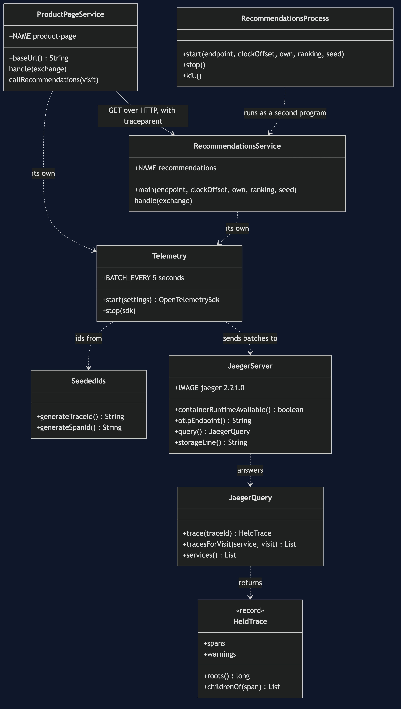

# Distributed Tracing with Jaeger Pattern — Class Diagram

The pattern is two lines in two classes: `ProductPageService` injects the trace context into the call it makes, and `RecommendationsService` extracts it from the call it receives. `Telemetry` gives each service its own OpenTelemetry; `JaegerQuery` reads back what the collector assembled.

