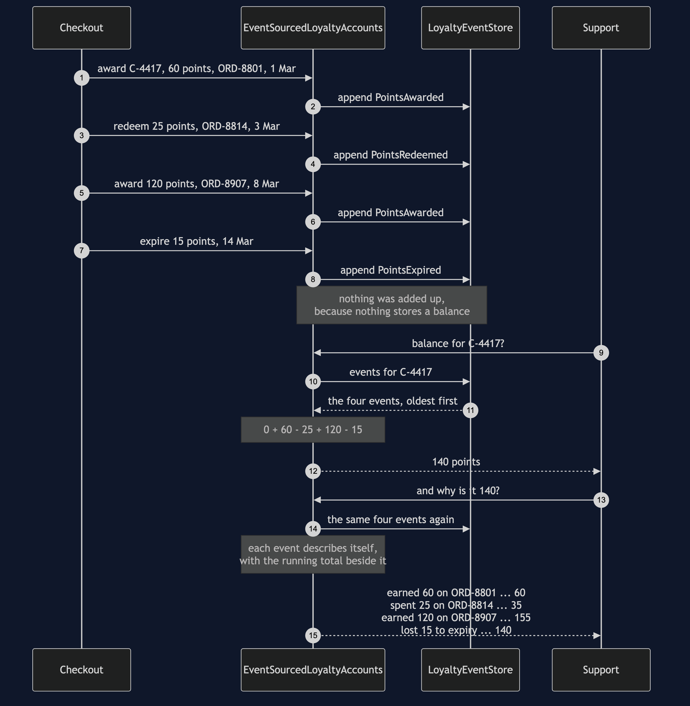

# Event Sourcing Pattern

**Store the things that happened, in the order they happened, and never change
them — then work out the current state by adding them up.**

Think of your bank statement. Somewhere in the bank there is a number saying how
much money you have, but that is not what they send you at the end of the month.
They send you a list: salary in on the twenty-eighth, rent out on the first, a
refund you had forgotten about. The total at the bottom is the least interesting
thing on the page, and it is the only thing you could work out from the rest.

The shop runs a loyalty scheme — one point per pound, points spendable on later
orders, unused points expiring after twelve months — and the obvious version keeps
a row with `140` in it. That row is correct. It is also unable to say why it is 140,
what it was three weeks ago, or which customers a double-awarding bug touched, and
those are exactly the three things somebody eventually asks for.

## Run

```bash
./gradlew run
```

Nine acts. The first five are what the pattern buys, and the last four — well, the
last three — are what it costs.

```
Act 1 - a customer asks why their balance is 140
  balance: 140
  support asks why, and this is the whole answer:
    the row says 140 points. How it got there was never written down.
  the four things that happened in March were each added to a number and then forgotten.

Act 4 - why it is 140
  balance: 140 points, and this time there is a reason:
    2025-03-01  earned 60 points on order ORD-8801                   balance 60
    2025-03-03  spent 25 points on order ORD-8814                    balance 35
    2025-03-08  earned 120 points on order ORD-8907                  balance 155
    2025-03-14  lost 15 points to the twelve-month expiry            balance 140
  the balance is not stored anywhere. That number is the four events added up, worked out just now.
```

The strongest act is the third. A release awards points twice and is fixed three
weeks later; the query that finds the damage is written *after* the bug shipped,
against data that was already lying there:

```
Act 3 - the same bug, with an append-only log behind it
  balance as the log stands: 100 points
  orders that earned points more than once:
    ORD-9001 awarded 2 times
  nobody wrote that query before the bug shipped. It was written after, and the data was already there.
  balance with the second award ignored: 55 points
  no event was edited and none was deleted. The reading code changed, and every balance is right again.
```

Read the last line twice. The log was never wrong — the shop really did award those
points twice, and that really is what happened. The *interpretation* was wrong, so
the fix lives in the code that interprets and the log is untouched.

Act 2 is the same bug without a log, and it is the reason the pattern is worth
paying for:

```
    C-5120 = 100 points
    C-5122 = 25 points
    C-5121 = 60 points
  which of those three is wrong, and by how much?
  100 could be a doubled £45 order on top of £10, or one honest £100 order. Both write 100.
  the information needed to tell them apart was overwritten by the bug itself.
```

## And then the bill

Acts 6, 7 and 8 are the costs, and they get as much room as the benefits.

```
Act 6 - the bill: a stream long enough to need a snapshot
  events in the log: 5000
  one balance, folded from the start: 500 points, 5000 events read
  one more order, folded from the start again: 502 points, 5001 events read
  the same 502 points, from the snapshot plus what came after it: 1 event read
  that is the fix, and it is also a second place a balance lives.
```

**Reading is slow, and the fix brings back the thing you removed.** A snapshot is a
stored balance. One written by buggy code stays wrong forever and nothing throws, so
it records which code computed it, and the cure is to throw every snapshot away and
refold. The log is the truth; a snapshot is a cache.

**Erasure fights the pattern head-on.** A customer has a legal right to be
forgotten and the log has no delete. Act 7 shows what "just delete their events"
does: the history that explained them is gone beyond recovery, *and* a snapshot
taken earlier still answers with their balance.

**An event is a schema you version and never migrate.** Somebody added the order id
field in 2023, so Act 3's duplicate hunt reports zero duplicates in a stream that
visibly contains two identical awards, and nothing anywhere reports a problem.

Act 9 settles the confusion this pattern is most often caught up in, by building
CQRS with no event sourcing and event sourcing with no CQRS in the same run. **CQRS
changes where reads come from. Event sourcing changes what the writes store.**

## Test

```bash
./gradlew test
```

31 tests, in about a second, with no `Thread.sleep` and nothing random. Every date is
a fixed `LocalDate`, so two runs of the demo are byte-identical and `DemoRunsTest`
asserts that the numbers in these documents are the numbers the program prints.

The test file worth reading first is `CurrentStateLoyaltyAccountsTest`, and every
test in it **passes**. It is not a list of failures waiting to be fixed by the
pattern — it pins down a boundary. The balance is right; every question past the
balance has no answer in that design. The sharpest test builds the same hundred
points twice, once by a bug and once honestly, and asserts that the shop cannot tell
them apart afterwards.

## One JVM, no infrastructure

This project starts nothing. No database, no Kafka, no Docker, no Spring, no HTTP
port. The event store is an `ArrayList` and it runs offline with only a JDK.

That is a deliberate trade. What you get is the pattern's shape — what an event is,
what may go into the log, where the meaning of an event lives, and why the repair is
a read rather than a write — and none of that changes when the list becomes a table.
What you do not get is durability, ordering guarantees, concurrent writers, or a
subscriber reading the log from another service. The cost figures in Act 6 are
events examined, not milliseconds. Finish this project and you will know what event
sourcing is, could write one, and will know what it costs. You will not have
operated one.

## Technologies and versions

The shortest list in the category, and the shortness is the point. Nothing here is a range
and nothing is `latest`: a course that worked last year and does not work today is worse
than one that never took the dependency. The versions are pinned in
[`../gradle/libs.versions.toml`](../gradle/libs.versions.toml) because Gradle can read that
file, and explained in [`../docs/pinned-versions.md`](../docs/pinned-versions.md).

| What | Version | Why it is here |
| --- | --- | --- |
| Java | 21 | The repository standard, requested through the Gradle toolchain block |
| Gradle | 9.2.1 | The wrapper in this directory; no separate install needed |
| JUnit 5 | 5.10.2 | The 31 tests. The only dependency this project has |

That is the whole list. No database, no Kafka, no Spring, no Docker, no HTTP port — the
event store is an `ArrayList` and the clock is a fixed `LocalDate`.

**And unlike its neighbours, this project has no `real/` tier.** That is a decision rather
than an omission. Putting the log in PostgreSQL or Kafka would buy durability, ordering
guarantees, concurrent writers and a subscriber in another service — all real, all
operational, and **none of them changes a single argument this project makes**. What an
event is, what may go into the log, where the meaning of an event lives, why the repair is
a read rather than a write, what a snapshot costs and why erasure fights the pattern head
on are all the same on a list as on a cluster. The reasoning is written out in full in
[`docs/architecture-diagram.md`](docs/architecture-diagram.md).

## Learning Material

| Document | What it covers |
| --- | --- |
| [`docs/problem-statement.md`](docs/problem-statement.md) | The row that cannot answer, and the bug that destroys its own evidence |
| [`docs/event-sourcing-pattern-explained.md`](docs/event-sourcing-pattern-explained.md) | The bank statement, the three moves, the code, the four costs, and CQRS |
| [`docs/class-diagram.md`](docs/class-diagram.md) | The types — and the balance field that is not there |
| [`docs/architecture-diagram.md`](docs/architecture-diagram.md) | The two designs side by side, and why this project has no `real/` tier |
| [`docs/data-flow-diagram.md`](docs/data-flow-diagram.md) | Writes down the left and stopping, reads up the right and computing |
| [`docs/sequence-diagram.md`](docs/sequence-diagram.md) | Four things happening, then two questions asked — and where the work actually is |
| [`docs/uml-diagram.md`](docs/uml-diagram.md) | Four sequences: the fold, the explanation, the investigation, the snapshot |
| [`docs/animation.html`](docs/animation.html) | The log filling up and the fold running, one step at a time, in a browser |
| [`docs/prerequisites.md`](docs/prerequisites.md) | What you need to know, what you explicitly do not, and how to get a JDK |
| [`docs/session.md`](docs/session.md) | A one-hour taught session with exercises |
| [`docs/spec.md`](docs/spec.md) | The generated specification, with measured test counts and timings |
| [`docs/youtube.md`](docs/youtube.md) | Title, description and chapters for the video |

### The pattern in one picture

The class diagram, and the important thing about it is an absence. Two implementations of
one loyalty-accounts interface sit side by side; the current-state one has a balance field
and the event-sourced one has no balance anywhere, only a store of events. Three kinds of
event — points awarded, redeemed and expired — each know their own effect on a balance and
how to describe themselves, and the snapshot and its store hang off to one side as the
cache they are.


### What runs where

One process, and the two designs side by side inside it. Look at what is missing from the
right-hand side: there is no balance field anywhere on it.


### How the data moves

Writes go down the left and stop. Reads go up the right and compute. No arrow returns to
the log to change anything, and every benefit on this page is a consequence of that.


### Who calls whom, in order

Four things happen to one customer's points, and each is appended and forgotten — nothing
is added up, because nothing stores a balance. Then support asks two questions. The first,
what the balance is, walks the four events and adds them. The second, why it is a hundred
and forty, is the same walk with each event describing itself.



### All four sequences

The full set from [`docs/uml-diagram.md`](docs/uml-diagram.md): the write and the read, the
explanation, the investigation that happens weeks later, and what a snapshot costs.

**One. A write, then a read.** Nothing is stored when the balance is asked for. It is
worked out, and asking twice does the walk twice.


**Two. Why is it 140?** The same walk, printing itself, with each event describing its own
effect so the accounts class never has to know how to describe an expiry.


**Three. The bug investigation, weeks later.** A query written *after* the bug shipped, run
against data that was already lying there, finding the orders that earned points twice. No
event is edited and none is deleted; the reading code changes and every balance is right
again.


**Four. The snapshot, and what it costs.** Folding five thousand events is slow, and the
fix is a stored balance — the very thing the pattern removed. One written by buggy code
stays wrong for ever and nothing throws, so it records which code computed it and the cure
is to throw every snapshot away and refold.


### Video

The narrated walkthrough is built from [`video/scenes.py`](video/scenes.py) by
[`video/build_video.sh`](video/build_video.sh). The rendered file is not committed —
see the repository README for why — and takes about ten minutes to produce on macOS.

## Where this sits

This is the reference project for
[`platform-design-patterns`](..), the category that sits between the micro-services
patterns and the enterprise ones. It was built first because it is the most
demanding pattern in the category and the one that most needs its costs shown
honestly, and because it settles the house style for how a platform project argues
its case: benefits first, bill second, and every number on screen taken from real
program output.

The distinguishing question, if you only remember one thing: **will anybody ever
need to know how this number got to be what it is?** A shopping basket, a settings
page, a stock level — no, and keeping the number is the right design. Money, loyalty,
orders, anything an auditor can ask about — yes, and then the history *is* the
product.

Most systems do not need this pattern. It is the most over-applied one in the
course, which is why three of the nine acts are spent on what it costs.
