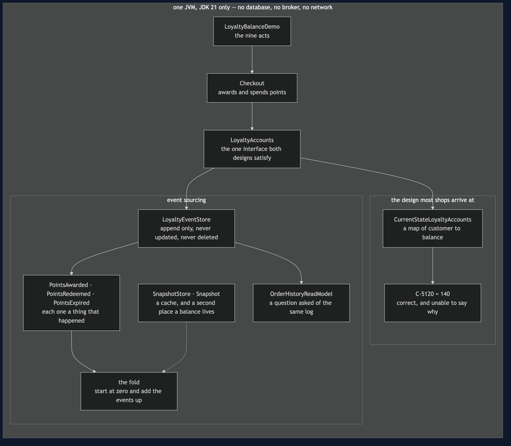
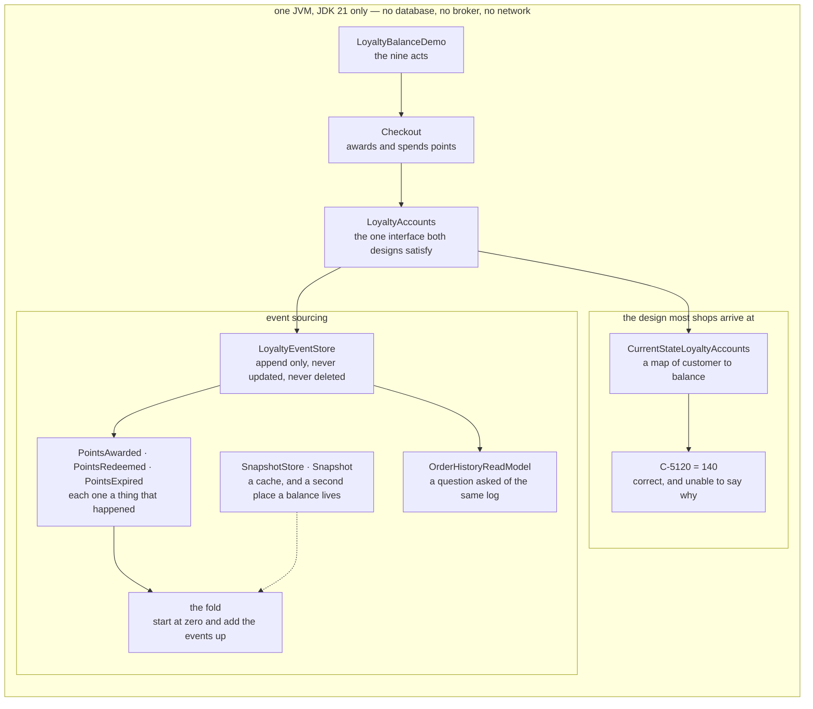

# Event Sourcing Pattern — Architecture Diagram

Where each piece runs, and which technology it is written in. The class diagram shows the
types and the sequence diagrams show the order of events; this one answers the question
those two cannot, which is **what would I have to start**.

The honest answer for this project is: nothing. There is one box, it is one Java program,
and the event store is an `ArrayList`. No database, no Kafka, no Docker, no Spring, no HTTP
port. Unlike its neighbours in this category, this project has no `real/` directory — and
that is a decision rather than an omission, explained at the bottom of this page.

So the picture is drawn a different way. Instead of processes, it shows the **two designs
side by side**, because the whole project is the difference between them. On the left, the
shop keeps a number and updates it. On the right, the shop keeps a list of the things that
happened and adds them up when asked.

Look at what is missing from the right-hand side: there is no balance field anywhere on it.
The number a customer is quoted does not exist until somebody asks for it, and it is
computed from the log every time. That absence is the pattern, and everything the pattern
buys and everything it costs follows from it.

Mermaid source

## What the diagram is telling you to count

**One interface, two implementations, one demo.** Both designs satisfy `LoyaltyAccounts`, so
the same checkout drives both and every comparison in the project is like for like. The
left-hand design is not a straw man: its tests all pass, the balance it reports is right, and
a reviewer would approve it without a comment.

**One arrow into the event store, and it only goes one way.** Nothing on the diagram updates
an event and nothing deletes one. That single restriction is what makes the log able to
answer questions nobody thought of in advance — including the query in the demo's third act,
which was written weeks after the bug it finds, against data that was already lying there.

**The snapshot is drawn with a dotted line, and it is drawn deliberately small.** It is a
cache, not a source of truth. The log is the truth; a snapshot is an optimisation that
happens to contain a balance, which is the very thing the pattern removed. One written by
buggy code stays wrong forever and nothing throws, so the cure is to throw every snapshot
away and fold again from the start.

**The read model is a second reader of the same log, not a second store of truth.** It
exists because "which orders awarded points more than once" is a question the fold cannot
answer, and the answer is derived rather than kept.

## Why there is no `real/` tier for this project

The other projects in this category carry a second tier where the pattern is rebuilt on real
infrastructure, because in each of those the process boundary is the thing the pattern is
actually about. Here it is not. Replacing the `ArrayList` with PostgreSQL, Kafka or a
purpose-built event store changes durability, ordering guarantees, concurrent writers and
the ability of another service to read the log — all real, all operational, and **none of
them changes a single argument this project makes**.

What an event is, what may go into the log, where the meaning of an event lives, why the
repair is a read rather than a write, what a snapshot costs and why erasure fights the
pattern head-on: every one of those is the same on a list as on a cluster. Standing up a
broker to say it again would add a great deal of machinery and no new claim.

The limit is stated plainly instead. Finish this project and you will know what event
sourcing is, could write one, and will know what it costs. You will not have operated one —
and the cost figures in the demo's sixth act are events examined, not milliseconds.
