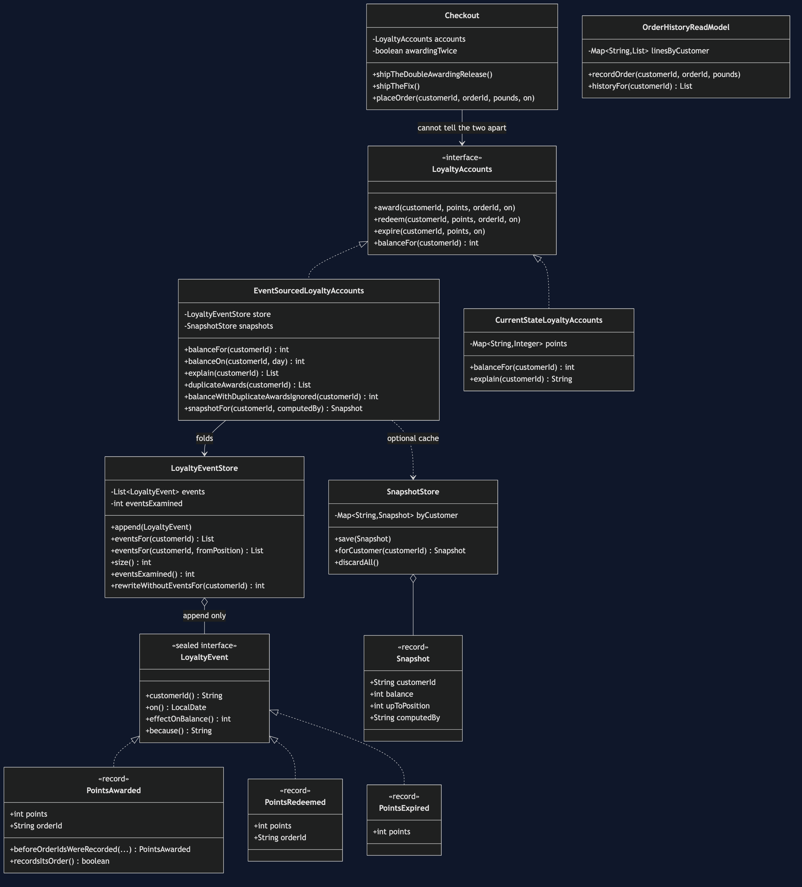
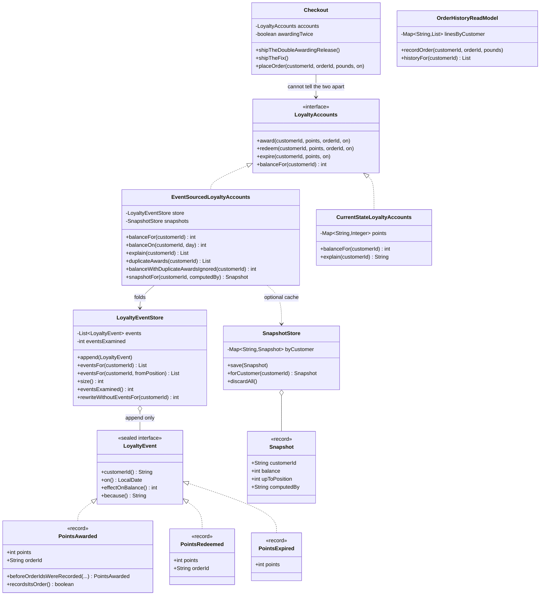

# Event Sourcing Pattern — Class Diagram

Shows the static structure: the three events that are the only facts in the system,
the append-only store that holds them, the accounts class that derives a balance
from them, the snapshot cache that is explicitly not the truth, and — kept
deliberately alongside and kept correct — the current-state version the pattern is
being compared against.

The single most important thing on this diagram is a **missing field**.
`CurrentStateLoyaltyAccounts` has `Map<String, Integer> points`.
`EventSourcedLoyaltyAccounts` has no balance field at all. Every number it returns
is computed on the spot from the store.

Mermaid source

## Reading The Diagram

**`Checkout` depends on `LoyaltyAccounts`, not on either implementation.** That is
what makes the comparison in the demo fair. The same `Checkout`, with the same bug
switched on, runs against both designs. Nothing about the calling code chooses the
pattern; the pattern is a choice about storage, made behind an interface the caller
never looks past.

**`LoyaltyEvent` is sealed, with exactly three permitted records.** The compiler
knows the list is complete. Add a fourth kind of thing that can happen to a balance
and every `switch` over events stops compiling until you handle it — which is the
reminder you want, since a reader that silently ignores an event kind produces a
wrong balance and no error.

**The arrow from `LoyaltyEventStore` to `LoyaltyEvent` is composition, and one-way.**
Events do not know about the store, do not know their own position, and hold no
reference to an `Order` or a `Customer` object. Everything an event needs to be
understood is copied inside it, because the whole value of the log is that reading
it in 2027 gives you what was true in 2025 rather than what is true now.

**The arrow to `SnapshotStore` is dashed and optional.** There are two constructors:
one with a snapshot store and one without. Every test that asserts correctness uses
the one without, and that is deliberate — a snapshot must never be required for a
right answer. The four fields on `Snapshot` are the whole of its honesty:
`upToPosition` says which event it covers, and `computedBy` names the code that
produced it, so that when that code turns out to have had a bug you know which
snapshots to throw away.

**`CurrentStateLoyaltyAccounts` is on the diagram on purpose.** It is not dead code
and it is not broken. It is the design most of the industry uses, kept side by side
so the trade-off can be measured rather than asserted.

**`OrderHistoryReadModel` connects to nothing.** It has no line to the store, to the
events or to the accounts, and the emptiness around it is the point: it is CQRS,
implemented with no event sourcing whatsoever, sitting in the same project to keep
the two ideas apart.
