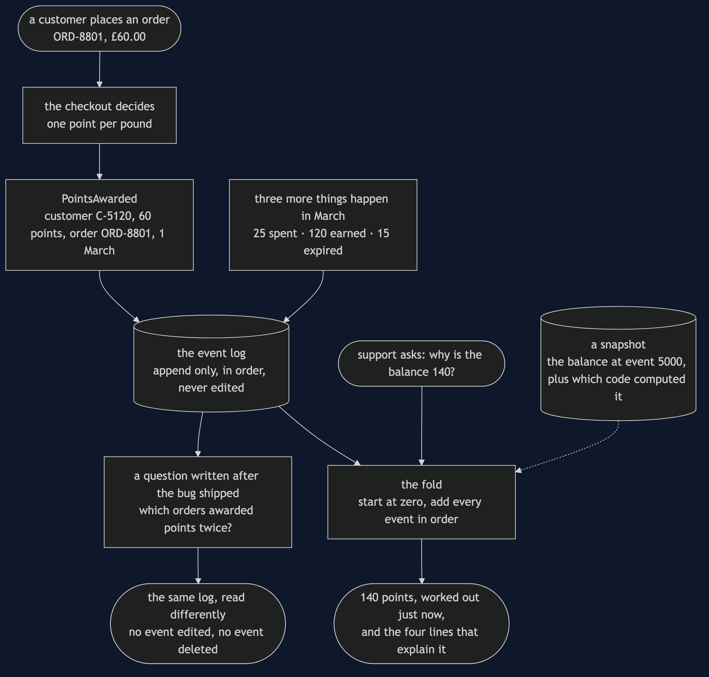
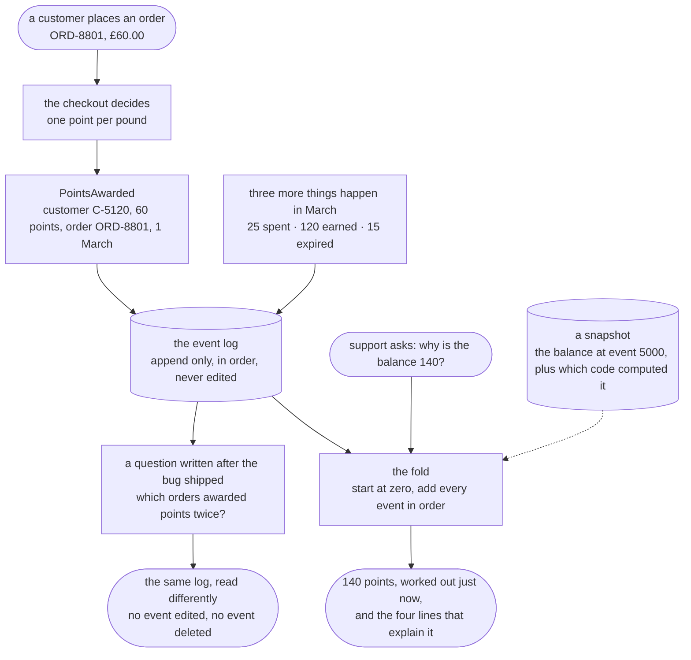

# Event Sourcing Pattern — Data Flow Diagram

Four things happening to one customer in March, followed from the order that caused them to
the number a support agent reads out on the phone. The architecture diagram says what the
pieces are; this one says what moves between them, and in which direction.

The shape of this diagram is the whole pattern, and it is worth describing in words before
you look at it. **Writes go down the left and stop.** Each thing that happens becomes a
record, the record is added to the end of a list, and nothing is ever changed afterwards.
**Reads go up the right and compute.** A balance is not fetched; it is worked out, on
demand, by starting at zero and adding up everything in the log.

Compare that with the design it replaces, where the same four things arrive, each one is
added to a number, and the four records are thrown away. The number is right. Everything
that explains the number is gone, and it was destroyed by the very act of keeping the
number up to date.

Watch what each arrow carries. Going down, an arrow carries a fact with a date on it: sixty
points earned on order ORD-8801, twenty-five spent on ORD-8814. Going up, an arrow carries
a question and comes back with an answer that was computed a moment ago and is not stored
anywhere.

Mermaid source

## The three things this flow proves

**Nothing flows backwards into the log.** There is no arrow from the fold, from the
snapshot or from the query that returns to the store and changes anything. That is the one
rule of the pattern, and every benefit on this page is a consequence of it.

**The answer to "why" is on the same path as the answer to "what".** The balance and the
explanation come out of the same fold, because the explanation is the input to the
calculation. In the design this replaces, the number and its reasons travel different paths
and only the number survives, which is why support's entire answer to a customer is *the row
says 140; how it got there was never written down*.

**A repair is a read, not a write.** When a release awards points twice, the log is not
wrong — the shop really did award those points twice, and that really is what happened. The
*interpretation* was wrong. So the fix goes in the code that reads, the log is untouched, and
every balance in the shop is right again. That is the arrow at the bottom right of the
diagram, and it is the strongest thing this pattern does.

## Where this flow costs you

**Reading gets slow, and the fix brings back the thing you removed.** Five thousand events
is five thousand reads for one balance. The snapshot on the diagram fixes that, and it is
drawn dotted for a reason: a snapshot *is* a stored balance, the exact thing the pattern
took away. One written by buggy code stays wrong forever and nothing throws, so it records
which code computed it, and the cure is to throw every snapshot away and refold.

**Erasure has no arrow, and that is the problem.** A customer has a legal right to be
forgotten, and this diagram has no delete on it anywhere. Deleting their events removes the
history that explained them, beyond recovery — and a snapshot taken earlier will still
answer with their balance, so the number survives the deletion of its own evidence.

**An event is a schema you version and never migrate.** The order id on `PointsAwarded` was
added at some point, which means older events do not have one. The duplicate query then
reports zero duplicates in a stream that visibly contains two identical awards, and nothing
anywhere reports a problem. Old events are old forever; the reading code is what has to cope.
