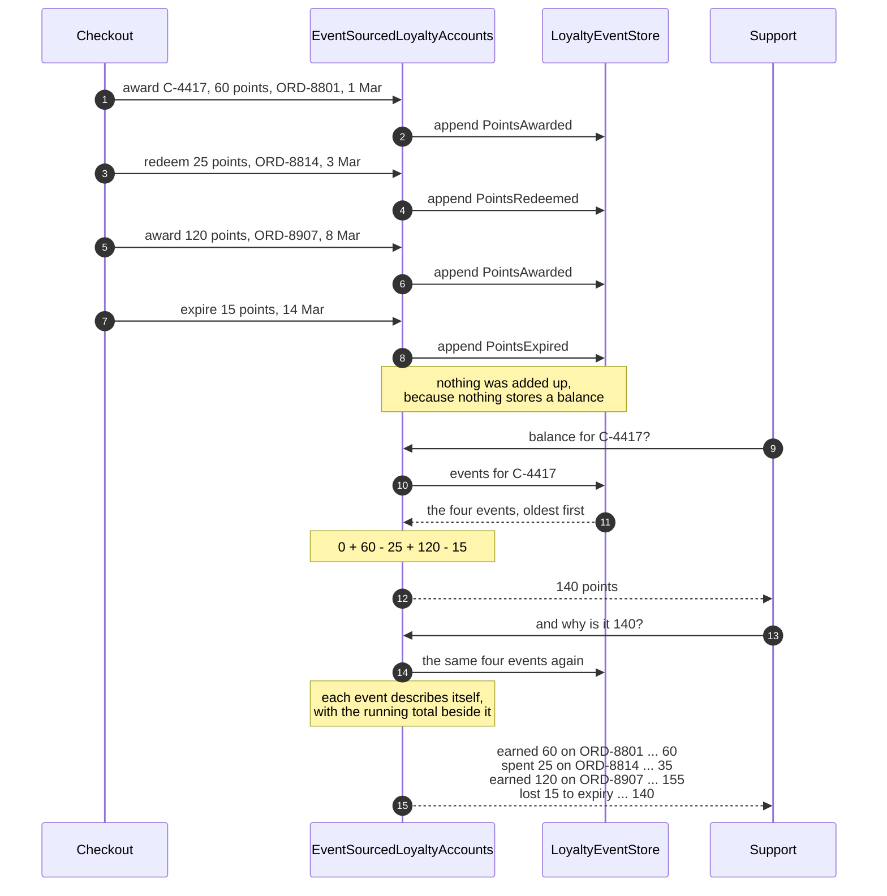

# Event Sourcing Pattern — Sequence Diagram

Four things happening to one customer's loyalty points, and then two questions asked about
them — in the order the calls happen. The architecture diagram puts the two designs side by
side and the data flow diagram shows writes going down and reads coming up; this one shows
**when each side does its work**, and the surprise is that the write side does almost
none.

Follow the writes first. The customer earns sixty points on an order in March, spends
twenty-five on the next one, earns a hundred and twenty on a third, and loses fifteen to
the twelve-month expiry. Each time, the checkout hands a fact to the store and the store
puts it at the end of the log. Nothing is added up. Nothing is overwritten. **There is no
balance to update, because there is no balance.**

Then the reads. Support asks what the balance is, and the accounts object fetches the four
events, oldest first, and adds them: zero plus sixty, minus twenty-five, plus a hundred
and twenty, minus fifteen — a hundred and forty. Ask again and the same walk happens
again. Then support asks the harder question, the one the shop could not answer before:
*why* is it a hundred and forty. The same walk runs, and this time each event is asked to
describe itself, so the answer comes back as four dated lines with a running total beside
each one.

Mermaid source

## What the order proves

**The write side is one arrow long.** Turn a decision into a fact, put the fact at the end
of the log, stop. Every interesting thing in this pattern happens on the read side, which
is the opposite of the design it replaces — there, the write did the arithmetic and the
read was a single lookup of a number that could not explain itself.

**The same walk answers both questions.** The balance and the explanation are the same
traversal with a different amount of printing, which is why the second question costs
nothing extra to support. A stored balance can answer the first and has no way at all to
answer the second.

**Each event explains itself.** The accounts object never learns how to describe an
expiry; it asks the expiry. Add a fifth kind of event next year and its explanation
arrives with it, rather than being bolted onto a growing switch statement somewhere else.

**Reading is the expensive direction, and that is the bill.** Four events add up
instantly; five thousand do not, and the fix — a snapshot — is a stored balance,
reintroducing the very thing the pattern removed. A snapshot written by buggy code stays
wrong for ever and nothing throws. The log is the truth; a snapshot is only a cache of it.

The investigation weeks after a bug shipped, and what a snapshot costs, are sequences 3
and 4 in [`uml-diagram.md`](uml-diagram.md).
