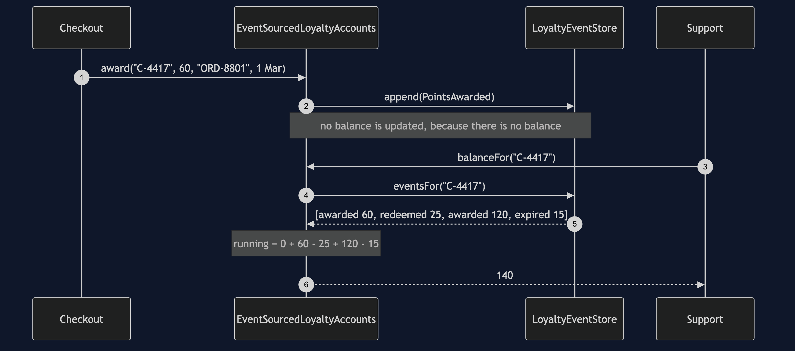
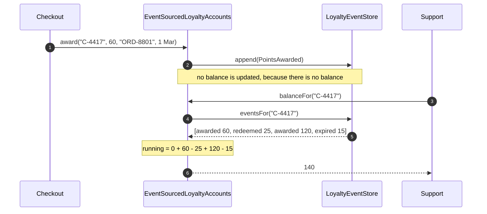
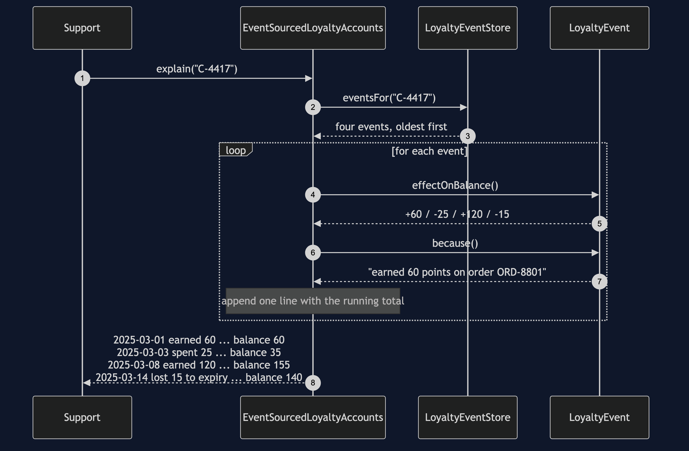
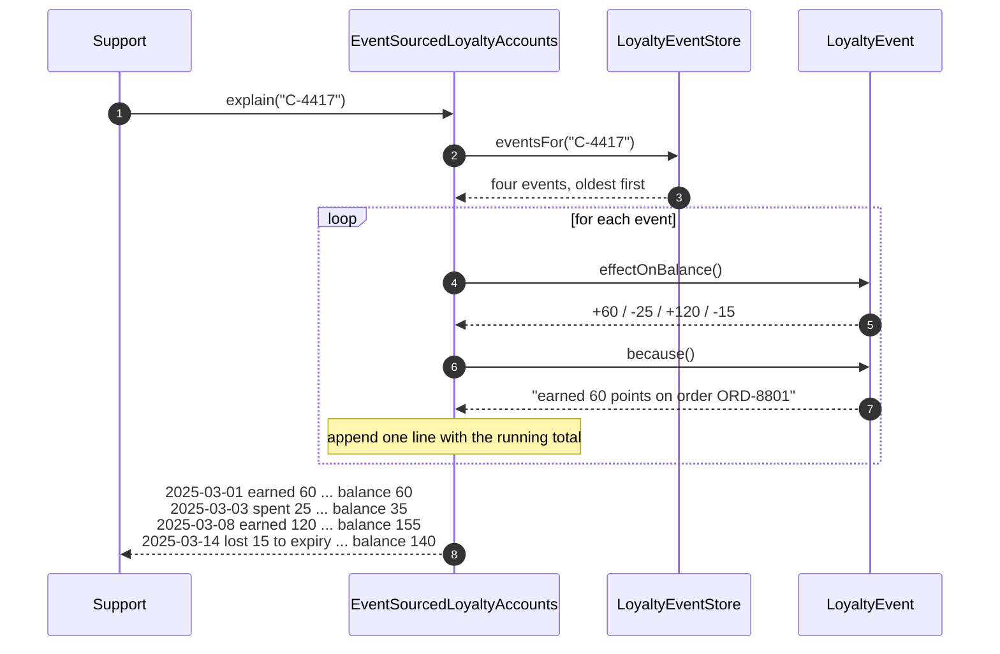
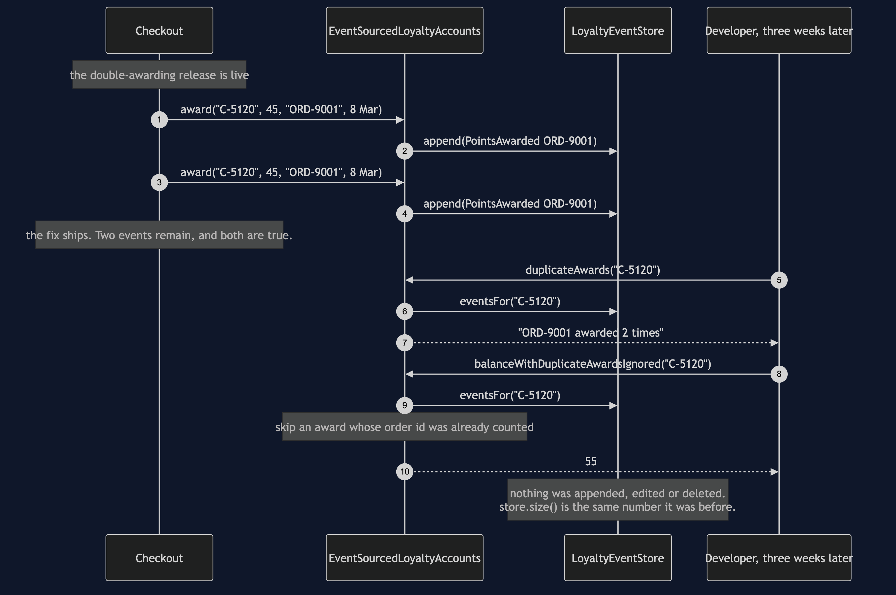
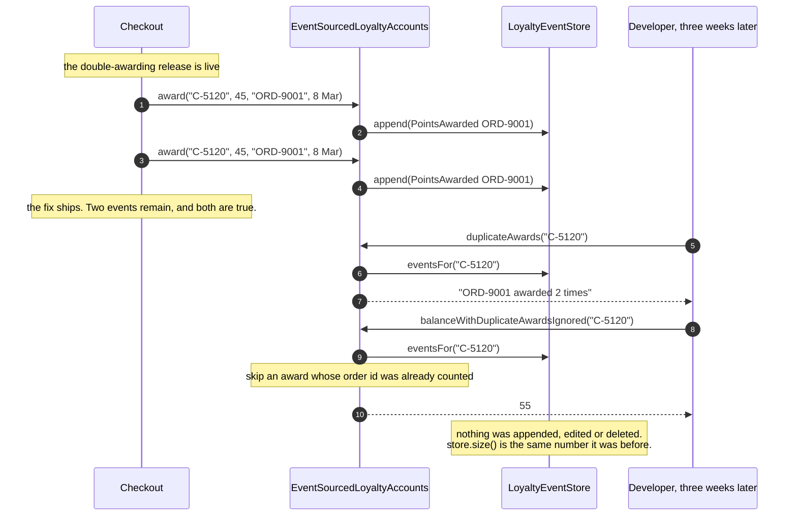
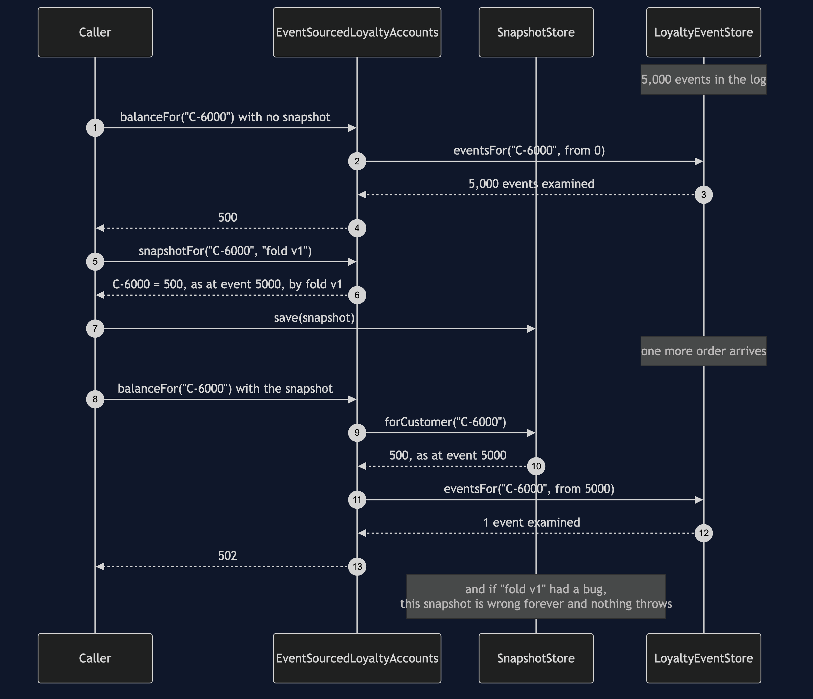
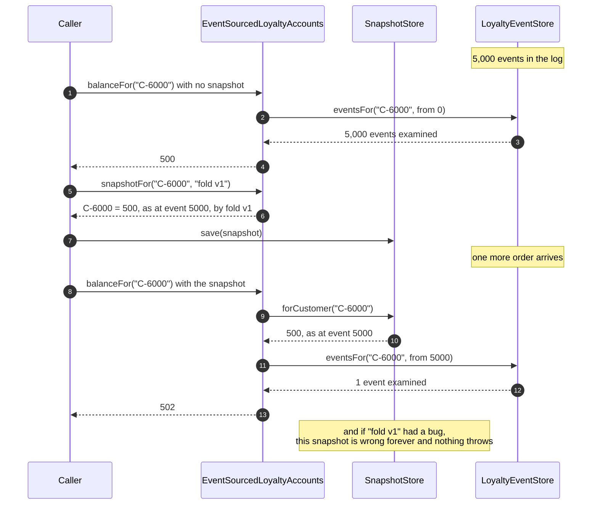

# Event Sourcing Pattern — UML Sequence Diagrams

Four sequences. The first is the whole pattern in one picture; the other three are
the three things it makes possible that the current-state design cannot do at all.

## 1. A Write, Then A Read

Nothing is stored when the balance is asked for. It is worked out.

Mermaid source

The write side has one job: turn a decision into a fact and put the fact at the end
of the log. The read side has one job: walk the facts and add them up. There is no
field anywhere holding 140, and asking a second time does the same walk again.

## 2. Why Is It 140?

The same walk, printing itself.

Mermaid source

Each event explains itself through `because()`, so the accounts class never has to
know how to describe an expiry. Add a fourth kind of event and the explanation comes
with it.

## 3. The Bug Investigation, Weeks Later

The query does not exist while the bug is live. It is written afterwards, against
data that was already lying there.

Mermaid source

The log was never wrong — the shop really did award twice. The *interpretation* was
wrong, so the repair is a change to the reading code. That is the sentence worth
carrying out of this project.

## 4. The Snapshot, And What It Costs

The fix for a slow fold, and the second place a balance comes to live.

Mermaid source

Five thousand reads become one, and the answer is identical. The price is that a
balance is now stored somewhere again, which is the thing the pattern set out to
avoid — so the snapshot records which event it covers and which code computed it,
and the cure when that code was wrong is to throw every snapshot away and refold.
That cure is cheap only because the log kept everything.
