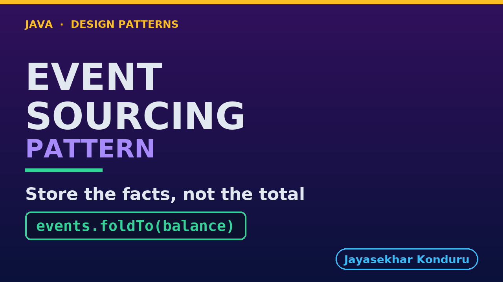

# YouTube — Event Sourcing Pattern

Everything needed to publish `video/event-sourcing-pattern-explained.mp4`. Copy the fields straight out of this file.

Chapter timings are generated from the video's `.srt`. Re-run `python3 docs/make_youtube_docs.py event-sourcing` after any change to the narration, or they will be wrong.

## Title

```
Event Sourcing in Java - Why Is This Balance 140?
```

49 characters — under the 60 YouTube shows before truncating in search results.

## Description

The first two lines are what a viewer sees above the fold, so they carry the hook rather than the boilerplate.

```
Learn event sourcing in Java 21 through a loyalty scheme, a row with a hundred and forty in it, and a customer ringing up to ask why. The version that keeps the total is shown fairly: four facts arrive, one is used, and the order id and the date are dropped on the floor. Three weeks later a bug doubles an order — and because a doubled forty-five and an honest hundred write the same number, the bug destroys the evidence of itself. The insight is that the balance was never something the shop was told; it was arithmetic over facts that were then thrown away. So we store past- tense facts in an append-only log with no stored balance anywhere, and the balance becomes a five-line fold and a dated walk a support agent can read down the phone. Then the second half, which is the reason this is the most over-applied pattern in the course: reading gets expensive, the snapshot that fixes it can be quietly wrong with nothing thrown and nothing logged, a right to be forgotten meets a log with no delete, and event sourcing turns out not to be CQRS.

CHAPTERS
00:00 Introduction
01:11 The Scenario
02:01 The Naive Approach — Keep the Total
02:46 What the Row Can Say
03:36 Three Weeks Later, a Bug
04:36 The Pattern
05:23 Three Moves
06:43 Who Does What
08:01 The Fold — and Why It Is 140
09:03 The Query Nobody Wrote in Advance
10:20 The Bill — Reading Gets Expensive
11:16 The Bill — A Snapshot Can Be Quietly Wrong
12:18 The Bill — Erasure, and Old Events
13:43 Event Sourcing Is Not CQRS
15:03 When to Reach for It
16:01 Thanks for Watching

SOURCE CODE, WRITTEN NOTES AND AN INTERACTIVE ANIMATION
https://github.com/jk-boot-up/java-design-patterns/tree/main/gradle-java/platform-design-patterns/event-sourcing-pattern

WHAT YOU NEED FIRST
Java 21 and a working knowledge of classes and interfaces. No prior design-pattern knowledge is assumed. The full prerequisites are in docs/prerequisites.md in the repository.
```

## Chapters

YouTube renders these as chapters only if there are at least three and the first is at `00:00`.

```
00:00 Introduction
01:11 The Scenario
02:01 The Naive Approach — Keep the Total
02:46 What the Row Can Say
03:36 Three Weeks Later, a Bug
04:36 The Pattern
05:23 Three Moves
06:43 Who Does What
08:01 The Fold — and Why It Is 140
09:03 The Query Nobody Wrote in Advance
10:20 The Bill — Reading Gets Expensive
11:16 The Bill — A Snapshot Can Be Quietly Wrong
12:18 The Bill — Erasure, and Old Events
13:43 Event Sourcing Is Not CQRS
15:03 When to Reach for It
16:01 Thanks for Watching
```

## Tags

```
event sourcing, append only log java, loyalty points, design patterns, java design patterns, gang of four, java 21, software design, clean code, object oriented design, java tutorial, ecommerce, programming tutorial
```

215 characters, under YouTube's 500 limit.

## Thumbnail



**Upload `docs/thumbnail.png`** — 1280×720, the size YouTube recommends, generated by `docs/make_thumbnails.py`. It is deliberately not the same image as the video's opening frame: a thumbnail is judged at about 360 pixels wide in a search result, so this one carries only the pattern name, one line of promise and one short piece of code, each set large enough to survive the shrink.

`video/poster.png` is the 1920×1080 opening frame, produced by the video build. It stays in the repository as the title card; it is not what gets uploaded.

YouTube will not pick the thumbnail up on its own — upload it under **Details → Thumbnail → Upload file**. A custom thumbnail requires a verified channel.

## Upload checklist

- [ ] Upload `video/event-sourcing-pattern-explained.mp4` (1080p, H.264, 30 fps, AAC 48 kHz — already YouTube's recommended settings, no re-encode needed)
- [ ] Set the video language to **English** first, or the subtitle option may not appear
- [ ] Add subtitles: *Video elements → Add subtitles → Upload file → With timing* → `video/event-sourcing-pattern-explained.srt`
- [ ] Upload `docs/thumbnail.png` as the thumbnail — do not let YouTube auto-pick a frame
- [ ] Paste the title, description and tags from above
- [ ] Add to the **Java Design Patterns** playlist, in learning order
- [ ] Wait for 1080p processing before sharing the link — code slides are unreadable at 360p

## Cards and end screen

End screen links to whichever pattern video goes up next — set it at upload time rather than assuming an order.

Add a card partway through pointing at the playlist, so a viewer who arrives at this pattern from search can find the rest of the series.

## Runtime

Approximately 16:59, narrated at 145 words per minute.
