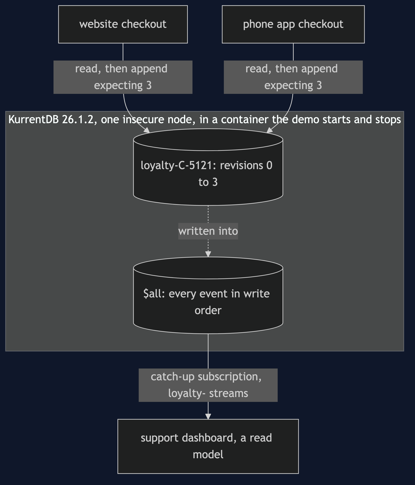

# Event Sourcing with EventStoreDB Pattern — Architecture Diagram

There are two checkouts and a support dashboard, each with its own connection, and one KurrentDB server in a container. The checkouts append to one stream per customer. The dashboard follows every loyalty stream through a subscription. Nothing talks to anything except the database.

