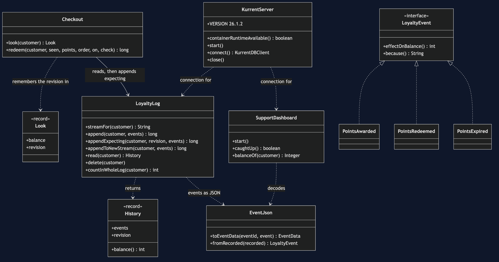

# Event Sourcing with EventStoreDB Pattern — Class Diagram

The pattern sits in two classes. `LoyaltyLog` appends to a customer's stream, with or without an expected revision, and reads it back. `Checkout` looks, decides and appends, and carries the revision from its look to its append. `SupportDashboard` only reads. `KurrentServer` owns the container.

