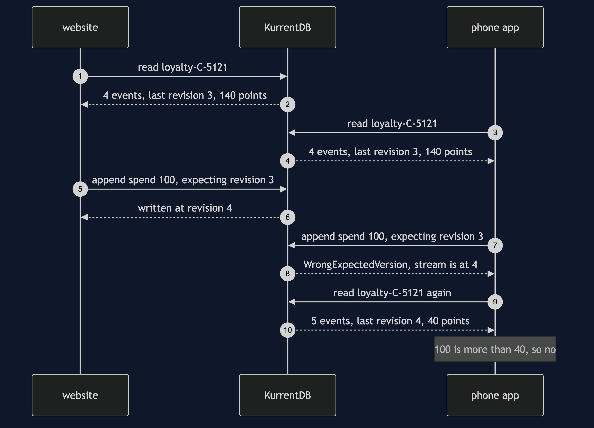

# Event Sourcing with EventStoreDB Pattern — Sequence Diagram

Written for a listener with the screen off.

Here it is in words. Customer C-5121 has 140 points and pays with points on the website and in the phone app at the same moment. The website reads the customer's stream from KurrentDB, adds it up to 140, and notes that the last event is revision 3. The phone app does exactly the same and sees the same. Both decide 100 points is affordable. The website appends a spend of 100, saying "only if the stream is still at revision 3". KurrentDB checks, finds revision 3, writes the spend at revision 4, and says so. Then the phone app appends its spend, also expecting revision 3. KurrentDB checks, finds revision 4, and refuses with WrongExpectedVersion. The phone app reads the stream again and adds it up to 40 points. A hundred is more than 40, so it tells the customer no. The balance is 40, and nothing was ever locked.

The load-bearing sentence: **the server writes an append only if the stream is still at the revision the writer looked at, so of two writers who looked at the same moment, exactly one succeeds.**

For the race with no check, the retry, the subscription and the delete, see [`uml-diagram.md`](uml-diagram.md).
