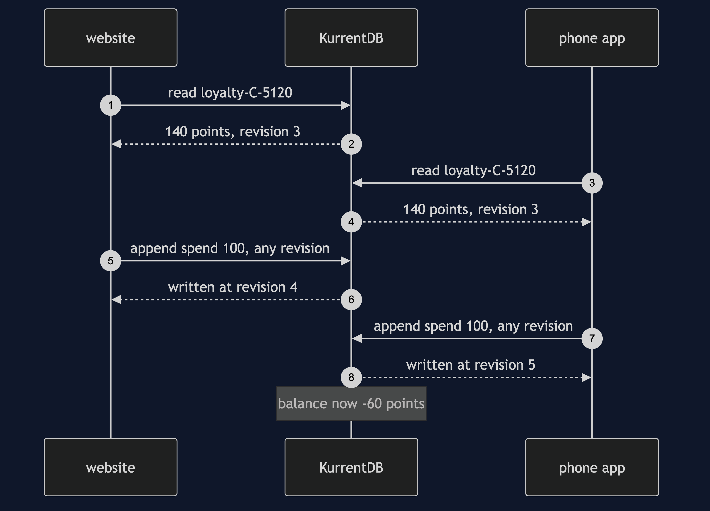
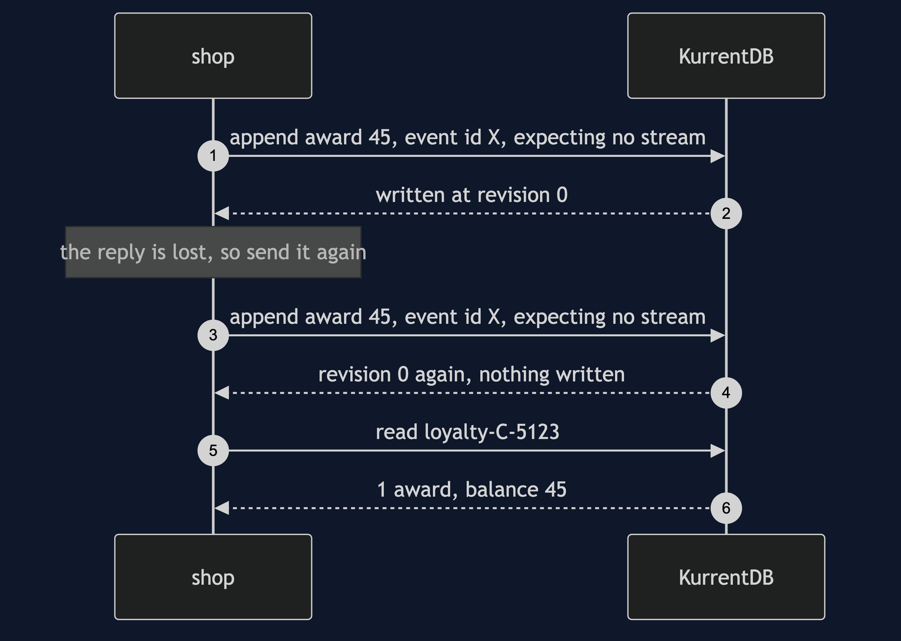
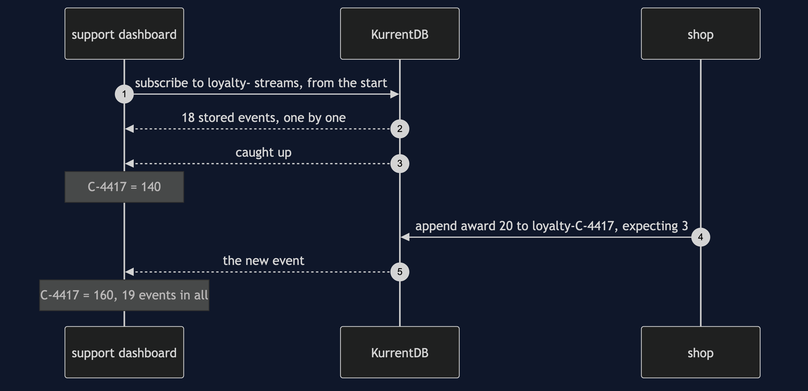
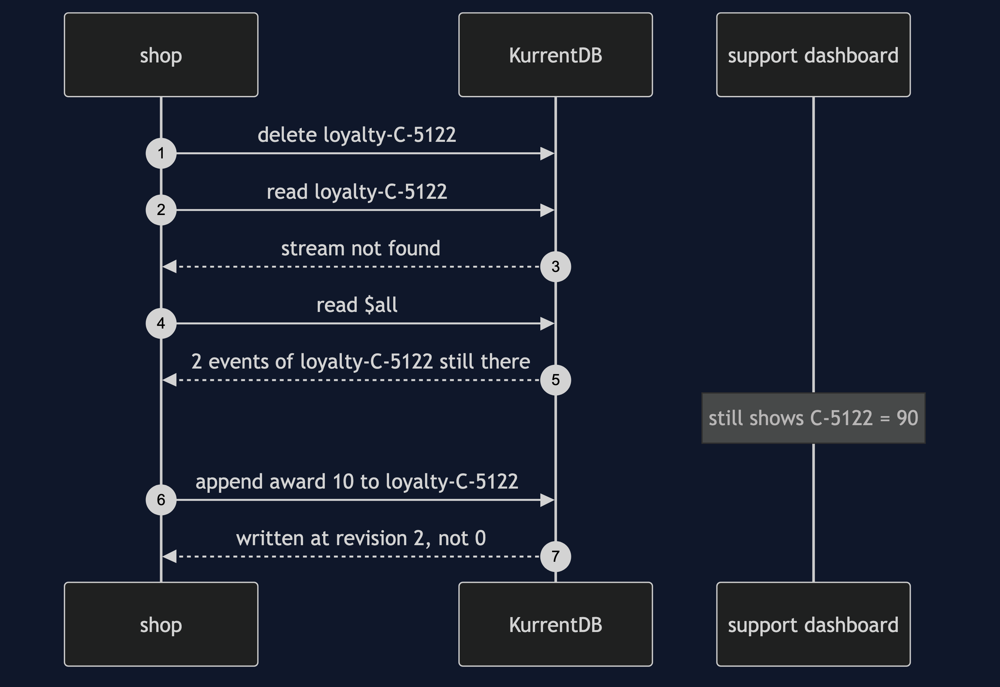

# Event Sourcing with EventStoreDB Pattern — UML Sequence Diagrams

Four sequences. The race with no check comes first, because it is the failure the expected revision exists to stop, and a list inside one program could never produce it.

## 1. Two Checkouts With No Check

Both checkouts see 140 points at revision 3. Both append with `any`. Both are accepted, and the balance is -60.

## 2. A Retry With The Same Event Id

The first send is written at revision 0. The reply is treated as lost, and the same event, with the same id and the same expectation, is sent again. The server answers revision 0 again and writes nothing.

## 3. A Catch-Up Subscription

The dashboard starts last. It receives the 18 stored events, is told it has caught up, and then receives the new award as it is written.

## 4. Deleting A Stream

The stream is not found by name. Its events are still in `$all` until a scavenge runs, and still on the dashboard. The name is used again at revision 2.

