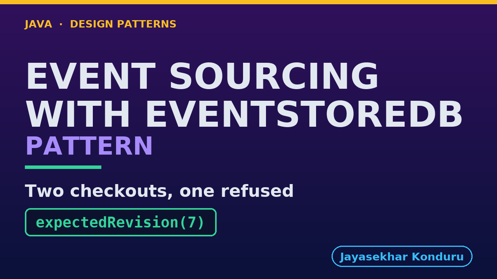

# YouTube — Event Sourcing With Eventstoredb Pattern

Everything needed to publish `video/event-sourcing-with-eventstoredb-pattern-explained.mp4`. Copy the fields straight out of this file.

Chapter timings are generated from the video's `.srt`. Re-run `python3 docs/make_youtube_docs.py event-sourcing-with-eventstoredb` after any change to the narration, or they will be wrong.

## Title

```
Event Sourcing with EventStoreDB - Real Revisions
```

49 characters — under the 60 YouTube shows before truncating in search results.

## Description

The first two lines are what a viewer sees above the fold, so they carry the hook rather than the boilerplate.

```
Event Sourcing pattern in Java, explained with a real event database, EventStoreDB, recently renamed KurrentDB. Instead of overwriting what it knows, the program writes down each thing that happened, in order, and adds the list up when it needs the current state. Our online store's loyalty scheme keeps every award, spend and expiry rather than one points balance. We watch two checkouts spend the same points at the same moment and the database refuse the second through an expected revision number, see a retry the database recognises, and a screen that catches up by reading the history. We finish with the bill, including what deleting a customer's stream really removes.

CHAPTERS
00:00 Introduction
00:55 The Scenario
01:28 KurrentDB's Words
02:08 A Real Log, Read Back
02:47 Two Checkouts, No Check
03:26 The Expected Revision
04:09 One Number Decides
04:43 One Argument
05:11 A Retry It Recognises
06:01 A Screen That Catches Up
06:55 The Bill: Deleting A Stream
07:39 What Else It Costs
08:13 What The Simulation Left Out
08:57 The Verdict
09:25 What Is Real, And When Not
09:54 Thanks for Watching

SOURCE CODE, WRITTEN NOTES AND AN INTERACTIVE ANIMATION
https://github.com/jk-boot-up/java-design-patterns/tree/main/gradle-java/platform-design-patterns/event-sourcing-with-eventstoredb-pattern

WHAT YOU NEED FIRST
Java 21 and a working knowledge of classes and interfaces. No prior design-pattern knowledge is assumed. The full prerequisites are in docs/prerequisites.md in the repository.
```

## Chapters

YouTube renders these as chapters only if there are at least three and the first is at `00:00`.

```
00:00 Introduction
00:55 The Scenario
01:28 KurrentDB's Words
02:08 A Real Log, Read Back
02:47 Two Checkouts, No Check
03:26 The Expected Revision
04:09 One Number Decides
04:43 One Argument
05:11 A Retry It Recognises
06:01 A Screen That Catches Up
06:55 The Bill: Deleting A Stream
07:39 What Else It Costs
08:13 What The Simulation Left Out
08:57 The Verdict
09:25 What Is Real, And When Not
09:54 Thanks for Watching
```

## Tags

```
event sourcing, eventstoredb, kurrentdb, optimistic concurrency, design patterns, java design patterns, gang of four, java 21, software design, clean code, object oriented design, java tutorial, ecommerce, programming tutorial
```

226 characters, under YouTube's 500 limit.

## Thumbnail



**Upload `docs/thumbnail.png`** — 1280×720, the size YouTube recommends, generated by `docs/make_thumbnails.py`. It is deliberately not the same image as the video's opening frame: a thumbnail is judged at about 360 pixels wide in a search result, so this one carries only the pattern name, one line of promise and one short piece of code, each set large enough to survive the shrink.

`video/poster.png` is the 1920×1080 opening frame, produced by the video build. It stays in the repository as the title card; it is not what gets uploaded.

YouTube will not pick the thumbnail up on its own — upload it under **Details → Thumbnail → Upload file**. A custom thumbnail requires a verified channel.

## Upload checklist

- [ ] Upload `video/event-sourcing-with-eventstoredb-pattern-explained.mp4` (1080p, H.264, 30 fps, AAC 48 kHz — already YouTube's recommended settings, no re-encode needed)
- [ ] Set the video language to **English** first, or the subtitle option may not appear
- [ ] Add subtitles: *Video elements → Add subtitles → Upload file → With timing* → `video/event-sourcing-with-eventstoredb-pattern-explained.srt`
- [ ] Upload `docs/thumbnail.png` as the thumbnail — do not let YouTube auto-pick a frame
- [ ] Paste the title, description and tags from above
- [ ] Add to the **Java Design Patterns** playlist, in learning order
- [ ] Wait for 1080p processing before sharing the link — code slides are unreadable at 360p

## Cards and end screen

End screen links to whichever pattern video goes up next — set it at upload time rather than assuming an order.

Add a card partway through pointing at the playlist, so a viewer who arrives at this pattern from search can find the rest of the series.

## Runtime

Approximately 11:44, narrated at 145 words per minute.
