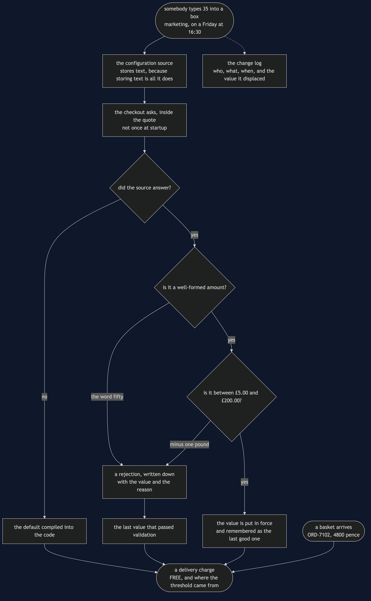

# Externalised Configuration Pattern

**Keep the values that change on somebody else's calendar outside the program, read
them while it runs — and rebuild, deliberately, every guard the value had while it
lived in the source code.**

Think of the greengrocer with a chalk board outside the shop. The prices are not
painted on the wall. When the tomatoes need shifting before closing, somebody walks
out with a cloth and a stick of chalk and the price is different thirty seconds
later. Nobody repaints the shop. That is the whole idea — and the reason the board is
outside where anyone can reach it is also the reason somebody can write nonsense on
it.

The shop gives free delivery to anyone spending over fifty pounds, and the obvious
version writes that fifty as a named constant in the checkout class. That constant is
correct. It is tidy, it is typed, it is in one place, and a reviewer would approve it
without a comment. It is also two hours and fifteen minutes of pipeline work spread
across a weekend away from being a different number, which is a problem when the
person who decides it works to a marketing calendar.

## Run

```bash
./gradlew run
```

Nine acts. The first four are the pattern and what it buys; the last five are the
bill and what you have to build to pay it.

Act 1 is the line of code that is not wrong.

```
Act 1 - free delivery over £50.00, and the number lives in the source
    ORD-7101  goods £62.00  delivery FREE
    ORD-7102  goods £48.00  delivery £4.99
    ORD-7103  goods £31.50  delivery £4.99
  nothing here is wrong. It is a named constant, in one place, and a reviewer would pass it.
  the threshold came from: a constant compiled into the program
```

Act 2 is what changing it costs, and it is the reason the pattern exists.

```
Act 2 - marketing wants £35.00 from Sat 08 Mar 09:00, and asks on Friday at 16:30
  edit the constant         15 min   done Fri 07 Mar 16:45
  code review               45 min   done Mon 10 Mar 09:30
  build and test            25 min   done Mon 10 Mar 09:55
  release approval          30 min   done Mon 10 Mar 10:25
  deploy and watch          20 min   done Mon 10 Mar 10:45
  total work: 2 hours 15 minutes
  live at:    Mon 10 Mar 10:45
  the promotion was for the weekend. It is late by 2 days 1 hour 45 minutes.
  no step in that list is unreasonable. A deploy is simply not a thing you do at 9am on a Saturday.
```

Read the gap between the first two lines. The edit finishes at a quarter to five on
Friday and the review finishes on Monday morning, because the release window closed
at five and did not reopen until Monday. Then try to delete a step. Code review is how
a typo does not reach a million customers. Approval is how a regulated business shows
its releases are controlled. The window exists because the people who would notice a
bad release are at their desks on weekdays. **Nothing in that list is waste, and the
promotion still misses its weekend.**

Act 3 is the pattern, and the elapsed time is the point.

```
Act 3 - the same threshold, read from a configuration source on every quote
  #1  Fri 07 Mar 16:30:04  delivery.freeOver  (not set) -> 35        by marketing
  the very next quote, 4 seconds later:
    ORD-7101  goods £62.00  delivery FREE
    ORD-7102  goods £48.00  delivery FREE
    ORD-7103  goods £31.50  delivery £4.99
  ORD-7102 now ships free. No rebuild, no redeploy, no restart.
```

One line of the checkout differs from Act 1: instead of reading a constant it asks a
settings reader, and it asks *inside* the quote rather than once when it is built. That
placement is the pattern. Read the value in the constructor and you have traded a
rebuild for a restart, which on a Saturday morning is not much of a trade.

Act 4 is the failure mode every setting carries a default for.

```
Act 4 - the config server stops answering
  threshold in force: £50.00
  came from: the default compiled into the code, because the config server could not be reached
  the shop starts and keeps selling, because the code carries its own default.
  note what it quietly lost, though: the promotion. Back to £50.00 with no error and no alarm.
```

A shop that refuses to serve customers because a configuration server is down is a
worse shop than one with a hard-coded threshold. But read the last line. The
promotion is off, no exception reaches anyone, no alert fires, and the only trace
anywhere is that origin string.

## And then the bill

Acts 5 to 9 get more room than the benefits, because the value did not leave the
source file alone. It left four guards behind.

**A well-formed number nobody checked.** Act 5 is somebody typing `-1` on Saturday
morning.

```
Act 5 - the bill: somebody types -1 into the box on Saturday morning
  #2  Sat 08 Mar 09:12:04  delivery.freeOver  35       -> -1        by marketing
    ORD-7103  goods £31.50  delivery FREE
  every basket in the shop now ships free, including the £31.50 one.
  -1 is a perfectly well-formed number, so nothing complains. There is no exception and no log line.
  it reached the running shop in 4 seconds, with no compiler, no code review and no test suite in the way.
```

There is no bug to find. The program was told the threshold is minus one pound and is
faithfully applying it. The first symptom is the margin report, on Monday.

**A value that is not a number at all.** Act 6 is eight minutes later.

```
Act 6 - the bill: eight minutes later, somebody types the word fifty
  #3  Sat 08 Mar 09:20:04  delivery.freeOver  -1       -> fifty     by marketing
    ORD-7101  checkout failed: setting 'delivery.freeOver' has value "fifty" — expected an amount of money such as "35" or "4.99"
  not one basket can be quoted. The shop is down, and it was taken down by a text box.
  the config server stored it happily, because storing text is all a config server does.
```

The compiler would have refused that. The compiler is no longer in the path. In one
sense this is the *better* of the two failures, because you find out in seconds
rather than from the accounts.

**Declare the setting, and validate at the boundary.** Act 7 is the same two bad
values with one guard in place.

```
Act 7 - the mitigation: declare the setting, and validate at the boundary
  delivery.freeOver: money, £5.00 to £200.00, default £50.00
  #5  Sat 08 Mar 11:40:04  delivery.freeOver  35       -> -1        by ops
    ORD-7103  goods £31.50  delivery £4.99   threshold £35.00
    came from: the last value that passed validation, because the configured value was rejected
  REJECTED  setting 'delivery.freeOver' has value "fifty" — expected an amount of money such as "35" or "4.99"
  REJECTED  setting 'delivery.freeOver' has value "-1" — expected between £5.00 and £200.00
  it did not revert to £50.00 either, because throwing away a good promotion over an unrelated typo is its own kind of wrong.
```

Look at what it falls back to: not the compiled-in fifty pounds, but the last value
that passed validation. And notice that the rejections are recorded — a guard that
swallows bad input in silence leaves the typo in place with nobody looking for it.

**Who changed what, and when.** Act 8 is the replacement for version control.

```
Act 8 - the mitigation: who changed what, and when
  5 changes to one setting in under a day, and not one of them is in the git history.
  the question you will be asked is never what the threshold is now. It is what it was at 9am on Saturday.
```

**A rollback as fast as the change.** Act 9 is the guard with no equivalent in the
source-code world.

```
Act 9 - the mitigation: a rollback as fast as the change
  #6  Sat 08 Mar 11:40:08  delivery.freeOver  -1       -> 35        by on-call (rollback)
  back in force at 4 seconds past the decision, and nobody had to remember the old value: the log had it.
  the same correction through the release pipeline would be live Mon 10 Mar 11:15.
  externalised configuration is not a way to avoid governing a change. It is a way to govern it in seconds instead of days.
```

Nobody had to remember that the threshold used to be thirty-five, at speed, on a
Saturday, while the shop gave delivery away. Every entry in the trail records the
value it displaced, so the rollback is a lookup rather than an act of memory.

That is the summary of the whole project:

| What the value lost | What has to replace it |
| --- | --- |
| The compiler refusing `"fifty"` | A typed setting that parses and rejects |
| A reviewer querying `-1` | A declared range the value must fall inside |
| Version control's history | An audit trail of who changed what, and when |
| A revert and a redeploy | A rollback as fast as the change |

## Test

```bash
./gradlew test
```

54 tests, in about a second, with no `Thread.sleep` and nothing random. Every date and
time in the demo is a fixed `LocalDateTime`, so two runs are byte-identical and
`DemoRunsTest` asserts that the numbers quoted in these documents are the numbers the
program actually prints.

The file worth reading first is `TheBillTest`, and `minusOneGivesEverythingAway`
**passes**. It is not a failure waiting to be fixed — it is a description of the
pattern working exactly as designed with a value somebody typed wrongly. The sharpest
test is `ConfiguredCheckoutTest.theThresholdIsReadEveryTime`, which fails the moment
somebody tidies the read up into the constructor.

## One JVM, no infrastructure

Tier 1 of this project — all of the code, all of the tests, all of the documents and
the whole video — starts nothing. No Spring, no config server, no HTTP port, no
Docker, no YAML. `ConfigServer` is a `HashMap` in the same JVM with a clock bolted on
so a write can take four seconds, and `goOffline` is a field.

That is a deliberate trade. What you get is the pattern's shape: where the read
belongs, why a default is mandatory, why "no value for this key" and "could not reach
the source" must stay separate, and what the four guards are. None of that changes
when the map becomes a real service. What you do not get is a network, caching and
refresh behaviour, layered sources, secret handling, or two instances of the shop
disagreeing about a value mid-rollout. The four seconds in the demo is a modelled
number, not a measurement.

For the version with a real Spring Cloud Config Server, a live `@RefreshScope`
refresh and the threshold visible over HTTP, see [`real/`](real) — optional,
additive, and excluded from `./gradlew test`. It is worth the minute it takes to
run even if you already know Spring Cloud Config, because it ends somewhere this
tier cannot: `@RefreshScope` with `@Validated` rejects a bad threshold, but then
fails **every subsequent request** rather than falling back to the last good
value. The half of the guard that Tier 1 makes look obvious is the half the
framework leaves to you.

## Technologies and versions

Two tiers, two very different dependency lists. Nothing here is a range and nothing is
`latest`: a course that worked last year and does not work today is worse than one that
never took the dependency. The Java versions are pinned in
[`../gradle/libs.versions.toml`](../gradle/libs.versions.toml) because Gradle can read
that file, and the rest in [`../docs/pinned-versions.md`](../docs/pinned-versions.md).

**Tier 1 — this project.** Clone it, run `./gradlew test`, and it passes with no network
and no Docker.

| What | Version | Why it is here |
| --- | --- | --- |
| Java | 21 | The repository standard, requested through the Gradle toolchain block |
| Gradle | 9.2.1 | The wrapper in this directory; no separate install needed |
| JUnit 5 | 5.10.2 | The 54 tests. The only Tier 1 dependency in the whole category |

There is deliberately no YAML, no properties file and no environment variable in Tier 1.
`ConfigServer` is a map in the same JVM with a clock bolted on, because the argument this
project makes is about *where the read happens* and *what the value lost on the way out of
the source file* — and neither of those needs a file format.

**Tier 2 — [`real/`](real), a separate Gradle build.** Two JVM processes, no containers.

| What | Version | Why it is here |
| --- | --- | --- |
| Spring Boot | 4.1.1 | Both applications: the config server and the checkout service. Newest generally available release; a milestone is not a release |
| Spring Cloud | 2025.1.3 | `spring-cloud-config-server` and `spring-cloud-starter-config` — the train built against Boot 4, so the pairing moves together |
| `spring-boot-starter-web` | with Boot 4.1.1 | The checkout's `/quote` endpoint and the config server's HTTP interface |
| `spring-boot-starter-actuator` | with Boot 4.1.1 | `POST /actuator/refresh`, which is how a running application is told to re-read its configuration |
| `spring-boot-starter-validation` | with Boot 4.1.1 | `@Validated` on the bound properties — the guard Tier 1 builds by hand |
| Spring dependency-management plugin | 1.1.7 | Applies the Boot BOM so no starter carries a version of its own |
| A directory of YAML files | — | Stands in for a Git-backed configuration repository. Real deployments point Config Server at a repository; the demo points it at a folder so that changing a value is one text editor away |

Worth recording because it is the sort of thing that is assumed rather than checked: moving
this tier from Spring Boot 3.5 to 4.1 required **no source change whatsoever**. Config
Server, `@RefreshScope`, `@ConfigurationProperties` binding and jakarta validation all
behave identically, and the demo's six steps produce the same output on both.

## Learning Material

| Document | What it covers |
| --- | --- |
| [`docs/problem-statement.md`](docs/problem-statement.md) | The constant that is not wrong, and Friday at half past four |
| [`docs/externalised-configuration-pattern-explained.md`](docs/externalised-configuration-pattern-explained.md) | The chalk board, the three moves, the code, the bill, and feature flags |
| [`docs/class-diagram.md`](docs/class-diagram.md) | The types — and the one direction of dependency that matters |
| [`docs/architecture-diagram.md`](docs/architecture-diagram.md) | What runs where, in both tiers, and why the guarded reader is the bigger box |
| [`docs/data-flow-diagram.md`](docs/data-flow-diagram.md) | One quote, one threshold, and the gates a value passes before it decides anything |
| [`docs/sequence-diagram.md`](docs/sequence-diagram.md) | When the value is read, and the change that lands four seconds later |
| [`docs/uml-diagram.md`](docs/uml-diagram.md) | Five sequences: the quote, the four-second change, the outage, the bill, the rollback |
| [`docs/animation.html`](docs/animation.html) | Twelve steps in a browser, from the constant to the rollback |
| [`docs/prerequisites.md`](docs/prerequisites.md) | What you need to know, and what you explicitly do not |
| [`docs/session.md`](docs/session.md) | A one-hour taught session with four exercises |
| [`docs/spec.md`](docs/spec.md) | The generated specification, with measured test counts and timings |
| [`docs/youtube.md`](docs/youtube.md) | Title, description and chapters for the video |

### The pattern in one picture

The class diagram, and it is two pairs. One checkout reads a constant and the other asks a
settings reader; one settings reader trusts whatever text it is handed and the other parses
it, range-checks it and remembers the last good value. Behind them sit the config source,
the change log that records every edit with the value it displaced, and the release
pipeline the pattern replaces.


### What runs where

Both tiers on one page. The two checkouts sit side by side because the whole project is the
difference between them, and the guarded settings reader is the larger box because that is
the honest shape of this pattern.


### How the data moves

A basket comes in from the left, having been through a compiler. A threshold comes down
from the top, having been through nobody. Everything on the right-hand side exists to put
back, at runtime, the checks the compiler used to do.



### Who calls whom, in order

Two quotes for the same forty-eight pound basket, with a change in between. The first
pays for delivery because the threshold is the compiled-in fifty pounds. Marketing then
lowers it to thirty-five, and four seconds later — no rebuild, no restart — the second
quote ships free. Watch where the lookup happens: inside the quote, not in the
constructor.


### All five sequences

The full set from [`docs/uml-diagram.md`](docs/uml-diagram.md): one quote, the change that
lands in four seconds, and then the three ways this pattern bites back.

**One. One quote, with the value read from outside.** The lookup happens inside the quote
rather than in the constructor, which is the difference between a change taking effect on
the next order and on the next restart.


**Two. The change that lands in four seconds.** Marketing sets a value, the change log
records what it displaced, and the next quote uses it. No rebuild, no redeploy, no restart.


**Three. The source is unreachable, and the shop keeps selling.** The reader falls back to
the last good value, and only to the declared default if it has never had one. A shop that
stops selling because a configuration server is down has traded one failure for a worse
one.


**Four. The bill: a well-formed number nobody checked.** Minus one pound is perfectly good
money and catastrophically wrong policy. Nothing throws, every order ships free, and this
is why every setting declares a range.


**Five. The rollback that is a lookup, not a memory.** The question at eleven at night is
never what the threshold is now; it is what it was at nine that morning. The change log
answers it, so nobody has to remember under pressure.


### Video

The narrated walkthrough is built from [`video/scenes.py`](video/scenes.py) by
[`video/build_video.sh`](video/build_video.sh). The rendered file is not committed —
see the repository README for why.

## Where this sits

This is pattern 38, the first of the [`platform-design-patterns`](..) as the category
lists them, and deliberately the gentlest. It depends on none of the other seven; the
listed order is a dependency order for the material, not a difficulty order. If you
have written a constant and then been asked to change it, you already understand the
problem.

The distinguishing question, if you only remember one thing: **does this value change
on an engineering calendar or on somebody else's?** The order of the steps in a
workflow, the structure of a total, the algorithm — engineering, and you should be
glad those are hard to change. A threshold, a page size, a timeout, a promotion
window — somebody else's, and putting them behind the pipeline does not make them
safer. It makes them late.

Then ask the second question, which is the one that gets skipped: **what can I break
by typing into that text box?** If the answer is "the shop", the guards are not
optional.
