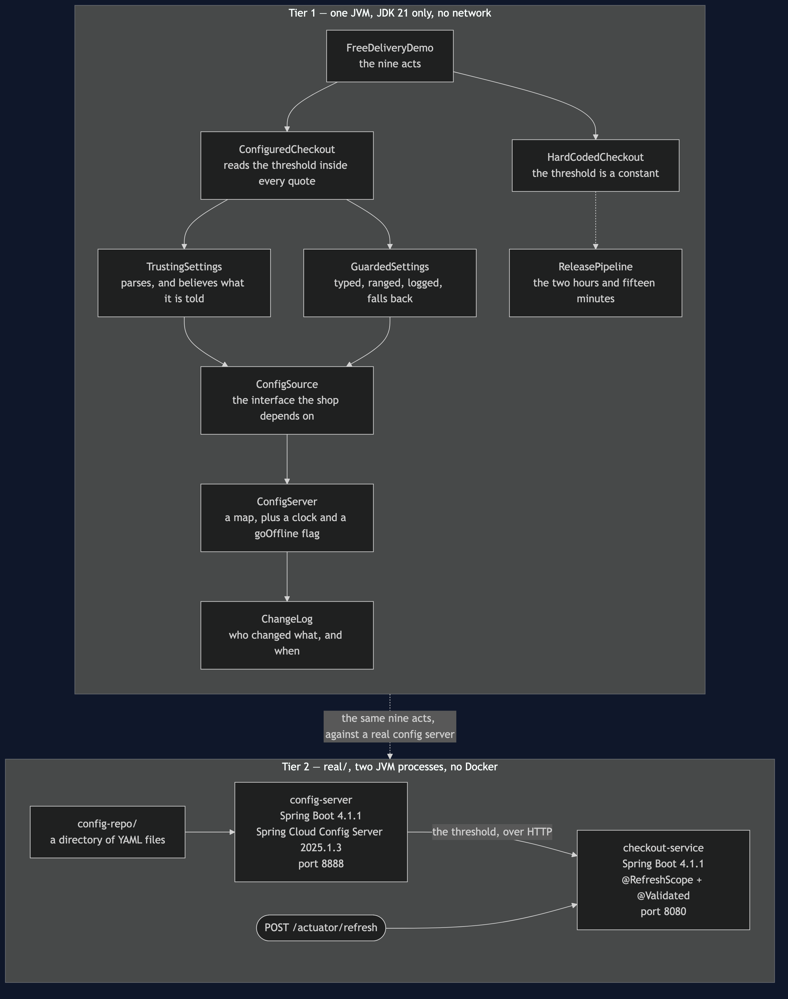
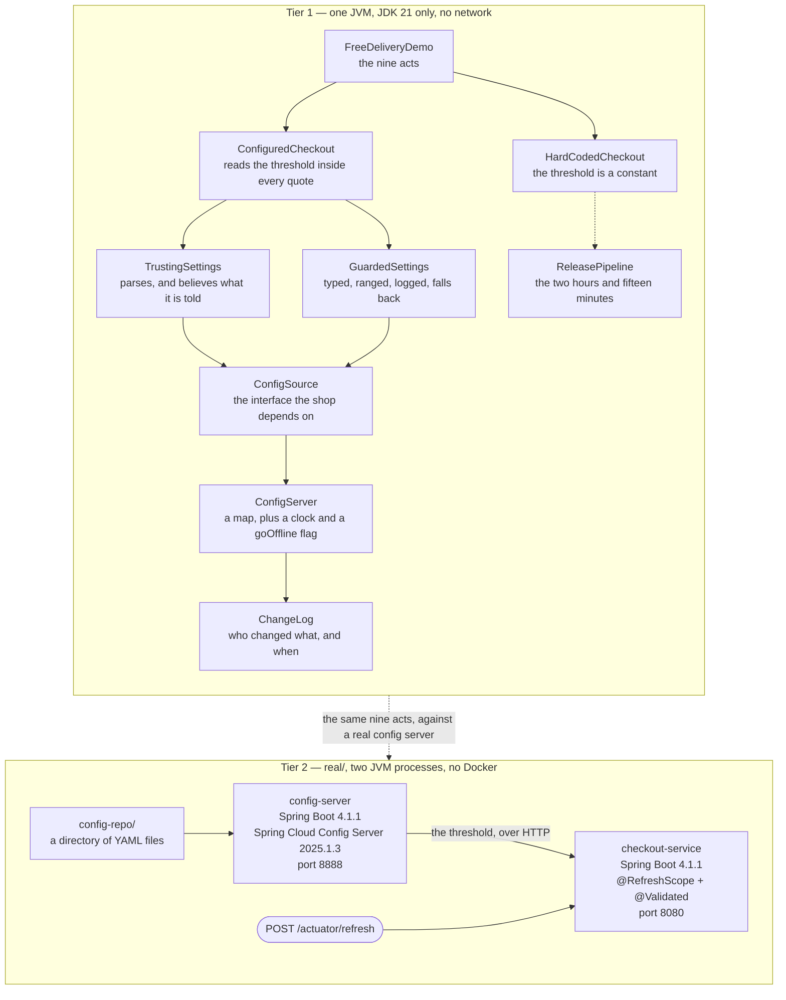

# Externalised Configuration Pattern — Architecture Diagram

Where each piece runs, in both tiers, and which technology it is written in. The class
diagram shows the types and the sequence diagrams show the order of events; this one
answers the question those two cannot, which is **what would I have to start**.

Read it as two boxes stacked. The upper box is Tier 1: one Java program, one process, no
network, nothing installed — `ConfigServer` is a map in the same JVM with a clock bolted on
so that a write can take four seconds. The lower box is Tier 2, under `real/`: two Spring
Boot applications, one of them a genuine Spring Cloud Config Server reading a directory of
YAML, and a threshold you can change with a text editor and see take effect over HTTP.

The line to watch is the one from the checkout to the settings reader, and specifically
**where it starts**. It starts inside the quote, not inside the constructor. A diagram
cannot draw that distinction, so it is worth saying in words: if that read happens once
when the object is built, the shop has traded a rebuild for a restart, and on a Saturday
morning that is not much of a trade.

Notice also that the arrow runs one way. The checkout asks the settings reader; nothing in
the configuration ever calls into the shop. Configuration is something a program reads, and
a system where the configuration source can reach into the application has invented a
second, undocumented way to make things happen.

Mermaid source

## What the diagram is telling you to count

**One arrow into the shop, from one interface.** Everything the shop knows about where its
values come from is `ConfigSource`. Swap the map for a config server, a file, an
environment variable or a database and the checkout does not change, because it never knew
which of those it was talking to.

**Two checkouts, drawn side by side.** `HardCodedCheckout` and `ConfiguredCheckout` differ
by one line, and the whole project is the difference between them. The dotted arrow from
the hard-coded one to the release pipeline is the cost of that line: an edit on Friday
afternoon that goes live on Monday morning.

**Two settings readers, and the second one is bigger.** `TrustingSettings` does what the
pattern says: read the value and use it. `GuardedSettings` is what the pattern actually
costs — parsing, a declared range, a rejection log and a ladder of fallbacks — and the fact
that it is the larger box is the honest shape of this pattern.

## What it deliberately leaves out

There is no secret store, no layered sources, no per-environment overlay and no second
instance of the shop. Real configuration systems have all four, and each one adds a way for
two running copies of the same program to disagree about a value mid-rollout. Tier 1 has
one reader and one source because the argument it is making — where the read belongs, why a
default is mandatory, and what the four guards are — does not need any of that, and adding
it would bury the argument in plumbing.

Tier 2 stays deliberately small too: no Git-backed repository, no encryption, no Vault. It
exists to end somewhere Tier 1 cannot, which is that `@RefreshScope` with `@Validated`
rejects a bad threshold and then fails **every subsequent request** rather than falling back
to the last good value. The half of the guard that Tier 1 makes look obvious is the half the
framework leaves to you.
