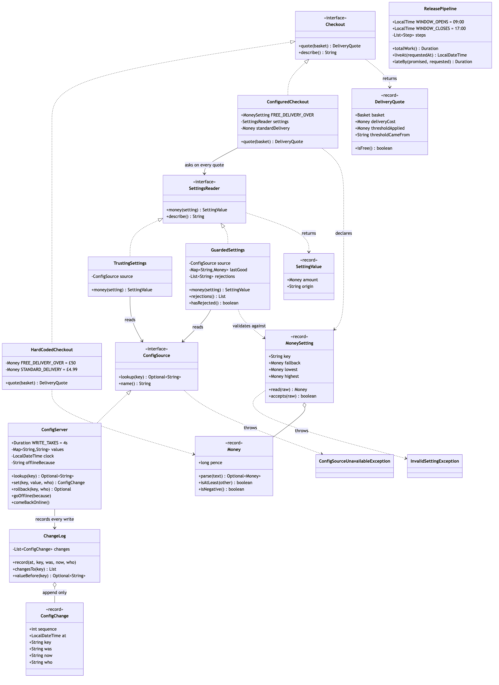
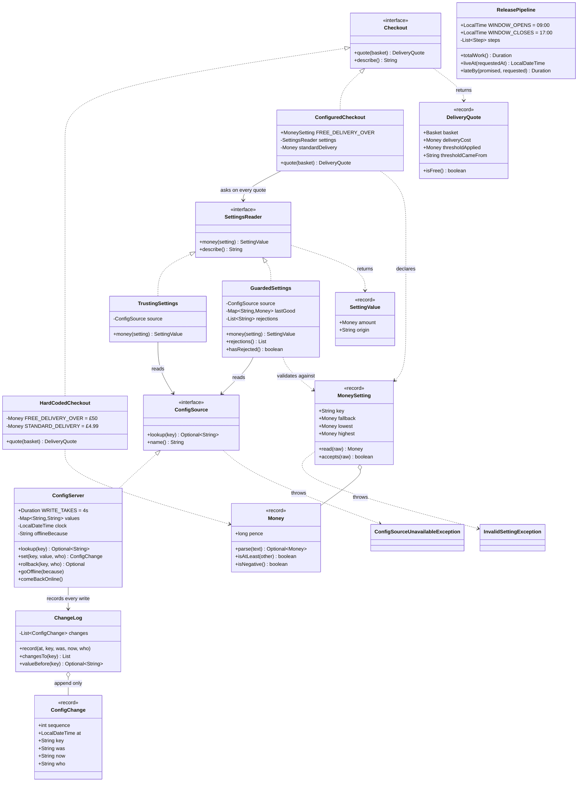

# Externalised Configuration Pattern — Class Diagram

Shows the static structure: the two checkouts that answer the same question
differently, the declared setting that is the replacement for the compiler, the two
readers that differ only in whether anybody checks the value, the configuration
source that stores text without judging it, and the audit trail that takes over from
version control.

The single most important thing on this diagram is a **direction of dependency**.
`ConfiguredCheckout` points at `SettingsReader` and at nothing else. It has no idea
whether there is a config server, a file, or a default behind that interface, which
is why swapping a trusting reader for a guarded one changes the shop's behaviour on
a bad Saturday and changes nothing at all about the checkout code.

The second most important thing is what `ReleasePipeline` connects to: **nothing**.
It is not part of the pattern. It is the price tag on the class next to it.

Mermaid source

## Reading The Diagram

**Both checkouts implement `Checkout`, and nothing else about them differs.** That
is what makes the comparison in the demo fair rather than rhetorical. The same three
baskets go through both, and with the threshold set to fifty pounds they produce the
same quotes — there is a test that asserts exactly that. The pattern is not a
behaviour change. It is a change to what it costs to alter one number.

**`ConfiguredCheckout` holds a `SettingsReader`, not a `ConfigSource`.** The extra
layer is doing real work. It is the one place in the program that knows the outside
world exists, so validation, last-good-value caching and the audit of rejections all
have somewhere to live that is not spread across the shop.

**There are two implementations of `SettingsReader` and only one of them is safe.**
`TrustingSettings` is not a straw man or a bug — it is the version almost everyone
writes first, and it does the two things the pattern is famous for: read per use, and
fall back to a default. `GuardedSettings` is the same class after a bad Saturday. The
demo runs both against the same two bad values.

**`MoneySetting` is a record with a `read` method, and it is the replacement for the
compiler.** When the threshold was a constant in the source, the compiler refused
"fifty", the type system refused anything that was not money, and a reviewer would
have queried minus one pound. None of those follows the value out of the source file.
`key`, `fallback`, `lowest` and `highest` are those guards written down as data.

**`ConfigSource.lookup` returns an `Optional` and can also throw.** Two different
absences, deliberately kept apart. "No value for this key" is ordinary and means use
the default. "Could not reach the source" is an incident and means the shop is now
running on defaults for *everything*. Conflating them is how a shop silently reverts
its whole configuration during a network blip and finds out from the sales figures.

**`SettingValue` carries an origin string, and the origin reaches `DeliveryQuote`.**
One extra field on each, and it answers the question that only exists once the value
can move: not "what is the threshold" but "which threshold was in force for this
order, and where did it come from". Both records are on the diagram because the
provenance is part of the pattern, not decoration.

**`ConfigServer` writes to `ChangeLog` on every `set`, and `ChangeLog` is
append-only.** There is no method to edit or delete a past entry, and that is not an
oversight: the one occasion you most need an audit trail is the one occasion somebody
has a motive to tidy it. `ConfigChange.was` is the field that makes
`ConfigServer.rollback` a lookup rather than an act of memory.

**`ConfigServer` has `goOffline` on it, which no real config server exposes.** It is
there so the outage path is a first-class part of the lesson rather than a paragraph
of warning. A shop that will not start because its config server is down is a worse
shop than one with a hard-coded threshold.

**`ReleasePipeline` has no line to anything else on the diagram.** It is not
machinery; it is measurement. Five steps, a weekday window, and an answer to "what
does it actually cost to change that constant" — 135 minutes of work, live Monday at
10:45, two days and nearly two hours after the Saturday the promotion was for. It
sits here because a pattern shown without the price of the alternative is just
structure.
