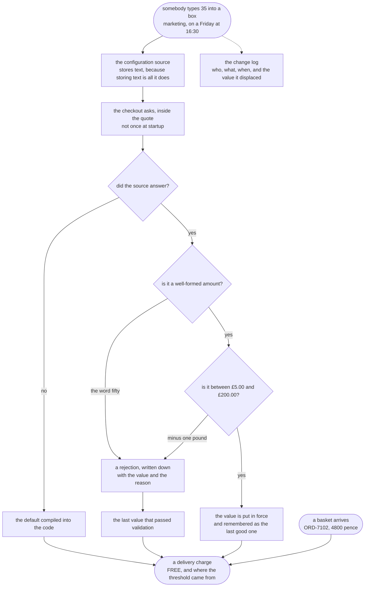

# Externalised Configuration Pattern — Data Flow Diagram

One quote, followed from the moment a basket reaches the checkout to the moment a delivery
charge comes back, with the threshold's journey drawn beside it. The architecture diagram
says what is running; this one says what moves between the boxes and what happens to a
value on the way.

Two things flow through this picture and they meet in the middle. From the left comes the
basket: an order reference and a total in pence, which the program knows is well formed
because a compiler said so. From the top comes the threshold: a string, typed by a person
into a box, arriving at the speed of a decision rather than the speed of a release.

The whole pattern, and the whole bill, is in that difference. **The basket has been through
a compiler and the threshold has not.** Everything in the right-hand column of the diagram
exists to put back, at runtime, the checks the compiler used to do at build time.

Follow the threshold down and count the gates. It is read, then parsed, then range-checked,
and only then is it allowed to decide anything. Fail any gate and the flow does not stop —
it steps sideways to the last value that passed, and writes down that it did so.

Mermaid source

## The three things this flow proves

**The read is on the request path, and that is the whole pattern.** The arrow from the
source to the quote is travelled once per quote. That is what makes the next quote, four
seconds after somebody changed their mind, use the new number without a rebuild, a redeploy
or a restart.

**Every path out of the diagram reaches the quote.** There is no route where the shop stops
selling because a configuration server is unwell. A shop that refuses customers over a
missing settings file is a worse shop than one with the number in the source code. But look
at what the leftmost path quietly loses: the promotion. Back to fifty pounds, with no
exception, no alert, and nothing to see but the origin string the quote carries with it.

**Rejection falls back to the last good value, not to the compiled default.** That is the
one arrow in the picture people get wrong. Throwing away a perfectly good promotion because
somebody made an unrelated typo half an hour later is its own kind of wrong, and the
diagram keeps the two fallbacks separate for that reason.

## Where the data goes that is not the answer

The dotted arrow to the change log is the replacement for something that was lost when the
value left the source file. A constant in the code had a history — who changed it, when, and
what it was before — and version control kept that history without anybody asking. A value in
a text box has none of it. The question you will eventually be asked is never *what is the
threshold now*; it is *what was it at nine o'clock on Saturday morning*, and only that log
can answer.

The same log is what makes the rollback in the demo's last act a lookup rather than an act
of memory. Every entry records the value it displaced, so putting things back does not
depend on somebody remembering a number at speed while the shop gives delivery away.
