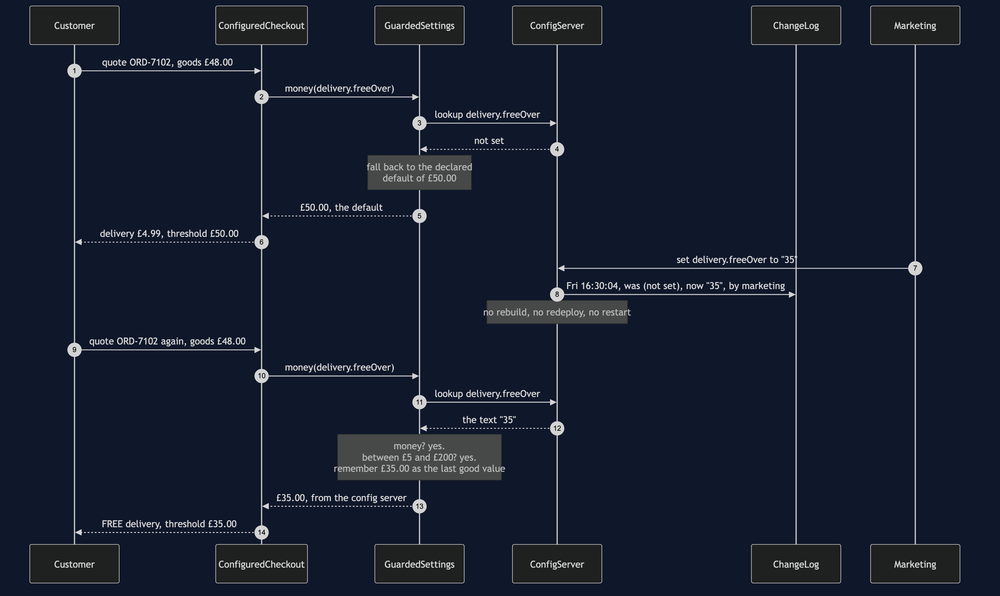
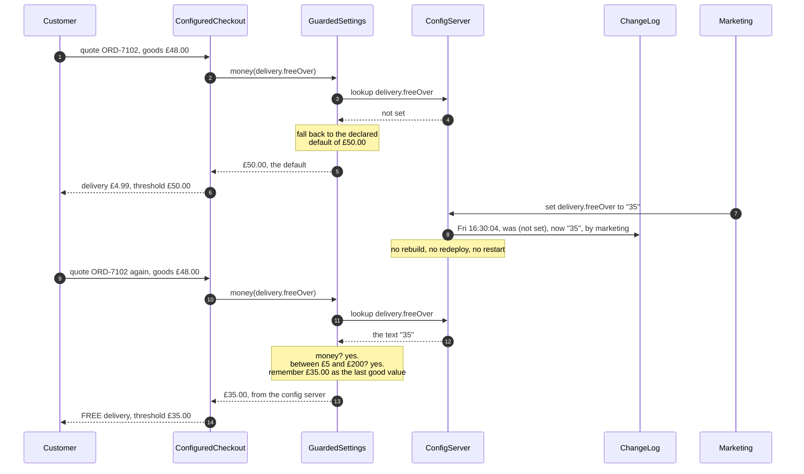

# Externalised Configuration Pattern — Sequence Diagram

One quote, and then the change that lands while the shop keeps selling — in the order the
calls happen. The architecture diagram says what is running and the data flow diagram
shows the gates a value has to pass; this one says **when the value is read**, which is
the decision the whole pattern turns on.

Read the first half slowly. A customer checks out with forty-eight pounds of goods, and
the threshold is the compiled-in default of fifty pounds, so they pay four pounds
ninety-nine for delivery. `ConfiguredCheckout` asks the settings reader for that
threshold — and it asks *during the quote*, not when it was constructed. The reader looks
the key up in the config server, turns the text it gets back into money, checks it against
a declared range of five to two hundred pounds, remembers it as the last good value, and
hands it back together with a note saying where it came from.

The second half is why anybody pays the bill. Marketing wants the threshold lowered to
thirty-five pounds for a weekend promotion, and asks on Friday at half past four. Four
seconds later the next quote reads the new value and the same forty-eight pound basket
ships free: no rebuild, no redeploy, no restart, and a change log entry recording the old
value, the new one, the time and the person who made it. The release pipeline this
replaced took a hundred and thirty-five minutes of work spread from Friday afternoon to
Monday at a quarter to eleven — for a promotion that was meant to run over the weekend.

Mermaid source

## What the order proves

**The read is inside the quote.** Step two is the entire pattern. Move that lookup into
the constructor — which is exactly what happens when somebody tidies this code up and
notices the same value being fetched over and over — and a configuration change takes
effect on the next restart instead of the next order. Nothing breaks, no test fails, and
the promotion silently does not start.

**Text becomes a checked value before it goes any further.** The compiler used to
guarantee that the threshold was a number in a sensible range, and moving the value
outside the build gives that guarantee away. The reader is what buys it back: parse,
range-check, and only then hand it on. Everything downstream can then assume the
threshold is sane, because one place made sure of it.

**Every answer carries its origin, and every change is recorded as it happens.** The
amount comes back with a note saying where it came from, and the change log keeps the
value that was displaced. That is not bookkeeping for its own sake — it is what makes a
rollback a lookup rather than an act of memory, and what lets a support agent three weeks
later explain a quote nobody can reproduce.

The failure modes — an unreachable source, a well-formed number nobody sanity-checked,
and the rollback that is a lookup rather than a memory — are sequences 3 to 5 in
[`uml-diagram.md`](uml-diagram.md).
